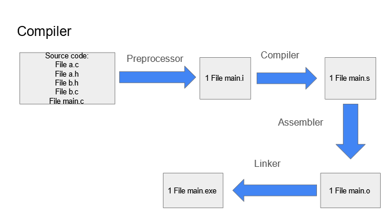
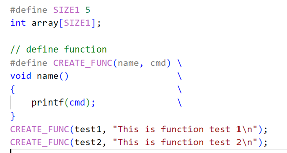
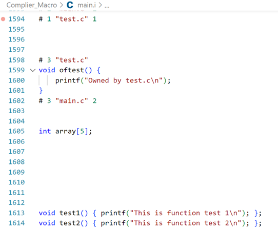

# Advance_C_Cpp
Contents

**LESSON 1: COMPILER - MACRO** 

---

**I. Compiler**

- Là quá trình chuyển đổi ngôn ngữ bậc cao sang ngôn ngữ máy.
- Gồm 4 giai đoạn


***Preprocessor (tiền xử lý)***: `gcc -E main.c -o main.i`. Các file trong source code (a.c, a.h, b.h, b.c, main.c,…) sẽ được biên dịch thành 1 file main.i. Ở giai đoạn này, trình biên dịch sẽ:

- Copy toàn bộ file thư viện (ví dụ #include <stdio.h>, #include “hello.h”,…)
- Thay thế các nội dung được #define 
- Xoá toàn bộ chú thích, các hàm và biến khai báo được giữ nguyên.

***Compiler***: File main.i được biên dịch thành file main.s (bao gồm các dòng lệnh được viết bằng ngôn ngữ assembly)


***Assembler***: Biên dịch ngôn ngữ assembly trong file main.s thành ngôn ngữ máy (file main.o)

***Linker***: 1 hoặc nhiều main.o sẽ được liên kết lại thành file thực thi (.exe)

---

**II. Macro**
-	Macro là một khái niệm dùng để định nghĩa một tập hợp các hướng dẫn tiền xử lý
-	Dùng để thay thế một chuỗi mã nguồn bằng một chuỗi khác trước khi chương trình biên dịch.
-	Giúp giảm lặp lại mã, dễ bảo trì chương trình.
-	Macro được định nghĩa bằng cách sử dụng chỉ thị tiền xử lý #define
-	Trong C, macro chia làm 3 loại: chỉ thị bao hàm tệp, chỉ thị định nghĩa, chỉ thị biên dịch có điều kiện.

**1. Chỉ thị bao hàm tệp (#include)** 
-	Gồm 2 loại:
    \*  <> (ví dụ #include <stdio.h>): khi run code, trình biên dịch tìm đến vị trí đã cài đặt file thư viện stdio.h trong bộ nhớ máy tính, sau đó sao chép toàn bộ nội dung file này vào file .i
    \* “…”: tìm trong thư mục chứ dự án hiện tại file nào có tên … sau đó sao chép toàn bộ nội dung file này vào file .i

    

**2. Chỉ thị định nghĩa**

***#define***: Định nghĩa, thay thế một tên, biến hoặc hàm 

-	Định nghĩa  giá trị của SIZE1 là 5 và  định nghĩa hàm

-	Sau giai đoạn tiền xử lý, nội dung được define ở file .c được thay thế vào trong file .i

***undef***: hủy định nghĩa của một macro đã được định nghĩa trước đó bằng #define
```c
#include <stdio.h>

#define SIZE1 5

int main(int argc, char const *argv[])
{
    printf("SIZE1 = %d\n", SIZE1);

    #undef SIZE1

    #define SIZE1 50

    printf("SIZE1 = %d\n", SIZE1);
    /* code */
    return 0;
}
```
**3. Chỉ thị biên dịch có điều kiện**

**3.1.**

***#if*** sử dụng để bắt đầu một điều kiện tiền xử lý.
- Nếu điều kiện trong ***#if*** là đúng, các dòng mã nguồn sau ***#if*** sẽ được biên dịch
- Nếu sai, các dòng mã nguồn sẽ bị bỏ qua đến khi gặp ***#endif***

***#elif*** dùng để thêm một điều kiện mới khi điều kiện trước đó trong ***#if*** hoặc ***#elif*** là sai

***#else*** dùng khi không có điều kiện nào ở trên đúng.

Ví dụ
```c
#include <stdio.h>

#define ESP32 1
#define STM32 2
#define ATmega 3

#define MCU STM32

int main(int argc, char const *argv[])
{
    while (1)
    {
        #if MCU == STM32
            printf("STM32");
        
        #elif MCU == ESP32
            printf("ESP32");
        
        #else 
            printf("0");

        #endif

    }
    return 0;
}
```
**3.2.**

***#ifdef*** và ***#ifndef*** thường được sử dụng trong tạo file thư viện, tránh việc định nghĩa mã nguồn nhiều lần gây lỗi trong quá trình tiền xử lý file .i

- ***#ifdef*** dùng để kiểm tra một macro đã được định nghĩa hay chưa, nếu macro đã được định nghĩa thì mã nguồn sau #ifdef sẽ được biên dịch.
- ***#ifndef*** dùng để kiểm tra một macro đã được định nghĩa hay chưa, nếu macro chưa được định nghĩa thì mã nguồn sau #ifndef sẽ được biên dịch.
Ví dụ
```c
#ifndef TEST_H
#define TEST_H

void display();

#endif
```
**3. Một số toán tử trong macro**

***a##b***: nối chuỗi

***#x***: chuẩn hóa chuỗi

Ví dụ
```c
#include<stdio.h>

#define concatenate(a,b) a##b

#define tostring(c) #c
int main(int argc, char const *argv[])
{
    int giatri = 10;

    // nối 'gia' và 'tri' thành 'giatri'
    printf("giatri = %d\n", concatenate(gia,tri));

    // chuẩn hóa chuỗi
    printf("chuỗi đã chuẩn hóa: %s\n", tostring(abc));
    return 0;
}
```

***Variadic macro***
- Là một dạng macro cho phép nhận một số lượng biến tham số có thể thay đổi.
- Giúp định nghĩa các macro có thể xử lý một lượng biến đầu vào khác nhau, dùng cho những hàm có tham số không xác định.

Ví dụ:

\__VA_ARGS__ sẽ thay thế vào dấu ...
```c
#include<stdio.h>

#define count_args(...) (sizeof(int[]){__VA_ARGS__}/sizeof(int));

#define sum(...)                \
int arr[] = {__VA_ARGS__};      \
int SUM = 0;                    \
int n = count_args(__VA_ARGS__);\
int i = 0;\
for(i = 0; i<n; i++)            \
{                               \
    SUM += arr[i];             \
}                               \
printf("SUM = %d\n", SUM);      \

int main(int argc, char const *argv[])
{
    sum(1,2,0,3,4);
    return 0;
}
```


