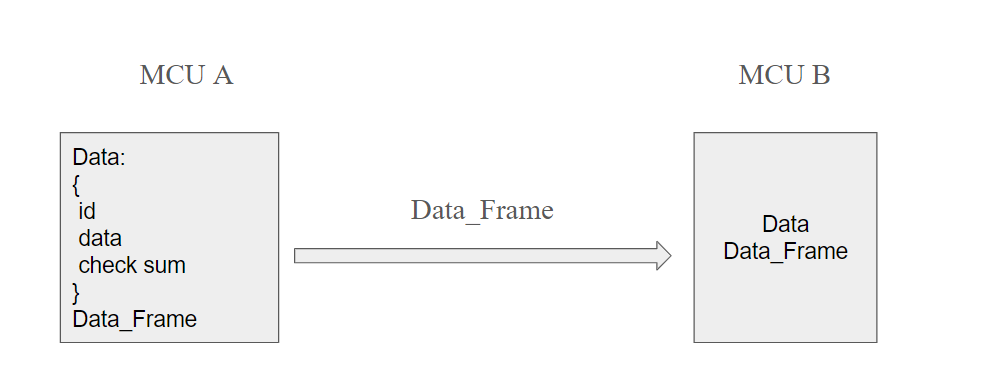

### Struct

- Trong ngôn ngữ lập trình C, struct là một cấu trúc dữ liệu cho phép lập trình viên tự định nghĩa một kiểu dữ liệu mới bằng cách nhóm các biến có các kiểu dữ liệu khác nhau lại với nhau. 

- Struct cho phép tạo ra một thực thể dữ liệu lớn hơn và có tổ chức hơn từ các thành viên (members) của nó.

```c
#include <stdio.h>

/* Cách khai báo 1*/
// struct Point
// {
//     int x;
//     int y;
// }

// struct Point p1, p2, p3; // cách này khi khai báo phải có struct ở trước
/* Cách khai báo 2*/
typedef struct 
{
   int x;
   int y; 
} Point;

Point p1, p2, *p3;

int main(int argc, char const *argv[])
{
    p1.x = 2;
    p1.y = 3;

    p3->x = 4;
    return 0;
}
```
- Đối tượng thuộc lớp truy cập đến thành viên struct, toán tử `.`

- Con trỏ truy cập đến thành viên struct, toán tử `->`

#### Data alignment

- Địa chỉ bắt đầu: chia hết cho sizeof(kiểu dữ liệu)

```c
double (8 byte): 0x00, 0x08, 0x1f,...
int32_t, uint32_t, int, float (4 byte): 0x00, 0x04, 0x08,..
int16_t, uint16_t (2 byte): 0x00, 0x02, 0x04,...
char, int8_t, uint8_t (1 byte): 0x00, 0x01,..
```

#### Data padding

- Byte trống, ô địa chỉ không sử dụng, được thêm vào khi phân vùng nhớ

#### Kích thước của 1 struct

- Số lượng byte được cấp tính theo kiểu dữ liệu có kích thước lớn nhất trong struct đó.

Ví dụ 1:
 
 ```c
 typedef struct 
{                        // cấp phát (1 lần 4 byte)       sử dụng         dư
    int var1;   // 4        0x00 - 0x07                   0x00 - 0x03       0x04 - 0x07            
    char var2;  // 1                                      0x04              0x05 - 0x07
    char var3;  // 1                                      0x05              0x06 - 0x07: 2 padding
    float var4; // 4        0x08 - 0x0f                   0x08 - 0x0b       0x0c - 0x0f
    double var5;// 8        0x10 - 0x17                    

} Point

 ```

Ví dụ 2:

```c
typedef struct
{
    uint8_t var1[9];   //1  9
    uint32_t var2[2];  //4  8
    uint16_t var3[10]; //2  20
} frame;
```
- data alignment: cấp 1 lần 4 byte địa chỉ

- 0x00 - 0x03: lưu 4 phần tử mảng var1

- 0x04 - 0x07: lưu 4 phần tử tiếp theo của var1

- 0x08 - 0x0B: lưu phần tử 9 của var1, 3 padding

- 0x0C - 0x0F: var2 [0]

- 0x10 - 0x13: var2 [1]

- 0x14 - 0x17: var2[0] , var2[1]

- .....

📌 Cần cấp 40 byte (using 39, 1 padding)

- Kích thước: tổng các kích thước của các thành phần và padding

- Những thành phần có địa chỉ riêng biệt

### Union

- Mục đích chính của union là tiết kiệm bộ nhớ bằng cách chia sẻ cùng một vùng nhớ cho các thành viên của nó.

-  Trong một thời điểm, chỉ một thành viên của union có thể được sử dụng.
-  

-  Kích thước union = kích thước lớn nhất của thành viên

Ví dụ:

```c
#include <stdio.h>
#include <stdint.h>

typedef union 
{
    uint8_t var1;  //1  3 padding
    uint32_t var2; //4  0 padding
    uint16_t var3; //2
} frame;

int main(int argc, char const *argv[])
{
    frame data;

    data.var1 = 5;
    data.var2 = 10;

    printf("var1: %d", data.var1); 
    printf("var2: %d", data.var1);
}
```

📌 Vấn đề khi sử dụng chung vùng nhớ
```c
  data.var2 = 4294967290; //0b 11111111 11111111 11111111 11111010
                                 0x03     0x02     0x01     0x00
    
    /*
    data.var1 = 11111010
    data.var3 = 11111111 11111010
    */
```

### Ứng dụng

- Struct: Viết thư viện, cấu hình, tính năng,..
- Kết hợp struct và union trong việc truyền dữ liệu của 2 vi điều khiển




```c
typedef union {
    struct {
        uint8_t id[2];
        uint8_t data[4];
        uint8_t check_sum[2];
    } data;

    uint8_t frame[8];

} Data_Frame;

```
- Khai báo biến sao cho tránh padding

- Struct lồng vào union, chỉ dùng 1 địa chỉ, 1 trong 3 thành phần thay đổi thì thành phần truyền đi frame sẽ được cập nhật

- Chuyển số thành chuỗi

```c
int main(int argc, char const *argv[])
{
    Data_Frame transmitter_data;
    
    strcpy(transmitter_data.data.id, "10");
    strcpy(transmitter_data.data.data, "1234");
    strcpy(transmitter_data.data.check_sum, "70");

		Data_Frame receiver_data;
    strcpy(receiver_data.frame, transmitter_data.frame);
	
    
    return 0;
}
```
- Debug truyền và nhận dữ liệu
