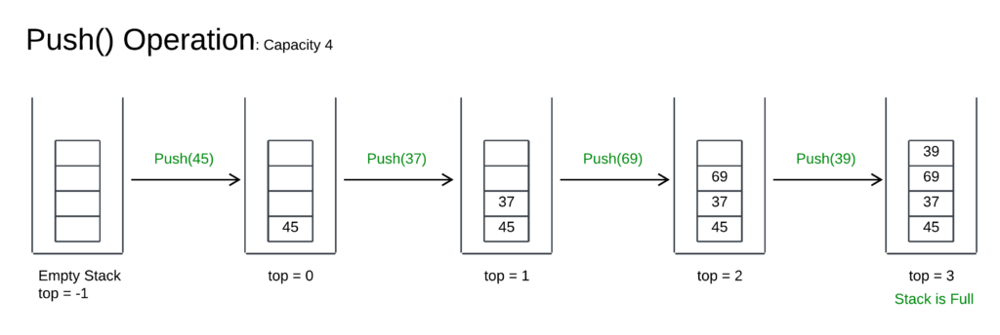

[Google Slides Presentation](https://docs.google.com/presentation/d/1Z04jpGAbsPfTi_S0r2N0MFV4peAnzDhn/)

# Stack

- Stack (ngăn xếp) là một cấu trúc dữ liệu tuân theo nguyên tắc "Last In, First Out" (LIFO), nghĩa là phần tử cuối cùng được thêm vào stack sẽ là phần tử đầu tiên được lấy ra. 

- Các thao tác cơ bản trên stack bao gồm:

"push" để thêm một phần tử vào đỉnh của stack

"pop" để xóa một phần tử ở đỉnh stack.

"peek/top" để lấy giá trị của phần tử ở đỉnh stack.

Kiểm tra Stack đầy: top = size - 1

Kiểm tra Stack rỗng: top = -1

# Queue

- Cấu trúc dữ liệu FIFO (First in, First out), tới trước ra trước

- Các thao tác cơ bản trên hàng đợi bao gồm:

**“enqueue” **(thêm phần tử vào cuối hàng đợi)

**“dequeue”** (lấy phần tử từ đầu hàng đợi). 

**“front”** để lấy giá trị của phần tử đứng đầu hàng đợi.

**“rear”** để lấy giá trị của phần tử đứng cuối hàng đợi.

Kiểm tra hàng đợi đầy/rỗng.

Ban đầu queue rỗng thì front = rear = -1; thêm vào phần tử đầu tiên, front = rear = 0

Chỉ được thêm dữ liệu mới vào (enqueue) khi queue rỗng toàn bộ -> front, rear về lại vị trí ban đầu (không thể thêm phần tử mới kể cả khi phía trước có khoảng trống)

📌 Để khắc phục nhược điểm này của Linear Queue, sử dụng Circular Queue:

- Khi rear đạt tới size - 1 và không còn chỗ trống từ phía cuối, nếu front đã di chuyển (nghĩa là đã có các phần tử được dequeue), rear có thể "quay vòng" về vị trí 0 để tận dụng khoảng trống.

- Khi kiểm tra rỗng chỉ có 1 trường hợp

📌 Ứng dụng Queue: truyền bit dữ liệu

## So sánh Stack và Queue

| Đặc điểm                          | Stack (Ngăn xếp)                  | Queue (Hàng đợi)                 |
|----------------------------------|----------------------------------|----------------------------------|
| **Cơ chế quản lý**               | LIFO (Last In, First Out)        | FIFO (First In, First Out)      |
| **Các thao tác**                 | `push`, `pop`                     | `enqueue`, `dequeue`            |
| **Truy cập dữ liệu**             | Chỉ có thể truy cập phần tử trên cùng | Truy cập dữ liệu theo thứ tự từ đầu đến cuối |
| **Ứng dụng**                     | Quản lý bộ nhớ, gọi hàm đệ quy, xử lý dấu ngoặc trong biểu thức | Quản lý dữ liệu hàng đợi, lập lịch CPU, xử lý yêu cầu in ấn |
| **Ví dụ trong lập trình embedded** | Tổ chức bộ nhớ lưu trữ các hàm ngắt | Lưu trữ dữ liệu cảm biến, giao tiếp UART |
| **Cấu trúc dữ liệu hỗ trợ**      | Mảng, danh sách liên kết         | Mảng, danh sách liên kết        |
| **Hiệu suất**                    | Hoạt động nhanh hơn do chỉ thao tác trên một đầu | Có thể chậm hơn nếu duyệt qua nhiều phần tử |
| **Khả năng mở rộng**             | Dễ dàng mở rộng bằng cách tăng kích thước mảng hoặc danh sách liên kết | Cần tối ưu hóa để tránh tắc nghẽn dữ liệu |

