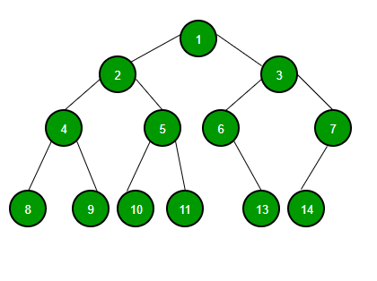
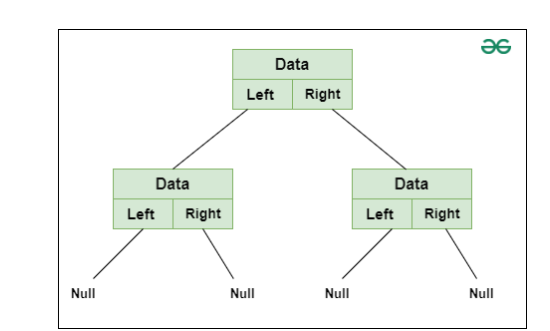
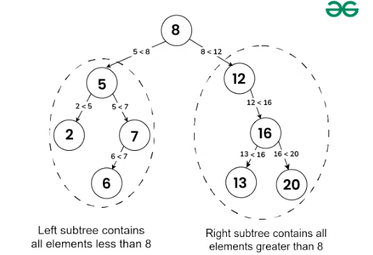

## 1. Binary search

### 1.1. Thuật toán

- **Linear search**: tìm kiếm bằng cách duyệt qua từng phần tử trong 1 mảng theo thứ tự -> chậm -> **Binary Search**

- **Binary search** giảm thời gian tìm kiếm (*đối với mảng đã được sắp xếp tăng dần*) bằng cách chia thành mảng nhỏ sau mỗi lần kiểm tra trước đó. Cụ thể:

    - Sắp xếp mảng theo thứ tự tăng dần

    - Ban đầu chỉ số **left**: phần tử 0 của mảng, **right**: size mảng - 1, **mid = (int) (right - left)/2**

    - Nếu **middle = x** -> trả về vị trí phần tử cần tìm. 
    
        - **middle < x** -> **left = mid + 1 & right giữ nguyên**, giữ lại mảng bên phải mid
  
        - **middle > x** -> **right = mid - 1 & left giữ nguyên**, giữ lại mảng bên trái mid

    - Lặp lại quá trình

    - **Vòng lặp cuối left = mid = right**, cho right = mid - 1, lúc này **right < left** -> END.

- Trường hợp mảng có 2 vị trí chứa phần tử cần tìm kiếm

- Phần tử trong mảng ngẫu nhiên bằng hàm random

## 2. Makefile

> <span style="color:#FF5733; font-weight:bold">"Makefile"</span>  
> [Source](https://docs.google.com/document/d/1orn_c-s46cFZCu2LZFVu9ztrV-fL6kTA/edit?tab=t.0#heading=h.gjdgxs)

- Tự động hóa quá trình biên dịch, liên kết các tệp nguồn trong 1 dự án

## 3. Binary Tree



- 1 Node của Binary Tree gồm

    - Data

    - Pointer to left child node

    - Pointer to right child node




- Xây dựng cây nhị phân (perfect binary tree), sử dụng 1 mảng, left child của node i là 2i + 1, right child của node i là 2i + 2

## 4. Binary Search Tree

- Áp dụng thuật toán tìm kiếm vào cây nhị phân, tổ chức và lưu dữ liệu theo cách sắp xếp

- Đặc điểm của cây tìm kiếm nhị phân

    - Nhánh bên trái chứa các node có chỉ số (key) nhỏ hơn key node gốc

    - Nhánh bên phải chức các node có chỉ số (key) lớn hơn key node gốc

    - Mỗi nhánh trái và phải cũng là binary search tree



## 5. File operations

- C cung cấp 1 số thư viện & hàm tiêu biểu để thực hiện theo tác với file

- File CSV: lưu trữ và truyền tải dữ liệu dưới cấu trúc dạng bảng, dữ liệu các cột được phân tích bằng dấu phẩy

```c
Họ và tên, Tuổi, Địa chỉ, Số điện thoại
John Doe, 30, 123 Main St, 555-1234
Jane Smith, 25, 456 Oak St, 555-5678
Bob Johnson, 40, 789 Pine St, 555-8765
```
- Mở file

`FILE *file = fopen(const char *file_name, const char *access_mode);`

    - r: Mở file với chế độ chỉ đọc file. Nếu mở file thành công thì trả về địa chỉ của phần tử đầu tiên trong file, nếu không thì trả về NULL.

    - w: Mở file với chế độ ghi vào file. Nếu file đã tồn tại, thì sẽ ghi đè vào nội dung bên trong file. Nếu file chưa tồn tại thì sẽ tạo một file mới. Nếu không mở được file thì trả về NULL.

    - a: Mở file với chế độ nối. Nếu mở file thành công thì trả về địa chỉ của phần tử cuối cùng trong file. Nếu file chưa tồn tại thì sẽ tạo một file mới. Nếu không mở được file thì trả về NULL.

    - r+: Mở file với chế độ đọc và ghi file. Nếu mở file thành công thì trả về địa chỉ của phần tử đầu tiên trong file, nếu không thì trả về NULL.

    - w+: Mở file với chế độ ghi và đọc file. Nếu file đã tồn tại thì trả về địa chỉ của phần tử đầu tiên của file. Nếu file chưa tồn tại thì sẽ tạo một file mới.

    - a+: Mở file với chế độ nối và đọc file. Nếu file đã tồn tại thì trả về địa chỉ của phần tử cuối cùng của file. Nếu file chưa tồn tại thì sẽ tạo một file mới.

```c

//  đường dẫn tuyệt đối: "D:\\C_C++_Advanced\\Binary_Search-File_operation\\FILE\\information.csv"
//  đường dẫn tương đối: ..\\FILE\\information.csv

// Mở file để ghi, nếu chưa có tạo file mới
    FILE *file = fopen(DATABASE_PATH, "w");
```

- Ghi dữ liệu vào file

`fprintf(): ghi chuỗi vào file/ thêm danh sách đối số`

- Đóng file đã mở `fclose()`


