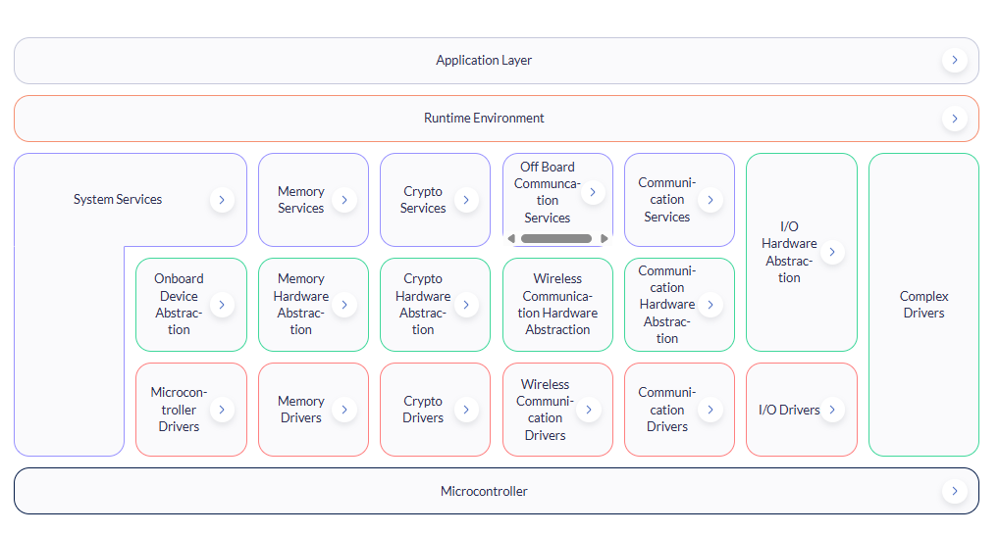
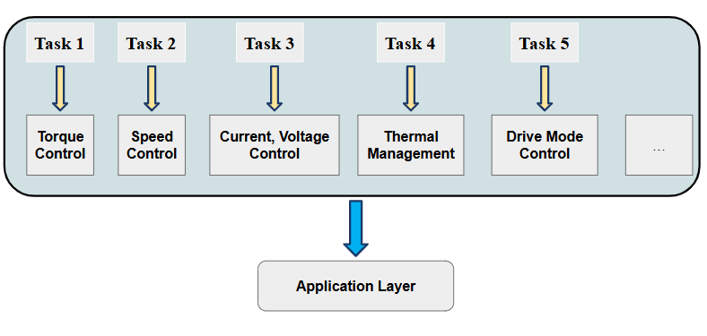
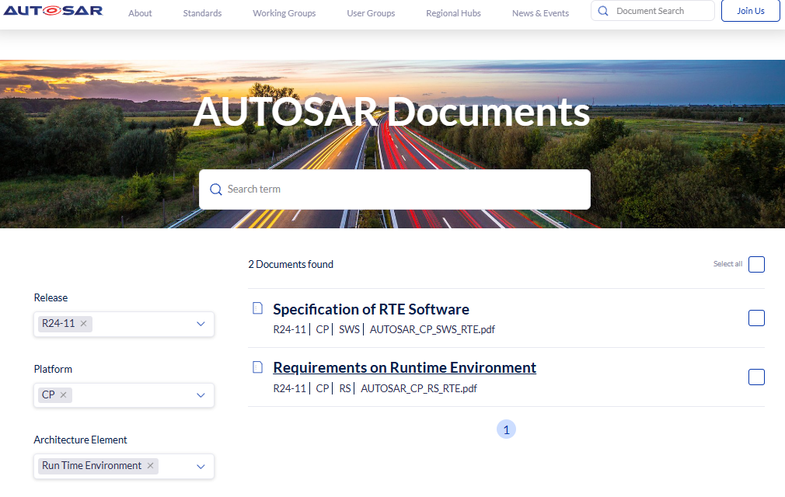

## AUTomotive Open System ARchitecture

- Chuẩn hóa kiến trúc phần mềm cho các hệ thống điều khiển điện tử (ECU)

### 1. Application layer

- Gồm các thành phần phần mềm ứng dụng, thực hiện các chức năng cụ thể của xe (kiểm soát động cơ, phanh,...)

- Gồm nhiều khối phần mềm ứng dụng (Software Component - SWC). Mỗi SWC  thực hiện 1 chức năng cụ thể trong hệ thống ECU. 

- SWC chỉ quan tâm đến logic (tính toán), không quan tiếp đến phần cứng. Tuy nhiên, SWC vẫn có thể giao tiếp với nhau và giao tiếp với phần cứng thông qua RTE.

### 2. Runtime Environment

- Liên kết SWC và BSW thông qua kiến trúc trừu tượng

- **Truyền thông tin giữa các SWCs:** Trao đổi dữ liệu giữa các SWC mà không cần biết chi tiết về các phần còn lại của hệ thống

- **Kết nối với BSW**: RTE cung cấp giao diện để các SWCs có thể tương tác với BSW. Điều này giúp các SWCs có thể sử dụng các dịch vụ hoặc điều khiển phần cứng một cách dễ dàng.

- Hỗ trợ việc lập lịch và điều phối thực thi của các SWCs theo các sự kiện hoặc chu kỳ định sẵn. 

### 3. Basic Software

- Là phần mềm cơ bản, bao gồm các thành phần phần mềm tiêu chuẩn để quản lý các chức năng hệ thống, giao tiếp và điều khiển phần cứng.

- Vai trò hỗ trợ phần mềm ứng dụng SWC hoạt động trên phần cứng

- Chia thành 3 lớp chính

    - **Service Layer**: Lớp cao nhất trong BSW, cung cấp các dịch vụ hệ thống và tiện ích cho các phần mềm ứng dụng (SWC) và các lớp khác của BSW. Các dịch vụ này bao gồm quản lý thời gian thực, chẩn đoán, quản lý lỗi, quản lý nguồn,...

    **- Hardware Abstraction Layer**:  cung cấp một giao diện trừu tượng cho tất cả các thiết bị ngoại vi và phần cứng cụ thể của ECU. Nó ẩn đi sự khác biệt về phần cứng của các thiết bị ngoại vi khác nhau và cung cấp một giao diện tiêu chuẩn cho các lớp bên trên (Service Layer và SWC).

    **- Microcontroller Abstraction Layer - MCAL**: lớp thấp nhất trong BSW, cung cấp giao diện trừu tượng để tương tác trực tiếp với các thành phần phần cứng của vi điều khiển, chẳng hạn như bộ xử lý trung tâm (CPU), các thiết bị ngoại vi tích hợp (như ADC, PWM, UART), và các bộ định thời (timer).
