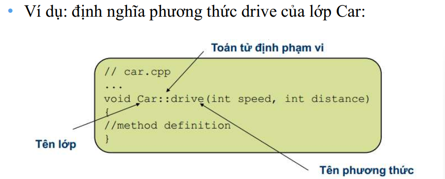

# Class

## C++

`#include <iostream>`, khai báo thực viện làm việc với terminal, các thư viện trong C++ không có đuôi .h

**Khai báo biến, nhập xuất**

```c
#include <iostream>

using namespace std;

int main(int argc, char const *argv[])
{
    int a;
    cout << "Hello";
    cin >> a;
    cout << a;
    return 0;
}

```

## Class


- Kiểu tự định nghĩa ra giống struct & union, trong class: biến (thuộc tính), hàm (phương thức)

- Mặc định các phần tử trong class không được truy cập từ bên ngoài (quyền truy cập private)

```c
class ClassName {
private:
    // Các thành phần riêng tư (private) chỉ có thể truy cập bên trong lớp
    // Dữ liệu thành viên, hàm thành viên, ...

protected:
    // Các thành phần bảo vệ (protected) tương tự như private, nhưng có thể truy cập từ lớp kế thừa

public:
    // Các thành phần công khai (public) được truy cập từ bên ngoài lớp
    // Dữ liệu thành viên, hàm thành viên, ...
    // Hàm thành viên và các phương thức khác có thể được định nghĩa tại đây
    // ...

};

```

-  Khai báo phương thức luôn đặt trong định nghĩa lớp, cũng như các
khai báo thành viên dữ liệu;

- Phần cài đặt (định nghĩa phương thức) có thể đặt trong định nghĩa lớp
hoặc đặt ở ngoài

- Khi định nghĩa một phương thức, ta cần sử dụng toán tử
phạm vi để trình biên dịch hiểu đó là phương thức của một
lớp cụ thể chứ không phải một hàm thông thường khác.





### Constructor

- Constructor trong C++ là một method sẽ được tự động gọi khi khởi tạo object.

- Constructor sẽ có tên trùng với tên của class.

- Gán giá trị, cấp vùng nhớ cho các dữ liệu thành viên;

- Hàm dựng mặc định (default constructor):

Đối với constructor mặc định, nếu ta không cung cấp một
phương thức constructor nào, C++ sẽ tự sinh constructor
mặc định là một phương thức rỗng (không làm gì);

Mục đích để luôn có một constructor nào đó để gọi khi không
có tham số nào

Tuy nhiên, nếu ta không định nghĩa constructor mặc định
nhưng lại có các constructor khác, trình biên dịch sẽ báo
lỗi không tìm thấy constructor mặc định nếu ta không
cung cấp tham số khi tạo thể hiện

### Deconstructor

Dọn dẹp 1 đối tượng trước khi nó được thu hồi

- Destructor không có giá trị trả về, và không thể định nghĩa
lại (nó không bao giờ có tham số)

- Mỗi lớp chỉ có 1 destructor.

- Không gọi trực tiếp, sẽ được tự động gọi khi hủy bỏ đối
tượng;

- Thu hồi vùng nhớ cho các dữ liệu thành viên là con trỏ;

-  Nếu ta không cung cấp destructor, C++ sẽ tự sinh một
destructor rỗng (không làm gì cả)

Tính chất hàm hủy
(destructor):

- Tự động gọi khi đối
tượng bị hủy.

- Mỗi lớp có duy nhất
một hàm hủy.

- Trong C++, hàm
hủy có tên ~<Tên
lớp>.

### Danh sách khởi tạo thành viên

Khởi tạo giá trị thuộc tính của đối tượng trong hàm dựng bằng cách sử dụng danh sách khởi tạo thành viên

Thứ tự ưu tiên: ds khởi tạo thành viên trước rồi mới tới hàm dựng

Ngay sau ghi nguyên mẫu hàm dựng


**5 cách khởi tạo giá trị cho các thành viên trong class**

1. Truy cập từ bên ngoài, gán giá trị trực tiếp ở main (không khuyến khích sử dụng)

2. Khởi tạo constructor không có tham số

3. Khởi tạo constructor có tham số - không có giá trị mặc định

4. Khởi tạo constructor có tham số - có giá trị mặc định

5. Khởi tạo thông qua danh sách khởi tạo thành viên

### Static keyword

- Địa chỉ của hàm, constructor nằm ở phân vùng text

- Các biến thành viên trong class, có phân vùng nhớ dựa vào đối tượng khởi tạo

**Static property**

- Tất cả các đối tượng sẽ dùng chung địa chỉ của biến static property 

- Trước khi muốn sử dụng phải khởi tạo ở bên ngoài

- 2 biến static có địa chỉ không liên kề với nhau (tùy vào trình biên dịch)

- Có địa chỉ dựa vào lúc khởi tạo

```c
// static property

static int counter;
static int counter1; 

// khởi tạo

int Sinhvien::counter = 0; // 0x01 - 0x04
int Sinhvien::counter1 = 0; // 0xf1 - 0xf4

```

```c
#include <iostream>
#include "Point.hpp"

using namespace std;

int main() {
    Point point1, point2;
    cout << Point::n << endl; // In giá trị của biến tĩnh n
    cout << Point::n1 << endl;
    cout << "Addr of n " << &(point1.n) << endl;
    cout << "Addr of n " << &(point2.n) << endl;
    cout << "Addr of n1 " << &(point1.n1) << endl;
    cout << "Addr of n1 " << &(point2.n1) << endl;
    return 0;
}

Result:
30
20
Addr of n 0x7ff73f003000
Addr of n 0x7ff73f003000
Addr of n1 0x7ff73f003004
Addr of n1 0x7ff73f003004

```

**Static method**

- Method thuộc về class thay vì object, được gọi ra thông qua class

- Chỉ có thể thao tác được với các static property

**Quyền truy cập private**

- Thành viên/ phương thức chỉ có thể được truy nhập từ bên trong chính lớp đó

- Tính đóng gói: đóng gói dữ liệu (thuộc tính), che dấu thông tin quan trọng của đối tượng, khai báo ở quyền truy cậ private, nếu muốn đọc/ ghi thì truy cập thông qua method

```c
Lấy giá trị các thuộc tính private xVal, yVal thông qua hàm get, set
// file Point.cpp
int Point::get_xVal()
{
    return this->xVal;
}
void Point::set_xVal(int value)
{
    this->xVal = value;
}

//file main.cpp
  point1.set_xVal(point2.get_xVal());
  point1.Show();
```

- Tính trừu tượng: ẩn đi các hàm, các quá trình trung gian, logic xử lí và thuật toán

