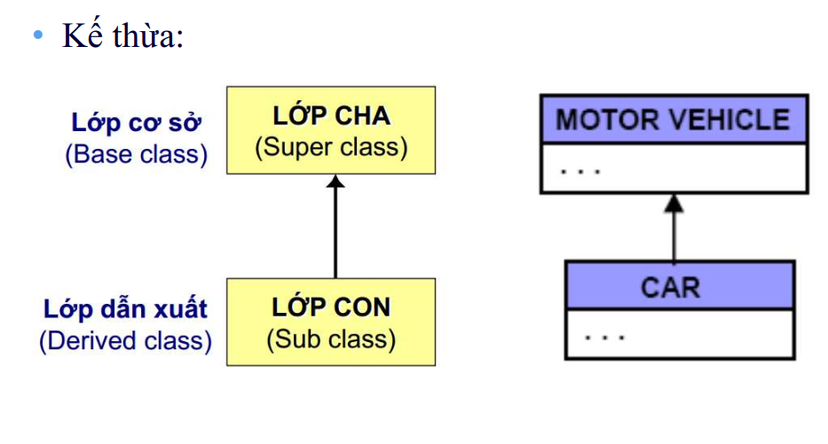

# OOP
## 1. Tính đóng gói

**Quyền truy cập private**

- Thành viên/ phương thức chỉ có thể được truy nhập từ bên trong chính lớp đó

- Tính đóng gói: đóng gói dữ liệu (thuộc tính), che dấu thông tin quan trọng của đối tượng, khai báo ở quyền truy cậ private, nếu muốn đọc/ ghi thì truy cập thông qua method có quyền truy cập là public

```c
Lấy giá trị các thuộc tính private xVal, yVal thông qua hàm get, set
// file Point.cpp
int Point::get_xVal()
{
    return this->xVal;
}
void Point::set_xVal(int value)
{
    this->xVal = value;
}

//file main.cpp
  point1.set_xVal(point2.get_xVal());
  point1.Show();
```

## 2. Tính kế thừa (Inheritance)

Các lớp được định nghĩa kế thừa từ các lớp khác, thực hiện khi biên dịch

- Khái niệm:

Khả năng cho phép xây dựng lớp mới được thừa
hưởng các thuộc tính của lớp đã có;

Các phương thức & thuộc tính được định nghĩa trong
một lớp có thể được sử dụng lại bởi lớp khác.

- Đặc điểm:

Lớp nhận được có thể bổ sung các thành phần;

Hoặc định nghĩa là các thuộc tính của lớp cha.
 
- Các loại thừa kế: Đơn thừa kế & Đa thừa kế


**Chức năng**

- Cho phép lớp dẫn xuất có thể sử dụng các thuộc
tính và phương thức của lớp cơ sở tương tự như
sử dụng thuộc tính và phương thức của mình;

- Cho phép chỉ cần thay đổi phương thức của lớp
cơ sở, có thể sử dụng được ở tất cả các lớp dẫn
xuất;

- Tránh sự cài đặt trùng lặp mã nguồn chương trình;

- Chỉ cần thay đổi mã nguồn một lần khi thay đổi
dữ liệu của các lớp



### 2.1. Các kiểu kế thừa: public, private, protected

- Truy xuất theo chiều ngang: phụ thuộc vào thuộc tính kế thừa của lớp con.

- Kế thừa public:
protected của cha thành protected của con;
public của cha thành public của con; nên sử dụng khi và chỉ khi có quan hệ là một từ lớp con đến
lớp cha.

- Kế thừa private: protected & public cha thành private của con;

- Kế thừa protected: thành phần nào mang thuộc tính này
thì chỉ có các lớp con mới có quyền truy cập

#### 2.2. Kế thừa public


- Các member public của class cha vẫn sẽ là public trong class con.

- Các member protected của class cha vẫn sẽ là protected trong class con.

- Các member private của class cha không thể truy cập trực tiếp từ class con nhưng có thể được truy cập gián tiếp qua các phương thức public hoặc protected của class cha


 

```c
#include <iostream>
#include <string>

using namespace std;

class DoiTuong{
    // private:
    //    string ten;
    //    int id;

    protected:
        string ten;
        int id;

    public:
        DoiTuong(){  
            static int ID = 1;
            id = ID;
            ID++;
        }

        void setName(string _ten){
            // check chuỗi nhập vào
            ten = _ten;
        }

        void display(){
            cout << "ten: " << ten << endl;
            cout << "id: " << id << endl;
        }
};

class SinhVien : public DoiTuong{
    protected:
        string chuyenNganh;

    public:
        void setChuyenNganh(string _nganh){
            chuyenNganh = _nganh;
        }

        void display(){ // override
            cout << "ten: " << ten << endl;
            cout << "id: " << id << endl;
            cout << "chuyen nganh: " << chuyenNganh << endl;
        }
};

class HocSinh : public DoiTuong{
    protected:
        string lop;
   
    public:
        void setLop(string _lop){
            lop = _lop;
        }

        void display(){ // override
            cout << "ten: " << ten << endl;
            cout << "id: " << id << endl;
            cout << "lop: " << lop << endl;
        }
};

class GiaoVien : public DoiTuong{
    protected:
        string chuyenMon;

    public:
        void setChuyenMon(string _mon){
            chuyenMon = _mon;
        }

        void display(){ // override
            cout << "ten: " << ten << endl;
            cout << "id: " << id << endl;
            cout << "chuyen mon: " << chuyenMon << endl;
        }
};

int main(int argc, char const *argv[])
{
    // SinhVien sv1;

    // sv1.ten = "Hoang";
    // sv1.id = 1;
    // sv1.chuyenNganh = "DTVT";

    // cout << "ID: " << sv1.id << endl;
    // cout << "Ten: " << sv1.ten << endl;
    // cout << "Chuyen nganh: " << sv1.chuyenNganh << endl;

    SinhVien sv1;
    sv1.setName("Cuong");
    sv1.setChuyenNganh("21CDT1");
    sv1.display();

    cout << endl;

    HocSinh hs1;
    hs1.setName("Cuong");
    hs1.setLop("12A1 - NguyenHue");
    hs1.display();

    cout << endl;

    GiaoVien gv1;
    gv1.setName("Tru Nguyen");
    gv1.setChuyenMon("TOEIC");
    gv1.display();
    return 0;
}


```
**Giải thích code:**

- 3 lớp SinhVien, HocSinh, GiaoVien được kết thừa từ lớp DoiTuong theo kiểu public

- Điểm chung của 3 lớp: Thuộc tính Ten, Id và phương thức setname()

- Override hàm display() đối với mỗi lớp:

Lớp dẫn xuất có thể định nghĩa lại một hàm
thành viên của lớp cơ sở mà nó được thừa kế.

• Khi đó nếu tên hàm được gọi đến trong lớp
dẫn xuất thì trình biên dịch sẽ tự động gọi đến
phiên bản hàm của lớp dẫn xuất.

• Muốn truy cập đến phiên bản hàm của lớp cơ
sở từ lớp dẫn xuất thì sử dụng toán tử định
phạm vi và tên lớp cơ sở trước tên hàm.


#### 2.2. Kế thừa private

- Các member public, protected của class cha sẽ trở thành private trong class con.

- Các member private của class cha không thể truy cập trực tiếp từ class con nhưng có thể được truy cập gián tiếp qua các phương thức public hoặc protected của class cha.

public -> private
protected -> private

```c
#include <iostream>
#include <string>

using namespace std;

class DoiTuong{
    protected:
        string ten;
        int id;

    public:
        DoiTuong(){  
            static int ID = 1;
            id = ID;
            ID++;
        }

        void setName(string _ten){
            // check chuỗi nhập vào
            ten = _ten;
        }

        void display(){
            cout << "ten: " << ten << endl;
            cout << "id: " << id << endl;
        }
};

class SinhVien : private DoiTuong{
    protected:
        string chuyenNganh;

    public:
        void setChuyenNganh(string _nganh){
            chuyenNganh = _nganh;
        }

        void setNameSV(string _ten){
            ten = _ten;
        }

        void display(){ // override
            cout << "ten: " << ten << endl;
            cout << "id: " << id << endl;
            cout << "chuyen nganh: " << chuyenNganh << endl;
        }
};

int main(int argc, char const *argv[])
{
    SinhVien sv1;
    sv1.setNameSV("Trung");
    sv1.setChuyenNganh("TDH");
    sv1.display();
    return 0;
}

```


#### 2.3. Kế thừa protected

- Các member public, protected của class cha sẽ là protected trong class con.

- Các member private của class cha không thể truy cập trực tiếp từ class con nhưng có thể được truy cập gián tiếp qua các phương thức public hoặc protected của class cha.

public -> protected
protected -> protected

#### 2.4. Đa kế thừa

- 1 class kết thừa từ nhiều class khác nhau


```c
#include <iostream>

using namespace std;

class Sensor {
public:
    void initialize() {
        cout << "Initializing sensor" << endl;
        // code khởi tạo cảm biến
    }

    int readData() {
        cout << "Reading sensor data" << endl;
        // code đọc dữ liệu cảm biến
        return 30;
    }

    void test();
};

class Communication {
public:
    void setupCommunication() {
        cout << "Setting up communication protocol" << endl;
        // code thiết lập giao thức truyền thông (SPI, I2C, UART,...)
    }

    void sendData(int data) {
        cout << "Sending data: " << data << endl;
        // code gửi dữ liệu qua các giao thức
    }

    void test();
};

class Control : public Sensor, public Communication
{
public:
    Control() {
        setupCommunication();
        initialize();
        
        int data = readData();
        sendData(data);
    }
};

int main(int argc, char const *argv[])
{
    Control sensorControl;

    sensorControl.test();

    return 0;
}

```

**Giải thích code:**

- Class Control kế thừa các thuộc tính, phương thức và thuộc tính từ  class Sensor & Communication

- Khi gọi hàm test(), trình biên dịch không biết là đang gọi hàm nào -> sự mơ hồ trong đa thừa kế (diamond problem)

## 3. Tính trừu tượng

- Tính trừu tượng đề cập đến việc ẩn đi các chi tiết cụ thể của một đối tượng và chỉ hiển thị những gì cần thiết để sử dụng đối tượng đó.

- Ẩn đi các hàm, các quá trình trung gian, logic xử lí và thuật toán

```c
#include <iostream>
#include <string>
#include <cmath>

using namespace std;

class GiaiPhuongTrinh{
    private:	// a,b,c,x1,x2,delta: tính đóng gói
        double a;
        double b;
        double c;
        double x1;
        double x2;
        double delta;
        void tinhNghiem(){	// tính trừu tượng
            delta = b*b - 4*a*c;
            if (delta < 0){
                delta = -1;
            }
            else if (delta == 0){
                x1 = x2 = -b/ (2*a);
            }
            else if (delta > 0){
                x1 = (-b + sqrt(delta))/(2*a);
                x2 = (-b - sqrt(delta))/(2*a);
            }
        }
       
    public:
        void enterNumber(double num_a, double num_b, double num_c);
        void printResult();

};

void GiaiPhuongTrinh::enterNumber(double num_a, double num_b, double num_c){
    a = num_a;
    b = num_b;
    c = num_c;
}

void GiaiPhuongTrinh::printResult(){
    tinhNghiem();
    if (delta == -1){
        cout << "PT vo nghiem" << endl;
    }
    else if (delta == 0){
        cout << "PT co nghiem chung: " << x1 << endl;
    }
    else if (delta > 0){
        cout << "PT co 2 nghiem: \n";
        cout << "x1: " << x1 << endl;
        cout << "x2: " << x2 << endl;
    }
}
int main()
{
  GiaiPhuongTrinh phuongtrinh1;
  phuongtrinh1.enterNumber(1,5,4);
  phuongtrinh1.printResult();
  return 0;
}


```

- Hàm tính nghiệm chứa các công thức tính toán được ẩn đi.

## 4. Tính đa hình

- “Polymorphism” có nghĩa “nhiều hình thức”, hay “nhiều
dạng sống”;

- Một vật có tính đa hình (polymorphic) là vật có thể xuất
hiện dưới nhiều dạng;

- Tính đa hình ( Polymorphism) có nghĩa là "nhiều dạng" và nó xảy ra khi chúng ta có nhiều class có liên quan với nhau thông qua tính kế thừa.

- Tính đa hình có thể được chia thành hai loại chính:

**Đa hình tại thời điểm biên dịch (Compile-time Polymorphism).**

**Đa hình tại thời điểm chạy (Run-time Polymorphism).**

### Đa hình tại thời điểm chạy (Run-time Polymorphism).

- ***upcast***  là quá trình tương tác với thể hiện của lớp
dẫn xuất như thể nó là thể hiện của lớp cơ sở. (con trỏ từ lớp cha trỏ đến đối tượng thuộc về lớp con)

-  Cụ thể, đây là việc đổi một con trỏ (hoặc tham
chiếu) tới lớp dẫn xuất thành một con trỏ (hoặc
tham chiếu) tới lớp cơ sở

```c
    DoiTuong *dt = &sv1; // up-casting
    dt->display();

    DoiTuong *dt1[3] = {&sv1, &hs1, &gv1};

    for (size_t i = 0; i < 3; i++)
    {
        dt1[i] ->display();
    }
    
```

Kết quả:

```c
ten: Cuong
id: 1
ten: Cuong
id: 2
ten: Tru Nguyen
id: 3
```
-> Chỉ xuất ra 2 thuộc tính (mất dữ liệu)

-> Cách xử lý: Sử dụng Virtual Function