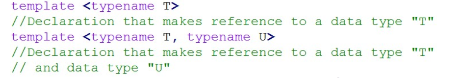

# Template

- Trong C++, function templates là một tính năng mạnh mẽ giúp viết các function hoặc class chung có thể được sử dụng cho nhiều kiểu dữ liệu khác nhau mà không cần phải triển khai nhiều phiên bản của cùng một function hoặc class. 

- 2 loại: ***Function Template, Class Template***

## 1. Function Template

- Khuôn mẫu hàm cho phép định
nghĩa các hàm tổng quát dùng đến các kiểu dữ liệu
tùy ý;

- Từ khóa template được theo sau bởi 1 cặp <> chứa tên
của các kiểu dữ liệu tùy ý được cung cấp

- 1 template chỉ áp dụng đối với 1 hàm



```c
#include <iostream>

using namespace std;

int sum(int a, int b)
{
    return a+b;
}

double sum(double a, double b)
{
    return a+b;
}

template <typename T>
T sum(T a, T b)
{
    return a+b;
}


int main(int argc, char const *argv[])
{
    cout << sum(1,2) << endl;
    cout << sum(1.5, 3.6) << endl;
    return 0;
}


```

- Trong quá trình compile - time, template sẽ dựa vào biến truyền vào hàm để chọn hàm có kiểu dữ liệu tương ứng đã được khai báo & định nghĩa trước đó

**Khi gặp lời gọi hàm sum (int, int)**

- Trình biên dịch tìm xem có 1 hàm HV() được khai báo
với 2 tham số kiểu int hay không:

 Nó không tìm thấy 1 hàm thích hợp, nhưng tìm thấy 1 template
có thể dùng được.

- Tiếp theo, nó xem xét khai báo của template HV() để
xem có thể khớp được với lời gọi hàm hay không:

 Lời gọi hàm cung cấp 2 tham số thuộc cùng 1 kiểu int;

 Trình biên dịch thấy template chỉ ra 2 tham số thuộc cùng kiểu
T, nên nó kết luận rang T phải là kiểu int;

 Do đó, trình biên dịch kết luận rằng template khớp với lời gọi
hàm.

**Khai báo template đối với nhiều kiểu dữ liệu**

```c
template <typename T>
T divide(T a, T b){}

template <typename T1, typename T2>
auto sum(T1 a, T2 b)
{
    return a+b;
}

template <typename T1, typename T2, typename T3>
auto sum(T1 a, T2 b, T3 c)
{
    return a+b+c;
}
```
**Từ khóa auto**

- Trình biên dịch tự động suy diễn kiểu dữ liệu (trong compile-time), trong gcc ở tiền xử lí

- Khi khai báo biến phải có giá trị truyền vào

- `auto sum(T1 a, T2 b, T3 c)`: chỉ cần 1 trong 3 có kiểu dữ liệu double -> Template trả về kiểu double

**Định nghĩa kiểu dữ liệu mặc định trong Function Template**

```c
// tham số mặc định
template <typename T = int>
T square(T x)
{
    return x * x;
}
```


`template <typename T = int>`, nếu không chỉ định kiểu dữ liệu -> mặc định là kiểu int

**Chuyên biệt hóa**

- Định nghĩa Template cho 1 kiểu dữ liệu duy nhất

- Muốn sử dụng template chuyên biệt, phải định nghĩa 1 template cho các dữ liệu còn lại

```c
// chuyên biệt hóa
template <typename T>
void display(T value)
{
    cout << value << endl;
}

// Chuyên biệt hóa cho kiểu 'const char*'
template <>
void display<const char*>(const char *str)
{
    cout << "String: " << str << endl;
}

// Chuyên biệt hóa cho kiểu 'int'
template <>
void display<int>(int value)
{
    cout << value << endl;
}
```

## 2. Class Template (cũng áp dụng cho Struct)

```c
#include <iostream>
#include <string>

using namespace std;

template <typename T>
class Sensor
{
    private:
        T value;

    public:
        Sensor(T init): value(init){}

        T readSensor(T newValue);

        T getValue() const;

        void display()
        {
            cout << "Giá trị cảm biến: " << getValue() << endl;
        }
};

template <typename type>
type Sensor<type>::readSensor(type newValue)
{
    this->value = newValue;
}

template <typename T>
T Sensor<T>::getValue() const{ return value; }


template <typename T>
class Printer 
{
    public:
        void print(T value) 
        {
            cout << "Generic: " << value << endl;
        }
};

// Chuyên biệt hóa cho kiểu std::string
template <>
class Printer<string> 
{
    public:
        void print(string value) 
        {
            cout << "String specialization: " << value << endl;
        }
};


int main(int argc, char const *argv[])
{
    Sensor<int> tempSensor1(36.5);
    tempSensor1.display();

    Sensor tempSensor3(26.7);
    tempSensor3.display();

    Sensor<double> tempSensor2(25);
    tempSensor2.display();

    Sensor stateSensor("ON");
    stateSensor.display();

    return 0;
}

```

- Dữ liệu cảm biến để kiểu tổng quá là kiểu T (int, double, string, const char*...)

```c
 Sensor<int> tempSensor1(36.5);
    tempSensor1.display();
```

- Quy định kiểu dữ liệu int/ gán ngầm định không quy định kiểu dữ liệu

```c
template <typename type>
type Sensor<type>::readSensor(type newValue)
{
    this->value = newValue;
}

template <typename T>
T Sensor<T>::getValue() const{ return value; }
```

- Định nghĩa các phương thức bên ngoài class

### Chuyên biệt hóa trong Class Template

```c
template <typename T>
class Printer 
{
    public:
        void print(T value) 
        {
            cout << "Generic: " << value << endl;
        }
};

// Chuyên biệt hóa cho kiểu std::string
template <>
class Printer<string> 
{
    public:
        void print(string value) 
        {
            cout << "String specialization: " << value << endl;
        }
};
```

- Tương tự, phải tạo class riêng để đáp ứng cho tất cả các kiểu dữ liệu

### Ex3

- Quản lý giá trị cảm biến gửi về thông qua Template

```c
class Sensor{
    public:
        virtual double getValue() const = 0;

        virtual string getUnit() const = 0;
};
```

- Abstract class đại diện chung

```c
// Class đại diện cho cảm biến nhiệt độ (Temperature Sensor)
class TemperatureSensor : public Sensor{
    private:
        double temp;

    public:
        double getValue() const override{
            // temp = 30.3;
            return 40.5; // Giá trị cảm biến giả định
        }

        string getUnit() const override{
            return "Celsius";
        }
};
```

- Class đại diện cho cảm biến nhiệt độ (Temperature Sensor), đọc giá trị cảm biến, dùng từ khóa constant (do giá trị không thay đổi)

```c
template<typename Sensor1, typename Sensor2>
class VehicleSensors{
    private:
        Sensor1 sensor1;  // Đối tượng cảm biến 1
        Sensor2 sensor2;  // Đối tượng cảm biến 2

    public:
        // Constructor nhận vào hai đối tượng cảm biến
        VehicleSensors(Sensor1 s1, Sensor2 s2) : sensor1(s1), sensor2(s2) {}

        // Hàm hiển thị thông tin của cả hai cảm biến
        void displaySensorsInfo() const {
            cout << "Sensor 1 Value: " << sensor1.getValue() << " " << sensor1.getUnit() << endl;
            cout << "Sensor 2 Value: " << sensor2.getValue() << " " << sensor2.getUnit() << endl;
        }
};

```

- Tạo Class Template để quản lý 2 cảm biến khác nhau, truyền vào 2 đối tượng cảm biến vừa tạo

### Ex4: Kết hợp Template & variadic macro (định nghĩa, khai báo, truy xuất kiểu dữ liệu)

`template <typename T, typename... Args>`: định nghĩa nhiều kiểu dữ liệu khác nhau, tổng quát, không biết được bao nhiêu

 * typename... : định nghĩa nhiều kiểu dữ liệu tổng quát
 * Args... : đại diện cho nhiều kiểu dữ liệu khi truyền vào hàm
 * args... : đại diện cho nhiều tham số truyền vào hàm

```c
    cout << sum(1, 2, 3.5, 4, 5.5) << endl;
    /*
     * Lần 1: first = 1,    args... = 2, 3.5, 4, 5.5 --> 1 + sum(2, 3.5, 4, 5.5)
     * Lần 2: first = 2,    args... = 3.5, 4, 5.5    --> 1 + 2 + sum(3.5, 4, 5.5)
     * Lần 3: first = 3.5,  args... = 4, 5.5         --> 1 + 2 + 3.5 + sum(4, 5.5)
     * Lần 4: fisrt = 4,    args... = 5.5            --> 1 + 2 + 3.5 + 4 + sum(5.5)
     * Lần 5: value = 5.5                            --> 1 + 2 + 3.5 + 4 + 5.5 = 
     */

```

- Ở lần 5, hàm chỉ còn 1 đối số nên không thể gọi auto sum -> cần định nghĩa hàm sung có 1 đối số

- Thực tế là cộng ngược lại vì biến được lưu ở Stack

```c
template <typename... Args>
void count(Args... args)
{
    cout << "Sô lượng tham số:  " << sizeof...(args) << endl;
}
```

- Đếm số lượng tham số

### Ex5: All of Template

```c
// Định nghxia class khi có ít nhát 1 dối số
class MyClass<T, Args...> : public MyClass<Args...>
```

- Kế thừa từ chính bản thân nó nhưng ít đi 1 tham số (đệ quy trong class)

```c
/*
 * Lần 1: 
 *      + T = int, Args... = double, char
 *      + first = 1, args... = 2.5, 'A'
 *      --> In ra: 1                        --> MyClass<double, char>(2.5, 'A')
 * 
 * Lần 2:
 *      + T = double, Args... = char
 *      + first = 2.5, args... = 'A'
 *      --> In ra: 1 2.5                    --> MyClass<char>('A')
 * 
 * Lần 3:
 *      + T = char, Args... không còn
 *      + first = 'A', args... không còn
 *      --> In ra: 1 2.5 'A'                --> MyClass<>
 * 
 * Lần 4: 
 *      --> In ra: 1 2.5 'A' No arguments
 */
```