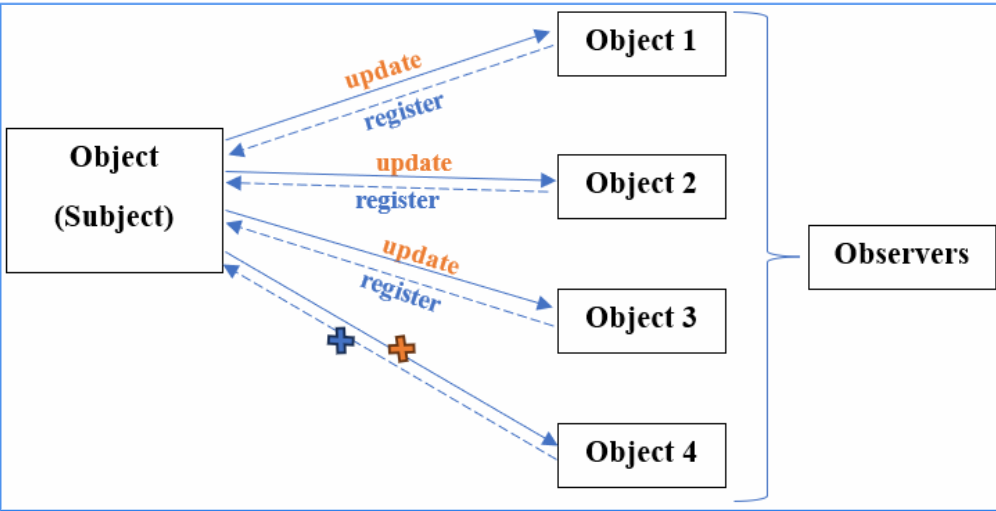

[text](https://docs.google.com/presentation/d/1tKHvHQhobCC2wIHaE_VpEQzvqPVt6d2s/edit?usp=sharing&ouid=112023306400142991703&rtpof=true&sd=true)


# Design Pattern

Design Patterns là các giải pháp tổng quát cho các vấn đề phổ biến trong phát triển phần mềm. Chúng là một dạng "công thức" giúp các lập trình viên xử lý các tình huống thường gặp trong quá trình thiết kế.

Bao nhiêu đối tượng?

Cách thức khởi tạo?

Tương tác đối tượng?

## 1. Creational Patterns (Mẫu khởi tạo): Quản lý việc khởi tạo đối tượng

### 1.1. Singleton

- Đảm bảo rằng một lớp chỉ có một đối tượng duy nhất được tạo ra

- Cung cấp một phương thức để truy cập đến đối tượng đó từ bất kỳ đâu trong chương trình.

```c
#include <iostream>

using namespace std;

void gpio_init()
{
    cout << "Configuration GPIO" << endl;
}

class GPIOManager
{
    // khai báo consructor là private để ngăn gọi đối tượng từ bên ngoài, chỉ gọi thông quá các method
    private:
        GPIOManager(){
            gpio_init();
        }

        static GPIOManager *instance;  // static có thể truy cập đượ tại bất cứ đâu

    public:
        static GPIOManager* createObj() // static method
        {
            if(instance == nullptr)
            {
                instance = new GPIOManager();
            }

            return instance;
        }
};

GPIOManager* GPIOManager::instance = nullptr;

int main(int argc, char const *argv[])
{
    GPIOManager::createObj(); // khởi tạo đối tượng 1 lần duy nhất thông qua static method
    return 0;
}

```

-->> Cấu hình GPIO 1 lần duy nhất
📌 Đặc điểm singleton:

- Contructor nằm ở phạm vi private

- Có 1 static method để khởi tạo đối tượng

- Có 1 static property và là con trỏ để quản lý đối tượng duy nhất được khởi tạo

### 1.2. Factory Pattern

- Giả sử bạn có một hệ thống làm việc với nhiều loại cảm biến như cảm biến nhiệt độ, độ ẩm, và áp suất. Mỗi loại cảm biến sẽ có một cách khởi tạo và đọc dữ liệu riêng. Nếu chúng ta cần viết mã cho mỗi loại cảm biến, sẽ phải nhớ tên cụ thể của từng loại và cách khởi tạo chúng.

-->> Cách thức khởi tạo đối tượng

- Thay vì khởi tạo trực tiếp các đối tượng, Factory Pattern sử dụng một phương thức hoặc một lớp trung gian (Factory) để quyết định loại đối tượng nào sẽ được khởi tạo dựa trên tham số đầu vào hoặc logic cụ thể

```c
#include <iostream>

using namespace std;

class Sensor
{
    public:
        // phương thức ảo thuần túy đọc dữ liệu cảm biến
        virtual void readData() = 0; 
};

class TemperatureSensor : public Sensor
{
    public:
        // Đọc dữ liệu cảm biến nhiệt độ
        void readData() override
        {
            cout << "reading temp Data..." << endl;
            // cấu hình, logic xử lý
        }
};

class HumiditySensor : public Sensor
{
    public:
        // Đọc dữ liệu cảm biến độ ẩm
        void readData() override
        {
            cout << "reading humidity Data..." << endl;
            // cấu hình, logic xử lý
        }
};

class PressureSensor : public Sensor
{
    public:
        // Đọc dữ liệu cảm biến áp suất
        void readData() override
        {
            cout << "reading pressure Data..." << endl;
            // cấu hình, logic xử lý
        }
};

// ứng dụng Factory pattern vào

typedef enum
{
    TEMP,
    PRES,
    HUMI
} SensorType;

class SensorFactory
{
    public:
        static Sensor* createSensor(SensorType type) // gọi thông qua static method
        {
            switch  (type)
            {
                case SensorType::TEMP:
                    return new TemperatureSensor();

                case SensorType::PRES:
                    return new PressureSensor();
                
                case SensorType::HUMI:
                    return new HumiditySensor();

                default:
                    cout<< "Không hợp lệ \n";
                    return nullptr;
            }
        }
};

int main(int argc, char const *argv[])
{
     Sensor* sensor1 = SensorFactory::createSensor(SensorType::TEMP); // tạo đối tượng cảm biến
     sensor1->readData();
    return 0;
}

```

 - Quản lí cách thức khởi tạo đối tượng
 
- Có một phương thức tĩnh createSensor(), giúp tạo ra đối tượng cảm biến theo kiểu SensorType.

Tại sao dùng static?
→ Để có thể gọi createSensor() mà không cần tạo đối tượng SensorFactory.

## 2. Behaviroal Patterns (mẫu hành vi): Xác định cách các đối tượng tương tác với nhau 

### 2.1. Observer

- Ví dụ có 1 cảm biến đọc giá trị và có các hành động kèm theo là hiển thị LCD, điều khiển bật/tắt quạt,....thì có cách nào khi đọc dữ liệu cảm biến thì tự động cập nhật giá trị cho các hành động trên không?

- Observer (quan sát, giám sát): khi một đối tượng thay đổi trạng thái (Object), tất cả các đối tượng phụ thuộc (Observers) vào nó sẽ được tự động thông báo và cập nhật



Code:

[Observer Pattern Code](ObserverPattern.cpp)

### 2.2. MVP Pattern

- Cách giao diện hiển thị hoặc cách thiết bị phản ứng với lệnh

- MVP (Model - View - Presenter) là một mẫu thiết kế thuộc nhóm Behavioral, phổ biến trong lập trình giao diện người dùng (UI) và phát triển ứng dụng. MVP tách biệt các thành phần của ứng dụng thành ba phần chính: Model, View, và Presenter. Cấu trúc này giúp dễ dàng quản lý, kiểm thử, và bảo trì mã nguồn.

-->> Tách việc xử lí và hiển thị