# Advance_C_Cpp
Contents

<details>
<summary>LESSON 1: COMPILER - MACRO</summary> 

---

**I. Compiler**
- Là quá trình chuyển đổi ngôn ngữ bậc cao sang ngôn ngữ máy.
- Gồm 4 giai đoạn


***Preprocessor (tiền xử lý)***: `gcc -E main.c -o main.i`. Các file trong source code (a.c, a.h, b.h, b.c, main.c,…) sẽ được biên dịch thành 1 file main.i. Ở giai đoạn này, trình biên dịch sẽ:

- Copy toàn bộ file thư viện (ví dụ #include <stdio.h>, #include “hello.h”,…)
- Thay thế các nội dung được #define 
- Xoá toàn bộ chú thích, các hàm và biến khai báo được giữ nguyên.

***Compiler***: File main.i được biên dịch thành file main.s (bao gồm các dòng lệnh được viết bằng ngôn ngữ assembly)


***Assembler***: Biên dịch ngôn ngữ assembly trong file main.s thành ngôn ngữ máy (file main.o)

***Linker***: 1 hoặc nhiều main.o sẽ được liên kết lại thành file thực thi (.exe)

---

**II. Macro**
-	Macro là một khái niệm dùng để định nghĩa một tập hợp các hướng dẫn tiền xử lý
-	Dùng để thay thế một chuỗi mã nguồn bằng một chuỗi khác trước khi chương trình biên dịch.
-	Giúp giảm lặp lại mã, dễ bảo trì chương trình.
-	Macro được định nghĩa bằng cách sử dụng chỉ thị tiền xử lý #define
-	Trong C, macro chia làm 3 loại: chỉ thị bao hàm tệp, chỉ thị định nghĩa, chỉ thị biên dịch có điều kiện.

**1. Chỉ thị bao hàm tệp (#include)** 
-	Gồm 2 loại:
    \*  <> (ví dụ #include <stdio.h>): khi run code, trình biên dịch tìm đến vị trí đã cài đặt file thư viện stdio.h trong bộ nhớ máy tính, sau đó sao chép toàn bộ nội dung file này vào file .i
    \* “…”: tìm trong thư mục chứ dự án hiện tại file nào có tên … sau đó sao chép toàn bộ nội dung file này vào file .i

    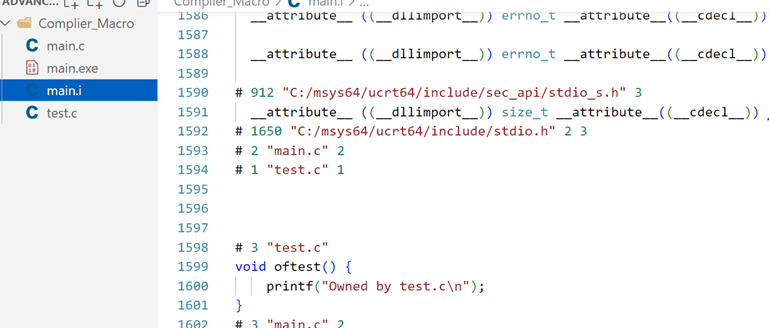

**2. Chỉ thị định nghĩa**

***#define***: Định nghĩa, thay thế một tên, biến hoặc hàm 
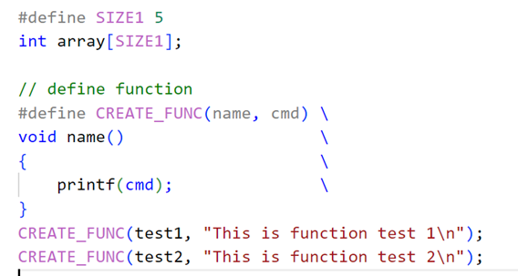
-	Định nghĩa  giá trị của SIZE1 là 5 và  định nghĩa hàm

-	Sau giai đoạn tiền xử lý, nội dung được define ở file .c được thay thế vào trong file .i

***undef***: hủy định nghĩa của một macro đã được định nghĩa trước đó bằng #define
```c
#include <stdio.h>

#define SIZE1 5

int main(int argc, char const *argv[])
{
    printf("SIZE1 = %d\n", SIZE1);

    #undef SIZE1

    #define SIZE1 50

    printf("SIZE1 = %d\n", SIZE1);
    /* code */
    return 0;
}
```
**3. Chỉ thị biên dịch có điều kiện**

**3.1.**

***#if*** sử dụng để bắt đầu một điều kiện tiền xử lý.
- Nếu điều kiện trong ***#if*** là đúng, các dòng mã nguồn sau ***#if*** sẽ được biên dịch
- Nếu sai, các dòng mã nguồn sẽ bị bỏ qua đến khi gặp ***#endif***

***#elif*** dùng để thêm một điều kiện mới khi điều kiện trước đó trong ***#if*** hoặc ***#elif*** là sai

***#else*** dùng khi không có điều kiện nào ở trên đúng.

Ví dụ
```c
#include <stdio.h>

#define ESP32 1
#define STM32 2
#define ATmega 3

#define MCU STM32

int main(int argc, char const *argv[])
{
    while (1)
    {
        #if MCU == STM32
            printf("STM32");
        
        #elif MCU == ESP32
            printf("ESP32");
        
        #else 
            printf("0");

        #endif

    }
    return 0;
}
```
**3.2.**

***#ifdef*** và ***#ifndef*** thường được sử dụng trong tạo file thư viện, tránh việc định nghĩa mã nguồn nhiều lần gây lỗi trong quá trình tiền xử lý file .i

- ***#ifdef*** dùng để kiểm tra một macro đã được định nghĩa hay chưa, nếu macro đã được định nghĩa thì mã nguồn sau #ifdef sẽ được biên dịch.
- ***#ifndef*** dùng để kiểm tra một macro đã được định nghĩa hay chưa, nếu macro chưa được định nghĩa thì mã nguồn sau #ifndef sẽ được biên dịch.
Ví dụ
```c
#ifndef TEST_H
#define TEST_H

void display();

#endif
```
**3. Một số toán tử trong macro**

***a##b***: nối chuỗi

***#x***: chuẩn hóa chuỗi

Ví dụ
```c
#include<stdio.h>

#define concatenate(a,b) a##b

#define tostring(c) #c
int main(int argc, char const *argv[])
{
    int giatri = 10;

    // nối 'gia' và 'tri' thành 'giatri'
    printf("giatri = %d\n", concatenate(gia,tri));

    // chuẩn hóa chuỗi
    printf("chuỗi đã chuẩn hóa: %s\n", tostring(abc));
    return 0;
}
```

***Variadic macro***
- Là một dạng macro cho phép nhận một số lượng biến tham số có thể thay đổi.
- Giúp định nghĩa các macro có thể xử lý một lượng biến đầu vào khác nhau, dùng cho những hàm có tham số không xác định.

Ví dụ:

\__VA_ARGS__ sẽ thay thế vào dấu ...
```c
#include<stdio.h>

#define count_args(...) (sizeof(int[]){__VA_ARGS__}/sizeof(int));

#define sum(...)                \
int arr[] = {__VA_ARGS__};      \
int SUM = 0;                    \
int n = count_args(__VA_ARGS__);\
int i = 0;\
for(i = 0; i<n; i++)            \
{                               \
    SUM += arr[i];             \
}                               \
printf("SUM = %d\n", SUM);      \

int main(int argc, char const *argv[])
{
    sum(1,2,0,3,4);
    return 0;
}
```
</details>

<details>
<summary>LESSON 2: STDARG - ASSERT</summary>

**1. Thư viện starg**

- Tương tự variadic macro
- Cung cấp các phương thức để làm việc với các hàm có số lượng tham số đầu vào không cố định

Ví dụ:

***Cách 1:***

```c
#include <stdio.h>
#include <stdarg.h>

int sum(int count, ...)
{
    va_list args;

    va_start(args, count);

    int result = 0;

    for(int i = 0; i < count; i++)
    {
        result += va_arg(args, int);
    }

    va_end(args);
    
    return result;
}

int main(int argc, char const *argv[])
{
    printf("Tong = %d\n", sum(5, 0, 1, 3, 5, 6));
    return 0;
}
```
***

Giải thích:

- va_list: 

    ✦ Kiểu dữ liệu để đại diện cho danh sách đối số các biến số. Trong thư viện được định nghĩa là: ```typedef char* args;```, con trỏ args trỏ đến chuỗi được truyền vào hàm sum ```(args = "int count, 0, 1, 3, 5, 6")```, các kí tự trong chuỗi có địa chỉ liền kề nhau.

    ✦ Ví dụ `0xa0 ('i') 0xa1('n') 0xaa('1')`

- va_start: Bắt đầu một danh sách đối số biến đổi. Nó cần được gọi trước khi truy cập các đối số biến đổi đầu tiên. ```va_start(args, count);```

    ✦ Truyền vào 2 tham số con trỏ `args` và nhãn `count`. Trình biên dịch sẽ so sánh từng kí tự  của 2 chuỗi `"int count, 0, 3, 5, 6, 7"` và `"count"`. Con trỏ `args` sẽ truy cập đến từng địa chỉ của từng kí tự trong chuỗi, lấy ra giá trị được lưu sau đó sẽ so sánh với kí tự trong label `"count"` được truyền vào.

    ✦ Sau bước này chuỗi `"int count, 0, 3, 5, 6, 7"` được tách thành `"0, 3, 5, 6, 7"` (chỉ còn những tham số thay đổi)

- va_arg(args, int): Truy cập một đối số trong danh sách. Hàm này nhận một đối số của kiểu được xác định bởi tham số thứ hai

    ✦ Mỗi lần được gọi sẽ tách lần lượt từng kí tự trong chuỗi, sau đó ép kiểu về kiểu dữ liệu được khai báo bởi tham số thứ hai
    
    ✦ Ví dụ gọi lần thứ nhất lấy kí tự `'0'`, gọi lần thứ hai lấy kí tự `'3'`

- va_end: Kết thúc việc sử dụng danh sách đối số biến đổi. Nó cần được gọi trước khi kết thúc hàm.

    ✦ Thu hồi lại địa chỉ của con trỏ args

***Cách 2***

```c
/*
Tính tổng của một dãy số bất kì sử dụng thư viện stdarg nhưng tối ưu hơn
Bắt đầu từ giá trị của count kết thúc khi gặp số 0
*/
#include <stdio.h>
#include <stdarg.h>

#define tong(...) sum(__VA_ARGS__, 0)

int sum(int count,...)
{
    va_list args;

    va_start(args, count);

    int result = count; // bắt đầu tính tổng từ count
    int value;

    while((value = va_arg(args, int)) != 0)
    {
        result += value;
    }

    va_end(args);

    return result;
}

int main(int argc, char const *argv[])
{
    printf("Tong = %d\n", tong(3, 2, 4, 5, 7)); // sum(3, 2, 4, 5, 7, 0)
    return 0;
}
```

***Cách 3: loại bỏ nhược điểm gặp số 0 là dừng của cách 2***

```c
/*
Tính tổng của một chuỗi bất kì 
*/
#include <stdio.h>
#include <stdarg.h>

#define tong(...) sum(__VA_ARGS__, '\n')

int sum(int count,...)
{
    va_list args;
    va_list check;

    va_start(args, count);

    va_copy(check, args);

    int result = count; // bắt đầu tính tổng từ count
    int value;

    while(( va_arg(check, char*)) != (char*)'\n')
    {
        result += va_arg(args, int);
    }

    va_end(args);

    return result;
}

int main(int argc, char const *argv[])
{
    printf("Tong = %d\n", tong(3, 2, 4, 0, 5, 6)); // sum(3, 2, 4, 0, 5, 7, '/n')
    return 0;
}
```
- Khai báo thêm 1 con trỏ check trỏ đến chuỗi `"int count, 3, 2, 4, 0, 5, 6"`
- Sử dụng thêm hàm `var_copy`: sao chép địa chỉ mà con trỏ args đang trỏ tới, thao tác với con trỏ check

📌 Code ứng dụng thư viện stdarg trong thực tế, đọc và xử trí tín hiệu và giá trị của các cảm biến

```c
#include <stdio.h>
#include <stdarg.h>

typedef enum {
    TEMPERATURE_SENSOR,
    PRESSURE_SENSOR
} SensorType;

void processSensorData(SensorType type, ...) {
    va_list args;
    va_start(args, type);

    switch (type) {
        case TEMPERATURE_SENSOR: {
            int numArgs = va_arg(args, int);
            int sensorId = va_arg(args, int);
            float temperature = va_arg(args, double); // float được promote thành double
            printf("Temperature Sensor ID: %d, Reading: %.2f degrees\n", sensorId, temperature);
            if (numArgs > 2) {
                // Xử lý thêm tham số nếu có
                char* additionalInfo = va_arg(args, char*);
                printf("Additional Info: %s\n", additionalInfo);
            }
            break;
        }
        case PRESSURE_SENSOR: {
            int numArgs = va_arg(args, int);
            int sensorId = va_arg(args, int);
            int pressure = va_arg(args, int);
            printf("Pressure Sensor ID: %d, Reading: %d Pa\n", sensorId, pressure);
            if (numArgs > 2) {
                // Xử lý thêm tham số nếu có
                char* unit = va_arg(args, char*);
                printf("Unit: %s\n", unit);
            }
            break;
        }
    }

    va_end(args);
}

int main() {
    processSensorData(TEMPERATURE_SENSOR, 2, 1, 36.5, "Room Temperature");
    processSensorData(PRESSURE_SENSOR, 2, 2, 101325);
    return 0;
}
```
***

**2. Thư viện Assert**

- Dùng để phát hiện lỗi, debug chương trình, thể hiện lỗi cụ thể ở một vị trí cụ thể trong code
- Nếu điều kiện đúng (true), không có gì xảy ra và chương trình tiếp tục thực thi.
- Nếu điều kiện sai (false), chương trình dừng lại và thông báo một thông điệp lỗi.

📌 Ví dụ 1: 

```c
#include <stdio.h>
#include <assert.h>

int main(int argc, char const *argv[])
{
    
    int x = 5;

    assert(x == 5);

    //chương trình chỉ thực thi khi điều kiện đúng
    printf("X = %d", x);
    return 0;
}
```
*Output*

`X = 5`

📌 Ví dụ 2:

```c
#include <stdio.h>
#include <assert.h>

int main(int argc, char const *argv[])
{
    
    int x = 5;

    assert(x > 10 && "X phải lớn hơn 10" );

    //chương trình chỉ thực thi khi điều kiện đúng
    printf("X = %d", x);
    return 0;
}
``` 
*Output*

`Assertion failed: x > 10 && "X phải lớn hơn 10", file Assert2.c, line 9`

- Macro assert dùng để debug:
`#define LOG(condition, cmd) assert(condition && #cmd)`

📌 Ví dụ: Thiết lập level nằm trong khoảng cho phép

```c
#include <assert.h>

#define ASSERT_IN_RANGE(val, min, max) assert((val) >= (min) && val <= (max))

void set_level(int level)
{
    ASSERT_IN_RANGE(level, 1, 10);
    // thiết lập cấp độ bằng macro assert
}
```

</details>


<details>
<summary>LESSON 3: BITMASK </summary> 

### Bit mask

📌 Để tối ưu hóa bộ nhớ khi khai báo biến trong C, ta khai báo thư viện `#include <stdint.h>`, một số kiểu dữ liệu trong thư viện
```c
/*
    int, int32_t, uint32_t: 4 byte
    int8_t, uint8_t: 1 byte
    int16_t, uint16_t: 2 byte
*/
```
📌 Bit mask một kỹ thuật sử dụng các bit để lưu trữ và thao tác với các cờ (flags) hoặc trạng thái (thao tác trên bit).

Ví dụ:

```c
/*
    uint8_t PORT_A = 0b00001101 (1 byte)
    bit 0: Pin_A0
    bit 1: Pin_A1 
    bit 2: Pin_A2
    .
    .
    .
    bit 8: Pin_A8

    Thao tác trên cụm bit này -> bit mask -> tối ưu hóa bộ nhớ
*/
```
📌 Các toán tử bitwise

- `AND (&), OR(|), XOR(^), NOT(~)`

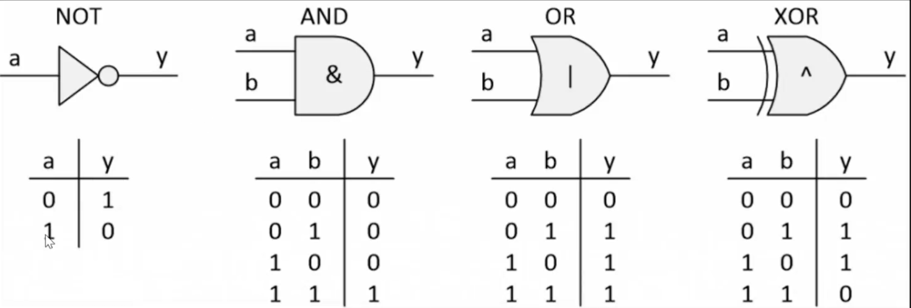

Ví dụ:

```c
uint8_t A = 0b01001001;
uint8_t B = 0b11101111;
    /*
    ~A = 0b10110110;
    A&B = 0b01001001;
    A|B = 0b11101111;
    A^B = 0b10100110;
    */
```

- `Shift left (<<) và Shift right (>>)`: phép dịch bit
- Trong trường hợp <<, các bit ở bên phải sẽ được dịch sang trái, và các bit trái cùng sẽ được đặt giá trị 0.
- Trong trường hợp >>, các bit ở bên trái sẽ được dịch sang phải, và các bit phải cùng sẽ được đặt giá trị 0 hoặc 1 tùy thuộc vào giá trị của bit cao nhất (bit dấu).

Ví dụ:

```c
uint8_t A = 0b01001001;
uint8_t B = 0b11101111;
    A = A << 2; //0b00100100;
    B = B >> 3; //0b00011101; 
    // bit dấu chỉ có ý nghĩa khi số có dấu (-8)
```

📌 Ví dụ sử dụng bit mask và giải thích

```c

#include <stdio.h>
#include <stdint.h>

/*
    Sử dụng macro và bit wise để khai báo các tính năng
    Phép dịch bit 1 << 0: 0b00000001 << 0
                  1 << 1: 0b00000001 << 1 để khai báo tính năng TSHIRT
    8 tính năng nằm trong 1 byte -> tối ưu bộ nhớ
*/


#define GENDER        1 << 0  // Bit 0: Giới tính (0 = Nữ, 1 = Nam)
#define TSHIRT        1 << 1  // Bit 1: Áo thun (0 = Không, 1 = Có)
#define HAT           1 << 2  // Bit 2: Nón (0 = Không, 1 = Có)
#define SHOES         1 << 3  // Bit 3: Giày (0 = Không, 1 = Có)
// Tự thêm tính năng khác
#define FEATURE1      1 << 4  // Bit 4: Tính năng 1
#define FEATURE2      1 << 5  // Bit 5: Tính năng 2
#define FEATURE3      1 << 6  // Bit 6: Tính năng 3
#define FEATURE4      1 << 7  // Bit 7: Tính năng 4

/*
    Sử dụng bit wise & để bật 1 tính năng mà không ảnh hưởng đến bit khác
    enableFeature(&options, GENDER | TSHIRT | HAT);
    uint8_t options = 0; // 0b00000000
    0b00000000
    &
    0b00000111
    ----------
    0b00000111 -> thao tác với bit mà không ảnh hưởng tới bit khác

*/

void enableFeature(uint8_t *features, uint8_t feature) {
    *features |= feature;
}

/*
    Sử dụng bit wise | để thao tác
    options = 0b00000111;
    disableFeature(&options, TSHIRT);
    0b00000111
    |
   ~0b00000010
   ------------
    0b00000101
*/

void disableFeature(uint8_t *features, uint8_t feature) {
    *features &= ~feature;
}


int isFeatureEnabled(uint8_t features, uint8_t feature) {
    return (features & feature) != 0;
}

void listSelectedFeatures(uint8_t features) {
    printf("Selected Features:\n");

    if (features & GENDER) {
        printf("- Gender\n");
    }
    if (features & TSHIRT) {
        printf("- T-Shirt\n");
    }
    if (features & HAT) {
        printf("- Hat\n");
    }
    if (features & SHOES) {
        printf("- Shoes\n");
    }

    for (int i = 0; i < 8; i++)
    {
        printf("feature selected: %d\n", (features >> i) & 1);
    }
    

    // Thêm các điều kiện kiểm tra cho các tính năng khác
}


int main() {
    uint8_t options = 0;

    // Thêm tính năng 
    enableFeature(&options, GENDER | TSHIRT | HAT);

    disableFeature(&options, TSHIRT);

    // Liệt kê các tính năng đã chọn
    listSelectedFeatures(options);
    
    return 0;
}


```

**Output**

```c
Selected Features:
- Gender
- Hat
feature selected: 1
feature selected: 0
feature selected: 1
feature selected: 0
feature selected: 0
feature selected: 0
feature selected: 0
feature selected: 0
```
- Sử dụng phép dịch bit và macro để khai báo các tính năng (tối ưu bộ nhớ)
- Dùng toán tử bit wise để bật tắt các tính năng mà không ảnh huởng đến tính năng khác, kiểm tra xem tính năng nào đã được bật.

</details>


<details>
<summary>LESSON 4: ADVANCED POINTER</summary> 

### Pointer

- Là biến chứ địa chỉ bộ nhớ của một đối tượng khác (biến, mảng, hàm) -> thao tác trên bộ nhớ 1 cách linh hoạt hơn

- Cách lưu giá trị trong bộ nhớ:

```c
int a = 12; // 0b00000000 00000000 00000000 00001100

0x01 -> 00001100 (LSB)
0x02 -> 00000000
0x03 -> 00000000
0x04 -> 00000000 (MSB)

// float = sign (1 bit) + exponent (8 bits) + mantissa (23 bits)
// double = sign (1 bit) + exponent (11 bits) + mantissa (52 bits)


```

```c

#include <stdio.h>

int main(int argc, char const *argv[])
{
    int test = 2;

    int *ptr = &test;

    printf("Size of pointer: %d bytes\n", sizeof(ptr));

    printf("Address of test: %p\n", &test);
    printf("Address of test: %p\n", ptr);

    printf("Value of test: %d\n", test);
    printf("Value of test: %d\n", *ptr); // dereference

    return 0;
}


```

Output

```c
Size of pointer: 8 bytes
Address of test: 000000DA42BFF974
Address of test: 000000DA42BFF974
Value of test: 2
Value of test: 2
```
- Khai báo con trỏ ptr trỏ đến địa chỉ của biến test

- Toán tử giải tham chiếu lấy ra giá trị của địa chỉ đang trỏ đến

📌 Kích thước của con trỏ phụ thuộc vào kiến trúc máy tính và trình biên dịch hoặc kiến trúc vi xử lý.

- Vì đang sử dụng máy tính cá nhân 64bit nên kích cỡ con trỏ là 8 byte

📌 Kiểu dữ liệu khai báo ảnh hưởng đến việc truy xuất dữ liệu ra (con trỏ kiểu int đọc 4 byte trong 8 byte)

📌 Ví dụ dùng con trỏ để đổi giá trị của 2 biến với nhau

```c
#include <stdio.h>
void swap(int *a, int *b)
{
    int tmp = *a;
    *a = *b;
    *b = tmp;
}
int main()
{
   int a = 10, b = 20;
   swap(&a, &b);

   printf("value a is: %d\n", a);
   printf("value b is: %d\n", b);

    return 0;
}
```

**Void Pointer**

- Void pointer thường dùng để trỏ để tới bất kỳ địa chỉ nào mà không cần biết tới kiểu dữ liệu của giá trị tại địa chỉ đó.

- Con trỏ kiểu void trỏ tới biến kiểu int, đọc giá trị cần sử dụng ép kiểu con trỏ `(int* )ptr_void`, giải tham chiếu để đọc giá trị, lúc này trình biên dịch sẽ biết được cần đọc bao nhiêu byte dữ liệu trong 8 byte lưu con trỏ void. 

📌 Ví dụ:

```c
#include <stdio.h>
#include <stdint.h>

int main(int argc, char const *argv[])
{
    // khai báo con trỏ void để trỏ tới các kiểu dữ liệu khác nhau
    void *ptr_void;

    // con trỏ void trỏ tới địa chỉ biến int
    int var_int = 10;
    ptr_void = &var_int;

    printf("Addr of = %p, Value = %d\n", ptr_void, *(int *)ptr_void);

    // Ép con trỏ void sang uint8_t* để đọc từng byte
    uint8_t *byte_ptr = (uint8_t *)ptr_void;

    for (int i = 0; i < 4; i++) // đọc từng byte trong 4 byte
    {
        printf("Addr of = %p, Value = %d\n", (byte_ptr + i), *(byte_ptr + i));
    }

    return 0;
}
```

Output:

```c
Addr of = 0000005BC0FFF9B4, Value = 10
Addr of = 0000005BC0FFF9B4, Value = 10
Addr of = 0000005BC0FFF9B5, Value = 0
Addr of = 0000005BC0FFF9B6, Value = 0
Addr of = 0000005BC0FFF9B7, Value = 0
```

- `ptr_void` chỉ thể hiện địa chỉ bắt đầu của con trỏ (byte đầu tiên trong 4 byte cần đọc)

- Với int *ptr:

sizeof(int) = 4 (giả sử trên hệ thống 32-bit).
ptr + 1 sẽ tăng địa chỉ của ptr thêm 4 byte.

- Với uint8_t *ptr:

sizeof(uint8_t) = 1.


ptr + 1 sẽ tăng địa chỉ của ptr thêm 1 byte.

📌 Trỏ đến địa chỉ khác nếu người dùng muốn

```c
    // trỏ tới địa chỉ khác
    double var_double = 3.14;
    ptr_void = &var_double;

     printf("Addr of = %p, Value = %.3f\n", ptr_void, *(double *)ptr_void);
```

📌 Tiếp tục trỏ đến một mảng, in ra từng kí tự có trong mảng

```c
     // trỏ đến 1 mảng
     char arr[] = "hello"; // gồm các kí tự h,e,l,l,o,\0
     ptr_void = arr;

     printf("Chuỗi: ");
     for(int i = 0; i <= (sizeof(arr)/sizeof(arr[0])); i++)
     {
        printf("%c\n", *(char* )(ptr_void + i));
     }
     printf("\n");
```

📌 Mảng con trỏ void, những phần tử của nó là địa chỉ của đối tượng

```c
  /*Khai báo mảng con trỏ void*/
    void *ptr[] = {&var_int, &var_double, arr};
    printf("ptr[0] = %d\n", *(int* )ptr[0]);
    printf("ptr[1] = %f\n", *(double* )ptr[1]);

    for(int i = 0; i < (sizeof(arr)/sizeof(arr[0])); i++)
    {
        printf("%c\n", *(char* )(ptr[2] + i));
    }
```


- Con trỏ void có thể trỏ đến bất cứ địa chỉ nào tiếp theo -> linh hoạt, giảm dung lượng bộ nhớ chương trình

**2. Pointer to function**

- Pointer to function (con trỏ hàm) là một biến mà giữ địa chỉ của một hàm. Có nghĩa là, nó trỏ đến vùng nhớ trong bộ nhớ chứa mã máy của hàm được định nghĩa trong chương trình.

- Cú pháp: `<return_type> (* func_pointer)(<data_type_1>, <data_type_2>);`, kiểu trả về và tham số phải giống với hàm mà nó muốn trỏ tới

- `void sum(int a, int b);`, con trỏ hàm lưu trữ địa chỉ: `void (*func_ptr)(int, int);`

- `int test(double a, char b, short c);` <- `int(*func_ptr)(double, char char);`

📌 3 cách dùng con trỏ hàm:

```c
#include <stdio.h>

void tong(int a, int b)
{
    printf("%d + %d = %d\n", a, b, a + b);
}

void hieu(int a, int b)
{
    printf("%d - %d = %d\n", a, b, a - b);
}

void tich(int a, int b)
{
    printf("%d * %d = %d\n", a, b, a * b);
}

/* Cách 2: Sử dụng con trỏ hàm làm tham số của 1 hàm */
void tinhtoan(void(*pheptoan)(int, int), int a, int b)
{
    pheptoan(a,b);
}
int main(int argc, char const *argv[])
{

    int a = 2, b = 3;
       
    /* Cách 1: Sử dụng con trỏ ham để gọi các phép toán */
    void(*ptr)(int, int); // khai báo con trỏ hàm
    ptr = tong;           // hoặc ptr = &tong; trỏ đến địa chỉ của hàm tổng 
    ptr(a, b);            // truyền vào tham số

    ptr = hieu;
    ptr(a, b);

    ptr = tich;
    ptr(a, b);

    /* Cách 2: Sử dụng con trỏ hàm làm tham số của 1 hàm */
    tinhtoan(tong, a, b);
    tinhtoan(hieu, a, b);
    tinhtoan(tich, a, b);

    /* Cách 3: Sử dụng mảng con trỏ hàm để gọi các phép toán*/
   void (*arr[])(int, int) = {tong, hieu, tich};
   arr[0](a, b);
   arr[1](a, b);
   arr[2](a, b);

  
    return 0;
}

```

📌 Ưu điểm so với gọi hàm thông thường: tăng tính linh hoạt (vì quá trình gọi hàm ở Run time)

**3. Pointer to Constant**

- Chỉ được phép đọc, không được phép thay đổi giá trị đang trỏ tới thông qua con trỏ

```c
int const *ptr_const; 
const int *ptr_const;
```
```c
#include <stdio.h>

int main(int argc, char const *argv[])
{
    int var = 5;
    const int* ptr = &var;
    var = 6; // no error
    ptr = 6; //error
    return 0;
}
```
**4. Constant to Pointer**

- Định nghĩa một con trỏ mà giá trị nó trỏ đến (địa chỉ) không thể thay đổi. Tức là khi con trỏ này được khởi tạo thì nó sẽ không thể trỏ tới địa chỉ khác.

```c
int *const const_ptr = &value;
```
- Ứng dụng: quản lý thanh ghi trong vi điều khiển, cố định địa chỉ cụ thể (ODR, GPOIC, CPHOL,...)

**5. NULL Pointer**

- Null Pointer là một con trỏ không trỏ đến bất kỳ đối tượng hoặc vùng nhớ cụ thể nào. Trong ngôn ngữ lập trình C, một con trỏ có thể được gán giá trị NULL để biểu diễn trạng thái null.

📌 Ví dụ: khởi tại giá trị ban đầu là NULL để tránh trỏ đến giá trị rác

```c
#include <stdio.h>

int main(int argc, char const *argv[])
{
    int *ptr = NULL;

    printf("Addr of ptr: %p\n", ptr);

    if(ptr == NULL)
    {
        printf("Pointer is NULL, can't dereference\n");
    }

    else
    {
        printf("Ptr = %d\n", *ptr);
    }
    return 0;
}

```

**6. Pointer to pointer**

- Con trỏ đến con trỏ (Pointer to Pointer) là một kiểu dữ liệu trong ngôn ngữ lập trình cho phép bạn lưu trữ địa chỉ của một con trỏ.

Ví dụ:

```c
#include <stdio.h>

int main(int argc, char const *argv[])
{
    int a= 5;

    int *p = &a;

    int **ptp = &p;

    printf("Addr of a = %p %p %p\n", &a, p, *ptp);
    printf("Value of a = %d %d %d\n", a, *p, **ptp);

    return 0;
}
```

```c
Addr of a = 000000F7307FFD84 000000F7307FFD84 000000F7307FFD84
Value of a = 5 5 5
```

</details>

<details>
<summary>LESSON 5: STORAGE CLASSES</summary> 

### Extern_Static_Voltage_Register

**1.Extern**

- Sử dụng lại biến, hàm,... từ file khác (tái sử dụng mã nguồn)

- Điều này giúp chương trình hiểu rằng biến hoặc hàm đã được định nghĩa và sẽ được sử dụng từ một vị trí khác, giúp quản lý sự liên kết giữa các phần khác nhau của chương trình hoặc giữa các file nguồn.

📌 Ví dụ 1: 

`file test.c`
```c
#include <stdio.h>

int var = 10;

void display()
{
    printf("%d\n", var);
}
```

`file main.c`, sử dụng các biến và hàm từ file test bằng từ khóa `extern` và không cần khai báo `"#include test.c"` -> gây lỗi khi vô tình được khai báo nhiều lần

```c
#include <stdio.h>

extern int var; // extern int var = 200; -> error

extern void display();

int main(int argc, char const *argv[])
{
    display();  
    return 0;
}
```
**Lưu ý**

- Chỉ khai báo chứ không định nghĩa giá trị cụ thể của biến, nội dung của hàm sau từ khóa `extern`

- Khi biên dịch cần liên kết 2 file `-o` qua câu lệnh `gcc main.c test.c -o a.exe`

- Chỉ sử dụng cho biến toàn cục

📌 Ví dụ 2:

`file test.h`

```c
#ifndef TEST_H
#define TEST_H

extern int var_global;

extern void display();

#endif
```
`file test.c`

```c
#include <stdio.h>
#include "test.h"

int var_global = 10;

void display()
{
    printf("%d\n", var_global);
}
```

`file main.c`

```c
#include <stdio.h>
#include "test.h"

int main(int argc, char const *argv[])
{
    var_global = 100;
    display();
    return 0;
}
```

- File .h sử dụng lại các biến, hàm mà nội dung của biến và hàm đó đã được khai báo ở file .c.

**2. Static**
**2.1 Static local variales**

- Khi static được sử dụng với local variables, nó giữ giá trị của biến khai báo cố định qua các lần gọi hàm, không giải phóng địa chỉ sau khi hàm kết thúc

-  Giữ phạm vi của biến chỉ trong hàm đó

📌 Ví dụ:

```c
#include <stdio.h>

int *ptr = NULL;

void upper()
{
    static int a = 0;
    ptr = &a;
    printf("addr of a: %p\n", &a);
    printf("a = %d\n", ++a);
}

int main(int argc, char const *argv[])
{
    upper(); // a = 1
    upper(); // a = 2
    *ptr = 9;
    upper(); // a = 10;
    return 0;
}

```

Output

```c
addr of a: 00007FF6018C7038
a = 1
addr of a: 00007FF6018C7038
a = 2
addr of a: 00007FF6018C7038
a = 10
```
- Sau khi kết thúc hàm, địa chỉ của biến `a` không được giải phóng nên lần gọi tiếp theo giá trị của `a` bằng 2

- Có thể thay đổi giá trị của biến static cục bộ a thông qua con trỏ.

**2.2 Static local variales**

- Khi static được sử dụng với global variables ( biến toàn cục - khai báo biến bên ngoài hàm), nó hạn chế phạm vi của biến đó chỉ trong file nguồn hiện tại.

📌 Ví dụ:

`test.h`

```c
#ifndef TEST_H
#define TEST_H

extern int b;

//extern int a;

//extern void display();

extern void test();

#endif
```

`test.c`

```c
#include <stdio.h>
#include "test.h"

static int a = 10;

int b = 2;

static void display()
{
    printf("file test.c/n");
}

void test()
{
    printf("Hello");
}
```

`main.c`

```c
#include <stdio.h>
#include "test.h"

int main(int argc, char const *argv[])
{
    //printf("%d\n", a);
    printf("%d\n", b);
    //display();
    test();
    return 0;
}

```
- `static int a = 10`, chỉ cho phép ở trong phạm vi file chứ nó, nếu cố tính truy cập thông qua extern -> báo lỗi

- Dùng để thiết kế các file thư viện

**3.Register**
- Trong ngôn ngữ lập trình C, từ khóa register được sử dụng để chỉ ra ý muốn của lập trình viên rằng một biến được sử dụng thường xuyên và có thể được lưu trữ trong một thanh ghi máy tính, chứ không phải trong bộ nhớ RAM -> nhằm tăng tốc độ truy cập. 

- Thông thường khai báo biến, địa chỉ của nó được lưu trên RAM

- CPU chuyển từ RAM sang register sau đó chuyển sang ALU (bộ xử lý tính toán)
giảm tính linh hoạt của register

📌 Ví dụ:

```c
#include<stdio.h>
#include<time.h>

int main(int argc, char const *argv[])
{
    clock_t start_time = clock();
    int i;

    for(i = 0; i < 200000000; i++)
    {
        // do something
    }

    // tính thời gian chạy bằng mili giây

    double time_taken = ((double)(clock() - start_time)) / CLOCKS_PER_SEC;

    printf("Run time = %f", time_taken);
    return 0;
}

```
Output

`Run time = 0.072000`

- Khai báo biến với register `register int i;` , lưu trên thanh ghi thay vì RAM output: `Run time = 0.071000` .

- Register chỉ dùng cho biến cục bộ

- Sử dụng cho việc tính toán số học

- Việc sử dụng register chỉ là một đề xuất cho trình biên dịch và không đảm bảo rằng biến sẽ được lưu trữ trong thanh ghi. Trong thực tế, trình biên dịch có thể quyết định không tuân thủ lời đề xuất này.

**4.Volatile**


```c
#include "stm32f10x.h"

volatile int i = 0;
int a = 100;

int main()
{
	
	while(1)
	{
		i = *((int*) 0x20000000);
		if (i > 0)
		{
			break;
		}
		
	}
	a = 200;
}

```

- Trình biên dịch đã tối ưu biến a, xóa khỏi chương trình, giữ mặc định luôn là `100` -> dẫn đến không đọc được giá trị thay đổi về sau

- `Volatile` ngăn chặn trình biên dịch tối ưu hóa hoặc xóa bỏ các thao tác trên biến đó, giữ cho các thao tác trên biến được thực hiện như đã được định nghĩa.

</details>

<details>
<summary>LESSON 6: GOTO_SETJMP</summary>

### Goto

- goto là một từ khóa trong ngôn ngữ lập trình C, cho phép chương trình nhảy đến một nhãn (label) đã được đặt trước đó trong cùng một hàm.

```c
goto label: 
.....
label:
    // Dòng lệnh được chuyển đến

```

- label là một tên đặt trước dấu :

- Khi chương trình gặp lệnh goto label, nó sẽ nhảy đến nhãn [label] tương ứng và thực thi các dòng lệnh từ đó

- Chỉ nhảy cục bộ

### Setjmp

- Là một thư viện trong ngôn ngữ lập trình C, cung cấp hai hàm chính là setjmp và longjmp.

- Loại bot hạn chế chỉ nhảy trong hàm main của `goto`

```c
#include <stdio.h>
#include <setjmp.h>

jmp_buf buf;

int exception;

void display()
{
    int x = 0;
}

int main(int argc, char const *argv[])
{
    exception = setjmp(buf);

    if(!exception)
    {
        printf("Exception = 0\n");
    }
    else if(exception == 1)
    {
        printf("Exception = 1\n");
    }
    else
    {
        printf("Exception # 0,1\n");
    }

    longjmp(buf, 2);
    
    return 0;
}

```

- Ở lần khởi tạo đầu tiên, hàm `setjmp(buf)` trả về 0, những lần khởi tạo sau trả về giá trị khác 0

- Câu lệnh `exception = setjmp(buf)` lưu trữ vị trí hiện tại,lưu địa chỉ con trỏ PC đang trỏ tới, kiểu `jmp_buf` là 1 mảng được sử dụng để lưu trữ trạng thái (program counter, thanh ghi khác,...)

`longjmp(buf, 1)`, khi thực thi câu lệnh này, program counter sẽ nhảy đến hàm `setjmp(buf)`

- 2 tham số truyền vào:
buf: vị trí `setjmp(buf)`; `1` giá trị trả về của `setjmp(buf)`


</details>

<details>
<summary>LESSON 7: STRUCT_UNION</summary>

### Struct

- Trong ngôn ngữ lập trình C, struct là một cấu trúc dữ liệu cho phép lập trình viên tự định nghĩa một kiểu dữ liệu mới bằng cách nhóm các biến có các kiểu dữ liệu khác nhau lại với nhau. 

- Struct cho phép tạo ra một thực thể dữ liệu lớn hơn và có tổ chức hơn từ các thành viên (members) của nó.

```c
#include <stdio.h>

/* Cách khai báo 1*/
// struct Point
// {
//     int x;
//     int y;
// }

// struct Point p1, p2, p3; // cách này khi khai báo phải có struct ở trước
/* Cách khai báo 2*/
typedef struct 
{
   int x;
   int y; 
} Point;

Point p1, p2, *p3;

int main(int argc, char const *argv[])
{
    p1.x = 2;
    p1.y = 3;

    p3->x = 4;
    return 0;
}
```
- Đối tượng thuộc lớp truy cập đến thành viên struct, toán tử `.`

- Con trỏ truy cập đến thành viên struct, toán tử `->`

#### Data alignment

- Địa chỉ bắt đầu: chia hết cho sizeof(kiểu dữ liệu)

```c
double (8 byte): 0x00, 0x08, 0x1f,...
int32_t, uint32_t, int, float (4 byte): 0x00, 0x04, 0x08,..
int16_t, uint16_t (2 byte): 0x00, 0x02, 0x04,...
char, int8_t, uint8_t (1 byte): 0x00, 0x01,..
```

#### Data padding

- Byte trống, ô địa chỉ không sử dụng, được thêm vào khi phân vùng nhớ

#### Kích thước của 1 struct

- Số lượng byte được cấp tính theo kiểu dữ liệu có kích thước lớn nhất trong struct đó.

Ví dụ 1:
 
 ```c
 typedef struct 
{                        // cấp phát (1 lần 4 byte)       sử dụng         dư
    int var1;   // 4        0x00 - 0x07                   0x00 - 0x03       0x04 - 0x07            
    char var2;  // 1                                      0x04              0x05 - 0x07
    char var3;  // 1                                      0x05              0x06 - 0x07: 2 padding
    float var4; // 4        0x08 - 0x0f                   0x08 - 0x0b       0x0c - 0x0f
    double var5;// 8        0x10 - 0x17                    

} Point

 ```

Ví dụ 2:

```c
typedef struct
{
    uint8_t var1[9];   //1  9
    uint32_t var2[2];  //4  8
    uint16_t var3[10]; //2  20
} frame;
```
- data alignment: cấp 1 lần 4 byte địa chỉ

- 0x00 - 0x03: lưu 4 phần tử mảng var1

- 0x04 - 0x07: lưu 4 phần tử tiếp theo của var1

- 0x08 - 0x0B: lưu phần tử 9 của var1, 3 padding

- 0x0C - 0x0F: var2 [0]

- 0x10 - 0x13: var2 [1]

- 0x14 - 0x17: var2[0] , var2[1]

- .....

📌 Cần cấp 40 byte (using 39, 1 padding)

- Kích thước: tổng các kích thước của các thành phần và padding

- Những thành phần có địa chỉ riêng biệt

### Union

- Mục đích chính của union là tiết kiệm bộ nhớ bằng cách chia sẻ cùng một vùng nhớ cho các thành viên của nó.

-  Trong một thời điểm, chỉ một thành viên của union có thể được sử dụng.
-  

-  Kích thước union = kích thước lớn nhất của thành viên

Ví dụ:

```c
#include <stdio.h>
#include <stdint.h>

typedef union 
{
    uint8_t var1;  //1  3 padding
    uint32_t var2; //4  0 padding
    uint16_t var3; //2
} frame;

int main(int argc, char const *argv[])
{
    frame data;

    data.var1 = 5;
    data.var2 = 10;

    printf("var1: %d", data.var1); 
    printf("var2: %d", data.var1);
}
```

📌 Vấn đề khi sử dụng chung vùng nhớ
```c
  data.var2 = 4294967290; //0b 11111111 11111111 11111111 11111010
                                 0x03     0x02     0x01     0x00
    
    /*
    data.var1 = 11111010
    data.var3 = 11111111 11111010
    */
```

### Ứng dụng

- Struct: Viết thư viện, cấu hình, tính năng,..
- Kết hợp struct và union trong việc truyền dữ liệu của 2 vi điều khiển

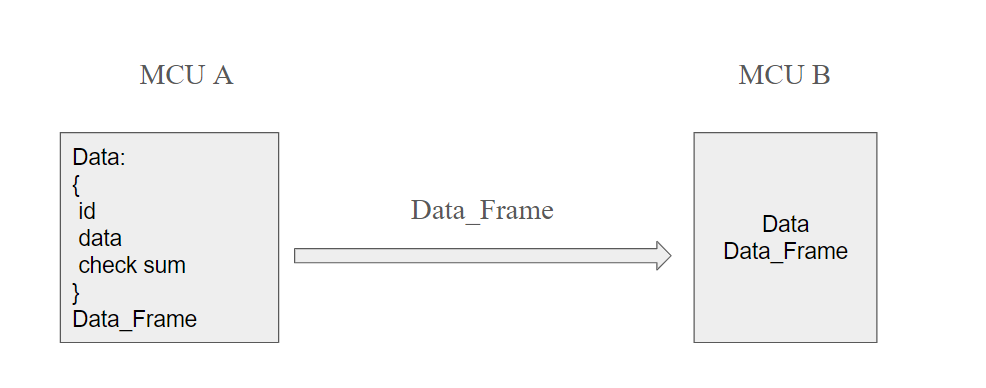

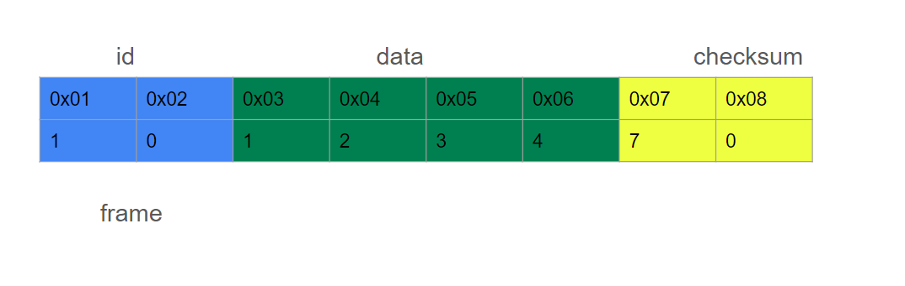

```c
typedef union {
    struct {
        uint8_t id[2];
        uint8_t data[4];
        uint8_t check_sum[2];
    } data;

    uint8_t frame[8];

} Data_Frame;

```
- Khai báo biến sao cho tránh padding

- Struct lồng vào union, chỉ dùng 1 địa chỉ, 1 trong 3 thành phần thay đổi thì thành phần truyền đi frame sẽ được cập nhật

- Chuyển số thành chuỗi

```c
int main(int argc, char const *argv[])
{
    Data_Frame transmitter_data;
    
    strcpy(transmitter_data.data.id, "10");
    strcpy(transmitter_data.data.data, "1234");
    strcpy(transmitter_data.data.check_sum, "70");

        Data_Frame receiver_data;
    strcpy(receiver_data.frame, transmitter_data.frame);
    
    
    return 0;
}
```
- Debug truyền và nhận dữ liệu
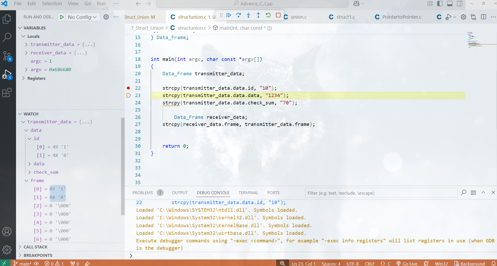

</details>

<details>
<summary>LESSON 8: MEMORY LAYOUT</summary>

### Memory layout

- Chương trình main.exe ( trên window), main.hex ( nạp vào vi điều khiển) được lưu ở bộ nhớ SSD hoặc FLASH. 

- Khi nhấn run chương trình trên window ( cấp nguồn cho vi điều khiển) thì những chương trình này sẽ được copy vào bộ nhớ RAM để thực thi.

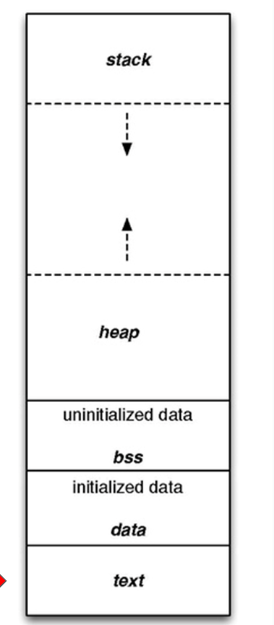

**1. Text segment (Code segment)**

- Chứa mã máy (lệnh thực thi), nơi mà program counter sẽ trỏ tới để thực thi câu lệnh
- Quyền truy cập: read-only

**2. Initialized Data Segment (Dữ liệu Đã Khởi Tạo)**

- Chứa các biến toàn cục được khởi tạo với giá trị khác 0.

- Chứa các biến static (global + local) được khởi tạo với giá trị khác 0.

- Quyền truy cập: đọc và ghi

- Tất cả các biến sẽ được thu hồi sau khi chương trình kết thúc.

```c
#include <stdio.h>

int a = 10;
double d = 20.5;

static int var = 5;

void test()
{
    static int local = 10;
}


int main(int argc, char const *argv[])
{  
    a = 15;
    d = 25.7;
    var = 12;
    printf("a: %d\n", a);
    printf("d: %f\n", d);
    printf("var: %d\n", var);


    return 0;
}

```
**3. Uninitialized Data Segment (BSS, Dữ liệu Chưa Khởi Tạo)**

- Chứa các biến toàn cục khởi tạo với giá trị bằng 0 hoặc không gán giá trị.

- Chứa các biến static với giá trị khởi tạo bằng 0 hoặc không gán giá trị.

- Quyền truy cập: đọc và ghi

- Tất cả các biến sẽ được thu hồi sau khi chương trình kết thúc.

Ví dụ:

```c
typedef struct 
{
    int x;
    int y;
} Point_Data;

Point_Data p1 = {5, 0};

Point_Data p2;

Point_Data p3 = {0, 0};
```

- `Point_Data p1 = {5, 0};`, p1 ở data ->thành viên x,y ở data -> x được khởi tạo giá trị = 5, y = 0 (y vẫn ở data)

- `Point_Data p2;`, p2,x,y: bss

- `Point_Data p3 = {0, 0};`: khởi tạo bằng 0 -> bss

📌 Lưu ý:

`const int a = 0; hằng số toàn cục`, tùy vào trình biên dịch MinGW gcc g++: rdata (read - only data) - text (MacOS clang)

```c
    .file	"text.c"
    .text
    .globl	a
    .section .rdata,"dr"
    .align 4
```

- `.text`, ghi địa chỉ thực thi câu lệnh vào text, từ `.global` cấp phát địa chỉ

- `char *ptr = "Hello";`, rdata - text. Nếu cố tình thay đổi `ptr[1] = 'a';` -> báo lỗi hoặc không tùy vào trình biên dịch

- `*ptr = NULL` // bss

**4. Stack**

- Chứa các biến cục bộ (trừ static cục bộ), tham số truyền vào.

- Hằng số cục bộ, có thể thay đổi thông qua con trỏ.

Quyền truy cập: đọc và ghi, nghĩa là có thể đọc và thay đổi giá trị của biến trong suốt thời gian chương trình chạy.

- Sau khi ra khỏi hàm, sẽ thu hồi vùng nhớ.

- Biến hằng số cục bộ nằm ở Stack (read - write), thay đổi thông qua con trỏ

```c
#include <stdio.h>

int *ptr = NULL;

void test()
{
    const int c = 10; // 0xf4: stack

    ptr = &c;
    *ptr = 20;

    printf("%d", c);
    
    char *str = "hello";

}
```

**4. Heap**

- Cấp phát tĩnh: `char str[5]` cố định kích thước mảng (sau compile time) -> gây lãng phí bộ nhớ hoặc không đủ bộ nhớ để lưu trữ trong 1 số trường hợp -> sử dụng cấp phát tĩnh, thay đổi kích thước trong runtime

Cấp phát động:

- Heap được sử dụng để cấp phát bộ nhớ động trong quá trình thực thi của chương trình.

- Điều này cho phép chương trình tạo ra và giải phóng bộ nhớ theo nhu cầu, thích ứng với sự biến đổi của dữ liệu trong quá trình chạy.

- Các hàm như malloc(), calloc(), realloc(), và free() được sử dụng để cấp phát và giải phóng bộ nhớ trên heap.

#### malloc()

- cú pháp: void* malloc(size_t size)

- cấp phát vùng nhớ dựa trên kích thước chỉ định

- phải dùng con trỏ để quản lý vùng nhớ vừa được cấp phát và mặc định trỏ tới địa chỉ đầu tiên trong vùng nhớ

- địa chỉ con trỏ có thể nằm ở Stack/Data/Bss, nhưng địa chỉ nó trỏ tới là Heap

- kích thước chỉ định: phụ thuộc số lượng phần tử và kiểu dữ liệu từng phần tử

- kiểu tra về là void* nên cần phải ép kiểu

- giá trị khởi tạo cho từng byte địa chỉ là giá trị rác (không khởi tạo giá trị)

- thu hồi thủ công (thông qua hàm free)

- Nếu không thu hồi thì có thể không còn đủ địa chỉ để cấp phát (memory leak)

- tìm kiếm địa chỉ khác để cấp phát, con trỏ ptr tro tới vị trí bất kì -> sau khi thu hồi nên gán về NULL

```c
#include <stdio.h>
#include <stdlib.h>
#include <stdint.h>
/*
int a = 10;

uint16_t *ptr = &a; // data

double *ptr = NULL; // bss
*/
int main(int argc, char const *argv[])
{

   
    uint16_t *ptr = NULL;

    int size;

    scanf("%d", &size);

    ptr = (uint16_t* )malloc(size * sizeof(uint16_t));
    /*
    -  cấp phát động theo số lượng phần tử và kiểu dữ liệu từng phần tử
    - ép kiểu để đọc đúng dữ liệu tại từng phần tử
    */
   for(int i = 0; i < size; i++)
   {
    printf("addr %d: %p - value: %d\n", i, ptr+i, *(ptr+i));
   }
      
    free(ptr); // thu hồi vùng nhớ
    return 0;
}

```

Output: mang giá trị rác

```c
5
addr 0: 000002134209DEF0 - value: 65
addr 1: 000002134209DEF2 - value: 65
addr 2: 000002134209DEF4 - value: 66
addr 3: 000002134209DEF6 - value: 81
addr 4: 000002134209DEF8 - value: 107
```
#### realloc()

- thay đổi kích thước vùng nhớ mà đã được cấp phát bởi malloc() hoặc calloc()

- giữ dữ liệu cũ, phần mở rộng không khởi tạo

- thu hồi thủ công (thông qua hàm free)

`ptr = (uint16_t* )realloc(ptr, 10 * sizeof(uint16_t));`

- cách thu hồi thứ 2

```c
for(int i = 0; i < 10; i++)
{
    ptr[i] = 0;
}
```
-> giá trị trong ô địa chỉ = 0, lần cấp phát tiếp theo trình biên dịch vẫn có thể lấy

</details>

<details>
<summary>LESSON 9: STACK - QUEUE</summary>

### Stack

- Stack (ngăn xếp) là một cấu trúc dữ liệu tuân theo nguyên tắc "Last In, First Out" (LIFO), nghĩa là phần tử cuối cùng được thêm vào stack sẽ là phần tử đầu tiên được lấy ra. 

- Các thao tác cơ bản trên stack bao gồm:

"push" để thêm một phần tử vào đỉnh của stack

"pop" để xóa một phần tử ở đỉnh stack.

"peek/top" để lấy giá trị của phần tử ở đỉnh stack.

Kiểm tra Stack đầy: top = size - 1

Kiểm tra Stack rỗng: top = -1

### Queue

- Cấu trúc dữ liệu FIFO (First in, First out)

- Các thao tác cơ bản trên hàng đợi bao gồm:

“enqueue” (thêm phần tử vào cuối hàng đợi)

“dequeue” (lấy phần tử từ đầu hàng đợi). 

“front” để lấy giá trị của phần tử đứng đầu hàng đợi.

“rear” để lấy giá trị của phần tử đứng cuối hàng đợi.

Kiểm tra hàng đợi đầy/rỗng.

Ban đầu queue rỗng thì front = rear = -1; thêm vào phần tử đầu tiên, front = rear = 0

Chỉ được thêm dữ liệu mới vào (enqueue) khi queue rỗng toàn bộ -> front, rear về lại vị trí ban đầu (không thể thêm phần tử mới kể cả khi phía trước có khoảng trống)

📌 Để khắc phục nhược điểm này của Linear Queue, sử dụng Circular Queue:

- Khi rear đạt tới size - 1 và không còn chỗ trống từ phía cuối, nếu front đã di chuyển (nghĩa là đã có các phần tử được dequeue), rear có thể "quay vòng" về vị trí 0 để tận dụng khoảng trống.

- Khi kiểm tra rỗng chỉ có 1 trường hợp

📌 Ứng dụng Queue: truyền bit dữ liệu

</details>

<details>
<summary>LESSON 10: LINKED LIST </summary> 

### Linked List

📌 Mảng: các dữ liệu được chứa trong mảng có địa chỉ liền kề nhau, phải biết được số lượng phần tử trong mảng

📌 Linked list: 

- Linked list là một cấu trúc dữ liệu trong lập trình máy tính, được sử dụng để tổ chức và lưu trữ dữ liệu.

- Gồm các node, không quan tâm đến số lượng node, mỗi node có địa chỉ ngẫu nhiên. Mỗi nút chứa một giá trị dữ liệu (con số, kí tự, chuỗi,...) và một con trỏ (pointer) đến nút tiếp theo trong chuỗi.

- Khi khởi tạo, các con trỏ trong mỗi node mang giá trị NULL. Sau khi liên kết thì con trỏ mang địa chỉ của node tiếp theo (trừ node cuối cùng).

- Ưu điểm so với mảng: thêm, xóa phần tử dễ dàng hơn

📌 Lưu ý khi viết các hàm thao tác linked list

Thêm 1 node vào phía cuối

- Nếu sử dụng con trỏ first cấp 1: nếu danh sách liên kết chưa có node nào sẽ gây lỗi (do kết thúc hàm con trỏ first đã được giải phóng) -> dùng con trỏ cấp 2

</details>

<details>
<summary>LESSON 11: JSON </summary> 


</details>

<details>
<summary>LESSON 12:BINARY SEARCH - FILE OPERATIONS - CODE STANDARDS </summary> 


</details>


<details>
<summary>LESSON 15: CLASS </summary> 

# Class

## C++

`#include <iostream>`, khai báo thực viện làm việc với terminal, các thư viện trong C++ không có đuôi .h

**Khai báo biến, nhập xuất**

```c
#include <iostream>

using namespace std;

int main(int argc, char const *argv[])
{
    int a;
    cout << "Hello";
    cin >> a;
    cout << a;
    return 0;
}

```


## Class

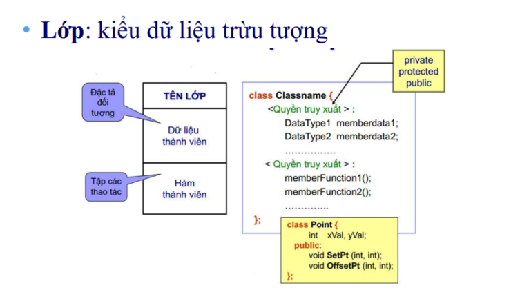

- Kiểu tự định nghĩa ra giống struct & union, trong class: biến (thuộc tính), hàm (phương thức)

- Mặc định các phần tử trong class không được truy cập từ bên ngoài (quyền truy cập private)

```c
class ClassName {
private:
    // Các thành phần riêng tư (private) chỉ có thể truy cập bên trong lớp
    // Dữ liệu thành viên, hàm thành viên, ...

protected:
    // Các thành phần bảo vệ (protected) tương tự như private, nhưng có thể truy cập từ lớp kế thừa

public:
    // Các thành phần công khai (public) được truy cập từ bên ngoài lớp
    // Dữ liệu thành viên, hàm thành viên, ...
    // Hàm thành viên và các phương thức khác có thể được định nghĩa tại đây
    // ...

};

```

-  Khai báo phương thức luôn đặt trong định nghĩa lớp, cũng như các
khai báo thành viên dữ liệu;

- Phần cài đặt (định nghĩa phương thức) có thể đặt trong định nghĩa lớp
hoặc đặt ở ngoài

- Khi định nghĩa một phương thức, ta cần sử dụng toán tử
phạm vi để trình biên dịch hiểu đó là phương thức của một
lớp cụ thể chứ không phải một hàm thông thường khác.


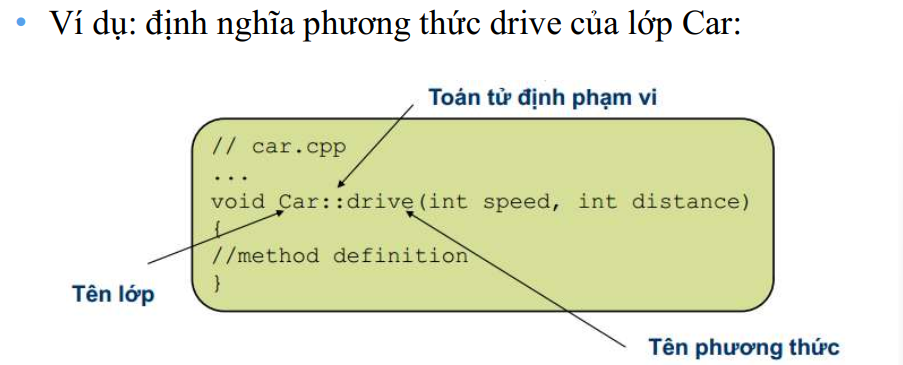


### Constructor

- Constructor trong C++ là một method sẽ được tự động gọi khi khởi tạo object.

- Constructor sẽ có tên trùng với tên của class.

- Gán giá trị, cấp vùng nhớ cho các dữ liệu thành viên;

- Hàm dựng mặc định (default constructor):

Đối với constructor mặc định, nếu ta không cung cấp một
phương thức constructor nào, C++ sẽ tự sinh constructor
mặc định là một phương thức rỗng (không làm gì);

Mục đích để luôn có một constructor nào đó để gọi khi không
có tham số nào

Tuy nhiên, nếu ta không định nghĩa constructor mặc định
nhưng lại có các constructor khác, trình biên dịch sẽ báo
lỗi không tìm thấy constructor mặc định nếu ta không
cung cấp tham số khi tạo thể hiện

### Deconstructor

Dọn dẹp 1 đối tượng trước khi nó được thu hồi

- Destructor không có giá trị trả về, và không thể định nghĩa
lại (nó không bao giờ có tham số)

- Mỗi lớp chỉ có 1 destructor.

- Không gọi trực tiếp, sẽ được tự động gọi khi hủy bỏ đối
tượng;

- Thu hồi vùng nhớ cho các dữ liệu thành viên là con trỏ;

-  Nếu ta không cung cấp destructor, C++ sẽ tự sinh một
destructor rỗng (không làm gì cả)

Tính chất hàm hủy
(destructor):

- Tự động gọi khi đối
tượng bị hủy.

- Mỗi lớp có duy nhất
một hàm hủy.

- Trong C++, hàm
hủy có tên ~<Tên
lớp>.

### Danh sách khởi tạo thành viên

Khởi tạo giá trị thuộc tính của đối tượng trong hàm dựng bằng cách sử dụng danh sách khởi tạo thành viên

Thứ tự ưu tiên: ds khởi tạo thành viên trước rồi mới tới hàm dựng

Ngay sau ghi nguyên mẫu hàm dựng


**5 cách khởi tạo giá trị cho các thành viên trong class**

1. Truy cập từ bên ngoài, gán giá trị trực tiếp ở main (không khuyến khích sử dụng)

2. Khởi tạo constructor không có tham số

3. Khởi tạo constructor có tham số - không có giá trị mặc định

4. Khởi tạo constructor có tham số - có giá trị mặc định

5. Khởi tạo thông qua danh sách khởi tạo thành viên

### Static keyword

- Địa chỉ của hàm, constructor nằm ở phân vùng text

- Các biến thành viên trong class, có phân vùng nhớ dựa vào đối tượng khởi tạo

**Static property**

- Tất cả các đối tượng sẽ dùng chung địa chỉ của biến static property 

- Trước khi muốn sử dụng phải khởi tạo ở bên ngoài

- 2 biến static có địa chỉ không liên kề với nhau (tùy vào trình biên dịch)

- Có địa chỉ dựa vào lúc khởi tạo

```c
// static property

static int counter;
static int counter1; 

// khởi tạo

int Sinhvien::counter = 0; // 0x01 - 0x04
int Sinhvien::counter1 = 0; // 0xf1 - 0xf4

```

```c
#include <iostream>
#include "Point.hpp"

using namespace std;

int main() {
    Point point1, point2;
    cout << Point::n << endl; // In giá trị của biến tĩnh n
    cout << Point::n1 << endl;
    cout << "Addr of n " << &(point1.n) << endl;
    cout << "Addr of n " << &(point2.n) << endl;
    cout << "Addr of n1 " << &(point1.n1) << endl;
    cout << "Addr of n1 " << &(point2.n1) << endl;
    return 0;
}

Result:
30
20
Addr of n 0x7ff73f003000
Addr of n 0x7ff73f003000
Addr of n1 0x7ff73f003004
Addr of n1 0x7ff73f003004

```

**Static method**

- Method thuộc về class thay vì object, được gọi ra thông qua class

- Chỉ có thể thao tác được với các static property

**Quyền truy cập private**

- Thành viên/ phương thức chỉ có thể được truy nhập từ bên trong chính lớp đó

- Tính đóng gói: đóng gói dữ liệu (thuộc tính), che dấu thông tin quan trọng của đối tượng, khai báo ở quyền truy cậ private, nếu muốn đọc/ ghi thì truy cập thông qua method

```c
Lấy giá trị các thuộc tính private xVal, yVal thông qua hàm get, set
// file Point.cpp
int Point::get_xVal()
{
    return this->xVal;
}
void Point::set_xVal(int value)
{
    this->xVal = value;
}

//file main.cpp
  point1.set_xVal(point2.get_xVal());
  point1.Show();
```

- Tính trừu tượng: ẩn đi các hàm, các quá trình trung gian, logic xử lí và thuật toán

</details>


<details>
<summary>LESSON 16: OOP </summary> 


# OOP
## 1. Tính đóng gói

**Quyền truy cập private**

- Thành viên/ phương thức chỉ có thể được truy nhập từ bên trong chính lớp đó

- Tính đóng gói: đóng gói dữ liệu (thuộc tính), che dấu thông tin quan trọng của đối tượng, khai báo ở quyền truy cậ private, nếu muốn đọc/ ghi thì truy cập thông qua method có quyền truy cập là public

```c
Lấy giá trị các thuộc tính private xVal, yVal thông qua hàm get, set
// file Point.cpp
int Point::get_xVal()
{
    return this->xVal;
}
void Point::set_xVal(int value)
{
    this->xVal = value;
}

//file main.cpp
  point1.set_xVal(point2.get_xVal());
  point1.Show();
```

## 2. Tính kế thừa (Inheritance)

Các lớp được định nghĩa kế thừa từ các lớp khác, thực hiện khi biên dịch

- Khái niệm:

Khả năng cho phép xây dựng lớp mới được thừa
hưởng các thuộc tính của lớp đã có;

Các phương thức & thuộc tính được định nghĩa trong
một lớp có thể được sử dụng lại bởi lớp khác.

- Đặc điểm:

Lớp nhận được có thể bổ sung các thành phần;

Hoặc định nghĩa là các thuộc tính của lớp cha.
 
- Các loại thừa kế: Đơn thừa kế & Đa thừa kế


**Chức năng**

- Cho phép lớp dẫn xuất có thể sử dụng các thuộc
tính và phương thức của lớp cơ sở tương tự như
sử dụng thuộc tính và phương thức của mình;

- Cho phép chỉ cần thay đổi phương thức của lớp
cơ sở, có thể sử dụng được ở tất cả các lớp dẫn
xuất;

- Tránh sự cài đặt trùng lặp mã nguồn chương trình;

- Chỉ cần thay đổi mã nguồn một lần khi thay đổi
dữ liệu của các lớp

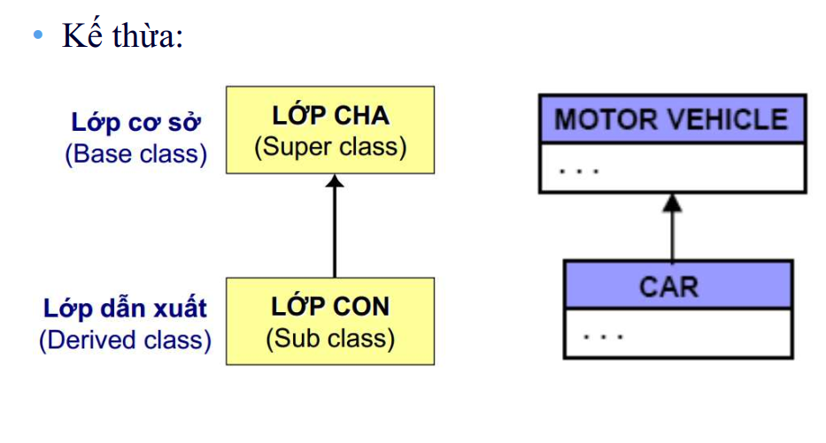

### 2.1. Các kiểu kế thừa: public, private, protected

- Truy xuất theo chiều ngang: phụ thuộc vào thuộc tính kế thừa của lớp con.

- Kế thừa public:
protected của cha thành protected của con;
public của cha thành public của con; nên sử dụng khi và chỉ khi có quan hệ là một từ lớp con đến
lớp cha.

- Kế thừa private: protected & public cha thành private của con;

- Kế thừa protected: thành phần nào mang thuộc tính này
thì chỉ có các lớp con mới có quyền truy cập

#### 2.2. Kế thừa public


- Các member public của class cha vẫn sẽ là public trong class con.

- Các member protected của class cha vẫn sẽ là protected trong class con.

- Các member private của class cha không thể truy cập trực tiếp từ class con nhưng có thể được truy cập gián tiếp qua các phương thức public hoặc protected của class cha


 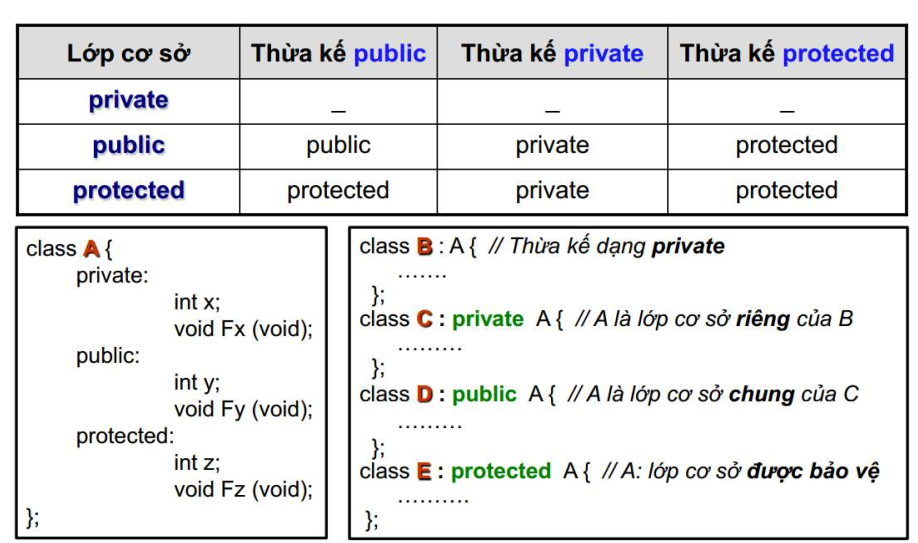

```c
#include <iostream>
#include <string>

using namespace std;

class DoiTuong{
    // private:
    //    string ten;
    //    int id;

    protected:
        string ten;
        int id;

    public:
        DoiTuong(){  
            static int ID = 1;
            id = ID;
            ID++;
        }

        void setName(string _ten){
            // check chuỗi nhập vào
            ten = _ten;
        }

        void display(){
            cout << "ten: " << ten << endl;
            cout << "id: " << id << endl;
        }
};

class SinhVien : public DoiTuong{
    protected:
        string chuyenNganh;

    public:
        void setChuyenNganh(string _nganh){
            chuyenNganh = _nganh;
        }

        void display(){ // override
            cout << "ten: " << ten << endl;
            cout << "id: " << id << endl;
            cout << "chuyen nganh: " << chuyenNganh << endl;
        }
};

class HocSinh : public DoiTuong{
    protected:
        string lop;
   
    public:
        void setLop(string _lop){
            lop = _lop;
        }

        void display(){ // override
            cout << "ten: " << ten << endl;
            cout << "id: " << id << endl;
            cout << "lop: " << lop << endl;
        }
};

class GiaoVien : public DoiTuong{
    protected:
        string chuyenMon;

    public:
        void setChuyenMon(string _mon){
            chuyenMon = _mon;
        }

        void display(){ // override
            cout << "ten: " << ten << endl;
            cout << "id: " << id << endl;
            cout << "chuyen mon: " << chuyenMon << endl;
        }
};

int main(int argc, char const *argv[])
{
    // SinhVien sv1;

    // sv1.ten = "Hoang";
    // sv1.id = 1;
    // sv1.chuyenNganh = "DTVT";

    // cout << "ID: " << sv1.id << endl;
    // cout << "Ten: " << sv1.ten << endl;
    // cout << "Chuyen nganh: " << sv1.chuyenNganh << endl;

    SinhVien sv1;
    sv1.setName("Cuong");
    sv1.setChuyenNganh("21CDT1");
    sv1.display();

    cout << endl;

    HocSinh hs1;
    hs1.setName("Cuong");
    hs1.setLop("12A1 - NguyenHue");
    hs1.display();

    cout << endl;

    GiaoVien gv1;
    gv1.setName("Tru Nguyen");
    gv1.setChuyenMon("TOEIC");
    gv1.display();
    return 0;
}


```
**Giải thích code:**

- 3 lớp SinhVien, HocSinh, GiaoVien được kết thừa từ lớp DoiTuong theo kiểu public

- Điểm chung của 3 lớp: Thuộc tính Ten, Id và phương thức setname()

- Override hàm display() đối với mỗi lớp:

Lớp dẫn xuất có thể định nghĩa lại một hàm
thành viên của lớp cơ sở mà nó được thừa kế.

• Khi đó nếu tên hàm được gọi đến trong lớp
dẫn xuất thì trình biên dịch sẽ tự động gọi đến
phiên bản hàm của lớp dẫn xuất.

• Muốn truy cập đến phiên bản hàm của lớp cơ
sở từ lớp dẫn xuất thì sử dụng toán tử định
phạm vi và tên lớp cơ sở trước tên hàm.


#### 2.2. Kế thừa private

- Các member public, protected của class cha sẽ trở thành private trong class con.

- Các member private của class cha không thể truy cập trực tiếp từ class con nhưng có thể được truy cập gián tiếp qua các phương thức public hoặc protected của class cha.

public -> private
protected -> private

```c
#include <iostream>
#include <string>

using namespace std;

class DoiTuong{
    protected:
        string ten;
        int id;

    public:
        DoiTuong(){  
            static int ID = 1;
            id = ID;
            ID++;
        }

        void setName(string _ten){
            // check chuỗi nhập vào
            ten = _ten;
        }

        void display(){
            cout << "ten: " << ten << endl;
            cout << "id: " << id << endl;
        }
};

class SinhVien : private DoiTuong{
    protected:
        string chuyenNganh;

    public:
        void setChuyenNganh(string _nganh){
            chuyenNganh = _nganh;
        }

        void setNameSV(string _ten){
            ten = _ten;
        }

        void display(){ // override
            cout << "ten: " << ten << endl;
            cout << "id: " << id << endl;
            cout << "chuyen nganh: " << chuyenNganh << endl;
        }
};

int main(int argc, char const *argv[])
{
    SinhVien sv1;
    sv1.setNameSV("Trung");
    sv1.setChuyenNganh("TDH");
    sv1.display();
    return 0;
}

```


#### 2.3. Kế thừa protected

- Các member public, protected của class cha sẽ là protected trong class con.

- Các member private của class cha không thể truy cập trực tiếp từ class con nhưng có thể được truy cập gián tiếp qua các phương thức public hoặc protected của class cha.

public -> protected
protected -> protected

#### 2.4. Đa kế thừa

- 1 class kết thừa từ nhiều class khác nhau


```c
#include <iostream>

using namespace std;

class Sensor {
public:
    void initialize() {
        cout << "Initializing sensor" << endl;
        // code khởi tạo cảm biến
    }

    int readData() {
        cout << "Reading sensor data" << endl;
        // code đọc dữ liệu cảm biến
        return 30;
    }

    void test();
};

class Communication {
public:
    void setupCommunication() {
        cout << "Setting up communication protocol" << endl;
        // code thiết lập giao thức truyền thông (SPI, I2C, UART,...)
    }

    void sendData(int data) {
        cout << "Sending data: " << data << endl;
        // code gửi dữ liệu qua các giao thức
    }

    void test();
};

class Control : public Sensor, public Communication
{
public:
    Control() {
        setupCommunication();
        initialize();
        
        int data = readData();
        sendData(data);
    }
};

int main(int argc, char const *argv[])
{
    Control sensorControl;

    sensorControl.test();

    return 0;
}

```

**Giải thích code:**

- Class Control kế thừa các thuộc tính, phương thức và thuộc tính từ  class Sensor & Communication

- Khi gọi hàm test(), trình biên dịch không biết là đang gọi hàm nào -> sự mơ hồ trong đa thừa kế (diamond problem)

## 3. Tính trừu tượng

- Tính trừu tượng đề cập đến việc ẩn đi các chi tiết cụ thể của một đối tượng và chỉ hiển thị những gì cần thiết để sử dụng đối tượng đó.

- Ẩn đi các hàm, các quá trình trung gian, logic xử lí và thuật toán

```c
#include <iostream>
#include <string>
#include <cmath>

using namespace std;

class GiaiPhuongTrinh{
    private:	// a,b,c,x1,x2,delta: tính đóng gói
        double a;
        double b;
        double c;
        double x1;
        double x2;
        double delta;
        void tinhNghiem(){	// tính trừu tượng
            delta = b*b - 4*a*c;
            if (delta < 0){
                delta = -1;
            }
            else if (delta == 0){
                x1 = x2 = -b/ (2*a);
            }
            else if (delta > 0){
                x1 = (-b + sqrt(delta))/(2*a);
                x2 = (-b - sqrt(delta))/(2*a);
            }
        }
       
    public:
        void enterNumber(double num_a, double num_b, double num_c);
        void printResult();

};

void GiaiPhuongTrinh::enterNumber(double num_a, double num_b, double num_c){
    a = num_a;
    b = num_b;
    c = num_c;
}

void GiaiPhuongTrinh::printResult(){
    tinhNghiem();
    if (delta == -1){
        cout << "PT vo nghiem" << endl;
    }
    else if (delta == 0){
        cout << "PT co nghiem chung: " << x1 << endl;
    }
    else if (delta > 0){
        cout << "PT co 2 nghiem: \n";
        cout << "x1: " << x1 << endl;
        cout << "x2: " << x2 << endl;
    }
}
int main()
{
  GiaiPhuongTrinh phuongtrinh1;
  phuongtrinh1.enterNumber(1,5,4);
  phuongtrinh1.printResult();
  return 0;
}


```

- Hàm tính nghiệm chứa các công thức tính toán được ẩn đi.

</details>


<details>
<summary>LESSON 17: VIRTUAL FUNCTION </summary> 

# Tính đa hình (Polymorphism)

- “Polymorphism” có nghĩa “nhiều hình thức”, hay “nhiều
dạng sống”;

- Một vật có tính đa hình (polymorphic) là vật có thể xuất
hiện dưới nhiều dạng;

- Đa hình là hiện tượng các đối tượng
thuộc các lớp khác nhau có khả năng hiểu cùng một
thông điệp theo các cách khác nhau.

- Ta có thể có định nghĩa tương tự cho đa hình hàm:
một thông điệp (lời gọi hàm) được hiểu theo các
cách khác nhau tuỳ theo danh sách tham số của
thông điệp.

- Ví dụ: nhận được cùng một thông điệp “nhảy”, một
con kangaroo và một con cóc nhảy theo hai kiểu
khác nhau: chúng cùng có hành vi “nhảy” nhưng các
hành vi này có nội dung khác nhau.

- Tính đa hình ( Polymorphism) có nghĩa là "nhiều dạng" và nó xảy ra khi chúng ta có nhiều class có liên quan với nhau thông qua tính kế thừa.

- Tính đa hình có thể được chia thành hai loại chính:

**Đa hình tại thời điểm biên dịch (Compile-time Polymorphism).**

**Đa hình tại thời điểm chạy (Run-time Polymorphism).**

## Đa hình tại thời điểm chạy (Run-time Polymorphism).

- ***upcast***  là quá trình tương tác với thể hiện của lớp
dẫn xuất như thể nó là thể hiện của lớp cơ sở. (con trỏ từ lớp cha trỏ đến đối tượng thuộc về lớp con)

-  Cụ thể, đây là việc đổi một con trỏ (hoặc tham
chiếu) tới lớp dẫn xuất thành một con trỏ (hoặc
tham chiếu) tới lớp cơ sở

```c
    DoiTuong *dt = &sv1; // up-casting
    dt->display();

    DoiTuong *dt1[3] = {&sv1, &hs1, &gv1};

    for (size_t i = 0; i < 3; i++)
    {
        dt1[i] ->display();
    }
    
```

Kết quả:

```c
ten: Cuong
id: 1
ten: Cuong
id: 2
ten: Tru Nguyen
id: 3
```
-> Chỉ xuất ra 2 thuộc tính (mất dữ liệu)

-> Cách xử lý: Sử dụng ***Virtual Function***

### 1. Override & Overload

#### Function ***overloading*** - 

Hàm chồng: dùng một tên
hàm cho nhiều định nghĩa hàm, khác nhau ở danh
sách tham số

- Method overloading – Phương thức chồng: tương tự
void jump(int howHigh);
void jump(int howHigh, int howFar);

- Hai phương thức jump trùng tên nhưng có danh sách
tham số khác nhau.

- Tuy nhiên, đây không phải đa hình hướng đối tượng
mà ta đã định nghĩa, vì đây thực sự là hai thông điệp
jump khác nhau

#### Override: 

- Ngoài tính năng của overload, override có thể ghi đè, định nghĩa hàm hoàn toàn mới

- Đa hình được cài đặt bởi một khái niệm tương tự nhưng hơi
khác: method overriding:
o “override” có nghĩa “vượt quyền”.

- Method overriding: nếu một phương thức của lớp cơ sở
được định nghĩa lại tại lớp dẫn xuất thì định nghĩa tại lớp cơ
sở có thể bị “che” bởi định nghĩa tại lớp dẫn xuất;

- Với method overriding, toàn bộ thông điệp (cả tên và tham
số) là hoàn toàn giống nhau – điểm khác nhau là lớp đối
tượng được nhận thông điệp.

- Khi một hàm ảo được ghi đè, hành vi của nó sẽ phụ thuộc vào kiểu của đối tượng thực tế, chứ không phải kiểu của con trỏ hay tham chiếu.

- Tính đa hình Run-time xảy ra khi quyết định gọi hàm nào (phiên bản của class cha hay class con) được đưa ra tại thời điểm chạy, không phải lúc biên dịch, giúp mở rộng chức năng. Điều này giúp chương trình linh hoạt hơn, cho phép việc mở rộng chức năng mà không cần sửa đổi mã nguồn hiện tại.


### 2.VIRTUAL FUNCTION

- Hàm/phương thức ảo – virtual function/method
là cơ chế của C++ cho phép cài đặt đa hình động;

- Nếu khai báo một hàm thành viên (phương thức) là
virtual, trình biên dịch sẽ đẩy lùi việc liên kết các lời
gọi phương thức đó với định nghĩa hàm cho đến khi
chương trình chạy;

Nghĩa là, ta bảo trình biên dịch sử dụng liên kết động thay
cho liên kết tĩnh đối với phương thức đó.

-  Để một phương thức được liên kết tại thời gian chạy,
nó phải khai báo là phương thức ảo (từ khoá
virtual) tại lớp cơ sở.

- Hàm ảo là một hàm thành viên được khai báo trong class cha với từ khóa virtual.

- Khi một hàm là virtual, nó có thể được ghi đè (override) trong class con để cung cấp cách triển khai riêng.

- Khi gọi một hàm ảo thông qua một con trỏ hoặc tham chiếu đến lớp con, ***hàm sẽ được quyết định dựa trên đối tượng thực tế mà con trỏ hoặc tham chiếu đang trỏ tới chứ không dựa vào kiểu của con trỏ.***


```c
#include <iostream>

using namespace std;

class cha{
    public:
        virtual void display(){                            // Hàm ảo
            cout << "display from class cha" << endl;
        }
};

class con : public cha{
    public:
        void display() override{                           // Ghi đè hàm ảo
            cout << "display from class con" << endl;
        }
};

int main(){
    cha *ptr;
    con obj;

    // trỏ con trỏ class cha đến đối tượng class con
    ptr = &obj;

    // Gọi hàm ảo
    ptr->display();
}


```

- Hàm ảo đi với từ khóa virtual

-  Một khi một phương thức được khai báo là hàm ảo
tại lớp cơ sở, nó sẽ tự động là hàm ảo tại mọi lớp
dẫn xuất trực tiếp hoặc gián tiếp

- Tuy không cần tiếp tục dùng từ khoá virtual trong
các lớp dẫn xuất, nhưng vẫn nên dùng để tăng tính
dễ đọc của các file header (nhắc ta rằng phương thức đó sử dụng liên kết động)

### 3. Pure Virtual Function (hàm thuần ảo)

- Hàm thuần ảo là một hàm ảo không có phần định nghĩa trong class cha, được khai báo với cú pháp = 0 và khiến class cha trở thành class trừu tượng, nghĩa là không thể tạo đối tượng từ class này.

```c
#include <iostream>
using namespace std;

class cha{
    public:
        virtual void display() = 0; // Hàm ảo thuần túy
};

class con : public cha{
    public:
        void display() override{   // Ghi đè hàm ảo thuần túy
            cout << "display from class con" << endl;
        }
};

int main(){
    // cha ptr; // wrong
    cha *ptr;
    con obj;

    ptr = &obj;
    ptr->display();

    return 0;
}

```

- Không thể tạo đối tượng vì lớp cha là lớp trừu tượng (có chứa ít nhất 1 hàm thuần ảo)

- Vẫn có thể khai báo con trỏ -> vì con trỏ đã trỏ tới lớp khác

- Phải ghi đè hàm ảo thuần túy, nếu không chương biên dịch sẽ hiểu cần chạy hàm thuần ảo của lớp cha -> lỗi

**Khi nào sử dụng hàm ảo, hàm thuần ảo???**

- Sử dụng hàm ảo khi đã biết chức năng chung của hàm con -> sử dụng hàm ảo để triển khai chức năng đó

- Sử dụng hàm ảo khi *chưa biết chức năng chung của hàm con*, triển khai = override hàm đó tại các lớp con

### 4. Kế thừa ảo

- Kế thừa ảo giúp tránh vấn đề diamond problem trong đa kế thừa.

- Chỉ có một bản sao duy nhất của lớp cơ sở chung được kế thừa.

- Kế thừa ảo giúp quản lý các lớp liên quan đến phần cứng và giao tiếp. 

- Điều này giúp tránh trùng lặp tài nguyên và quản lý hiệu quả trong hệ thống nhúng.


```c
#include <iostream>

using namespace std;

class A{
    public:
        A(){ cout << "Constructor A\n"; }

        void hienThiA(){ cout << "Day la lop A\n"; }
};

class B : public A{
    public:
        B(){ cout << "Constructor B\n"; }

        void hienThiB(){ cout << "Day la lop B\n"; }
};

class C : public A {
    public:
        C(){ cout << "Constructor C\n"; }

        void hienThiC(){ cout << "Day la lop C\n"; }
};

class D : public B, public C{
    public:
        D(){ cout << "Constructor D\n"; }

        void hienThiD(){ cout << "Day la lop D\n"; }
};

int main() {
    D d;

    // d.hienThiA(); // wrong

    // Gọi phương thức từ lớp A qua B và C
    d.B::hienThiA(); // Gọi hàm hienThiA từ lớp A thông qua B
    d.C::hienThiA(); // Gọi hàm hienThiA từ lớp A thông qua C

    // d.hienThiB();
    // d.hienThiC();
    // d.hienThiD();

    return 0;
}


```

- Diamond problem: Nếu từ đối tượng d gọi `d.hienThiA();` -> lỗi vì không biết hiển thị hàm đó thông qua lớp nào 

- Cách 1: Dùng toán tử ::

- Cách 2: Kế thừa ảo

```c
#include <iostream>

using namespace std;

class A {
    public:
        A(){ cout << "Constructor A\n"; }

        void hienThiA(){ cout << "Day la lop A\n"; }
};

class B : virtual public A{
    public:
        B(){ cout << "Constructor B\n"; }

        void hienThiB(){ cout << "Day la lop B\n"; }
};

class C : virtual public A {
    public:
        C(){ cout << "Constructor C\n"; }

        void hienThiC(){ cout << "Day la lop C\n"; }
};

class D : public B, public C{
    public:
        D(){ cout << "Constructor D\n"; }

        void hienThiD(){ cout << "Day la lop D\n"; }
};

int main() {
    D d;

    d.hienThiA();

    // Gọi phương thức từ lớp A qua B và C
    // d.B::hienThiA(); // Gọi hàm hienThiA từ lớp A thông qua B
    // d.C::hienThiA(); // Gọi hàm hienThiA từ lớp A thông qua C

    // d.hienThiB();
    // d.hienThiC();
    // d.hienThiD();

    return 0;
}


```

- `class B : virtual public A`, `class C : virtual public A`: chỉ có 1 bản sao duy nhất của lớp cơ sở B và C


## Đa hình tại thời điểm biên dịch (Compile-time Polymorphism).

### 1. Function overloading (nạp chồng hàm)

- Là cách định nghĩa các hàm cùng tên nhưng khác
nhau:

Kiểu trả về;

Danh sách tham số:

 Số lượng;

 Thứ tự;

 Kiểu dữ liệu.

Có thể sử dụng đối số mặc định.

Ví dụ:

```c
#include <iostream>

using namespace std;

int sum(int a, int b)
{
    return a + b;
}

double sum(double a, double b)
{
    return (double)a + b;
}

double sum(int a, double b)
{
    return (double)a + b;
}

int sum(int a, int b, int c)
{
    return a + b + c;
}


int main(int argc, char const *argv[])
{
cout << "Tổng 2+3: " << sum(2,3) << endl;
cout << "Tổng 2+3.14: " << sum(2,3.14) << endl;
cout << "Tổng 3.5+5.6: " << sum(3.5,5.6) << endl;
cout << "Tổng 2+3+4: " << sum(2,3,4) << endl;

cout << "Tổng 2+3+4.6: " << sum(2,3,4.6) << endl;  // int x = 5.5;
    return 0;
}

```
### 2. Operator overloading (nạp chồng toán tử)

- Là đi tái định nghĩa toán tử trên kiểu dữ liệu mới
Viết 1 hàm đa năng hóa, trong hàm thực hiện định nghĩa toán tử đ/v kiểu dữ liệu mới (đối tượng)

- Đa năng hóa sử dụng 2 cách:

Hàm toàn cục: số lượng tham số bằng số toán hạng

Hàm thành viên của lớp: (), [], ->, = (bắt buộc)

- Các phép toán có thể tái định nghĩa:

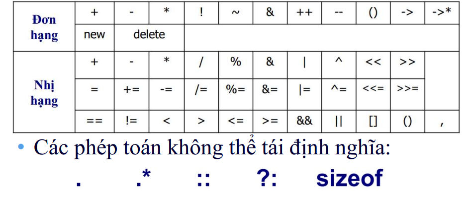

Ví dụ: Đa năng hóa toán tử + & - bằng hàm toàn cục, số lượng tham số bằng số toán hạng; sử dụng hàm thành viên của lớp

```c
// Point.hpp
class Point
{
    private:
        int xVal, yVal;
    public:
        Point(int = 1, int = 1);
        Point(const Point&);
        ~Point();
        void Show();
        friend Point operator+(const Point&, const Point&);
        //p1 - p2
        Point operator-(const Point&);
};

// Point.cpp
#include "Point.hpp"
#include <iostream>
using namespace std;

Point::Point(int xVal, int yVal)
{
    this->xVal = xVal;
    this->yVal = yVal;
}

Point::Point(const Point& p)
: xVal(p.xVal), yVal(p.yVal)
{

}

Point::~Point()
{

}

void Point::Show()
{
    cout << this->xVal << this->yVal << endl;
}

Point operator+(const Point& p1, const Point& p2)
{
    Point p(p1.xVal + p2.xVal, p1.yVal + p2.yVal);
    return p;
}

Point Point::operator-(const Point& q)
{
    Point p(this->xVal - q.xVal, this->yVal - q.yVal);
    return p;
}

//main.cpp

#include "Point.hpp"
#include <iostream>
using namespace std;

int main(int argc, char const *argv[])
{
    Point p1(1,2);
    Point p2(1,2);

    Point p3 = p1 + p2;
    Point p4 = operator + (p1, p2);

    Point p5 = p1 - p2;
    Point p6 = p1.operator-(p2); // p1 - p2
    Point p7 = p2.operator-(p1); // p2 - p1
    p3.Show();
    p4.Show();
    p5.Show();
    p6.Show();
    p7.Show();
    return 0;
}


```

 **Đa năng hóa sử dụng hàm toàn cục**

- Vì 2 thuộc tính xVal, yVal có quyền truy cập private -> xử lý qua hàm friend

- Truyền vào `const Point&` vì đối tượng của class Point truyền vào là không thay đổi

 **Đa năng hóa sử dụng hàm thành viên của lớp**

 - p1 là con trỏ this, truyền vào const Point& cho p2

### 3. This Pointer

- Khi khai báo 1 class, trình biên dịch tự động cung cấp 1 con trỏ, con trỏ đó trỏ đến đối tượng hiện tại

- Khai báo bao nhiêu đối tượng thì có bấy nhiêu con trỏ this

- Là con trỏ hằng (constant pointer)

```c
Point::Point(int xVal, int yVal)
{
    this->xVal = xVal;
    this->yVal = yVal;
}
```

-> Lúc này trình biên dịch không biết đây là biến xVal hay là thuộc tính xVal của lớp

- Nếu ghi this->xVal, sẽ hiểu là tên thuộc tính xVal của cái đối tượng mà con trỏ this đang trỏ tới, Point p1, ở đây là hàm dựng mặc định,  p1.Show() đi đến Point::Show() in ra xVal và yVal của đối tượng p1.


### 4. Truyền tham chiếu (pass-by-reference)

- Truyền tham trị vào hàm: mọi tác động đều không ảnh hưởng đến biến gốc

- Truyền tham chiếu:

```c
#include <iostream>

using namespace std;

void modifyByReference(int &ref)
{
    cout << "Địa chỉ biến ref: " << &ref << endl;
    ref++;
    cout << "Giá trị: " << ref << endl;
}

void modifyByPointer(int *ptr)
{
    *ptr = 30;
}

int main()
{
    int x = 10;  // 0x34: 10
    cout << "Địa chỉ biến x: " << &x << endl;

    modifyByReference(x); // Tham chiếu
    cout << "After modifyByReference: " << x << endl;

    modifyByPointer(&x); // Con trỏ
    cout << "After modifyByPointer: " << x << endl;

    return 0;
}

```

**Khác nhau giữa reference và con trỏ**

- Khi kháo báo 1 con trỏ, tốn 1 vùng nhớ trên RAM

- Khai báo tham chiếu, không tốn vùng nhớ, chỉ mượn vùng nhớ của biến tham chiếu đến
</details>

<details>
<summary>LESSON 18: TEMPLATE</summary> 

# Template

- Trong C++, function templates là một tính năng mạnh mẽ giúp viết các function hoặc class chung có thể được sử dụng cho nhiều kiểu dữ liệu khác nhau mà không cần phải triển khai nhiều phiên bản của cùng một function hoặc class. 

- 2 loại: ***Function Template, Class Template***

## 1. Function Template

- Khuôn mẫu hàm cho phép định
nghĩa các hàm tổng quát dùng đến các kiểu dữ liệu
tùy ý;

- Từ khóa template được theo sau bởi 1 cặp <> chứa tên
của các kiểu dữ liệu tùy ý được cung cấp

- 1 template chỉ áp dụng đối với 1 hàm


```c
#include <iostream>

using namespace std;

int sum(int a, int b)
{
    return a+b;
}

double sum(double a, double b)
{
    return a+b;
}

template <typename T>
T sum(T a, T b)
{
    return a+b;
}


int main(int argc, char const *argv[])
{
    cout << sum(1,2) << endl;
    cout << sum(1.5, 3.6) << endl;
    return 0;
}


```

- Trong quá trình compile - time, template sẽ dựa vào biến truyền vào hàm để chọn hàm có kiểu dữ liệu tương ứng đã được khai báo & định nghĩa trước đó

**Khi gặp lời gọi hàm sum (int, int)**

- Trình biên dịch tìm xem có 1 hàm HV() được khai báo
với 2 tham số kiểu int hay không:

 Nó không tìm thấy 1 hàm thích hợp, nhưng tìm thấy 1 template
có thể dùng được.

- Tiếp theo, nó xem xét khai báo của template HV() để
xem có thể khớp được với lời gọi hàm hay không:

 Lời gọi hàm cung cấp 2 tham số thuộc cùng 1 kiểu int;

 Trình biên dịch thấy template chỉ ra 2 tham số thuộc cùng kiểu
T, nên nó kết luận rang T phải là kiểu int;

 Do đó, trình biên dịch kết luận rằng template khớp với lời gọi
hàm.

**Khai báo template đối với nhiều kiểu dữ liệu**

```c
template <typename T>
T divide(T a, T b){}

template <typename T1, typename T2>
auto sum(T1 a, T2 b)
{
    return a+b;
}

template <typename T1, typename T2, typename T3>
auto sum(T1 a, T2 b, T3 c)
{
    return a+b+c;
}
```
**Từ khóa auto**

- Trình biên dịch tự động suy diễn kiểu dữ liệu (trong compile-time), trong gcc ở tiền xử lí

- Khi khai báo biến phải có giá trị truyền vào

- `auto sum(T1 a, T2 b, T3 c)`: chỉ cần 1 trong 3 có kiểu dữ liệu double -> Template trả về kiểu double

**Định nghĩa kiểu dữ liệu mặc định trong Function Template**

```c
// tham số mặc định
template <typename T = int>
T square(T x)
{
    return x * x;
}
```


`template <typename T = int>`, nếu không chỉ định kiểu dữ liệu -> mặc định là kiểu int

**Chuyên biệt hóa**

- Định nghĩa Template cho 1 kiểu dữ liệu duy nhất

- Muốn sử dụng template chuyên biệt, phải định nghĩa 1 template cho các dữ liệu còn lại

```c
// chuyên biệt hóa
template <typename T>
void display(T value)
{
    cout << value << endl;
}

// Chuyên biệt hóa cho kiểu 'const char*'
template <>
void display<const char*>(const char *str)
{
    cout << "String: " << str << endl;
}

// Chuyên biệt hóa cho kiểu 'int'
template <>
void display<int>(int value)
{
    cout << value << endl;
}
```

## 2. Class Template (cũng áp dụng cho Struct)

```c
#include <iostream>
#include <string>

using namespace std;

template <typename T>
class Sensor
{
    private:
        T value;

    public:
        Sensor(T init): value(init){}

        T readSensor(T newValue);

        T getValue() const;

        void display()
        {
            cout << "Giá trị cảm biến: " << getValue() << endl;
        }
};

template <typename type>
type Sensor<type>::readSensor(type newValue)
{
    this->value = newValue;
}

template <typename T>
T Sensor<T>::getValue() const{ return value; }


template <typename T>
class Printer 
{
    public:
        void print(T value) 
        {
            cout << "Generic: " << value << endl;
        }
};

// Chuyên biệt hóa cho kiểu std::string
template <>
class Printer<string> 
{
    public:
        void print(string value) 
        {
            cout << "String specialization: " << value << endl;
        }
};


int main(int argc, char const *argv[])
{
    Sensor<int> tempSensor1(36.5);
    tempSensor1.display();

    Sensor tempSensor3(26.7);
    tempSensor3.display();

    Sensor<double> tempSensor2(25);
    tempSensor2.display();

    Sensor stateSensor("ON");
    stateSensor.display();

    return 0;
}

```

- Dữ liệu cảm biến để kiểu tổng quá là kiểu T (int, double, string, const char*...)

```c
 Sensor<int> tempSensor1(36.5);
    tempSensor1.display();
```

- Quy định kiểu dữ liệu int/ gán ngầm định không quy định kiểu dữ liệu

```c
template <typename type>
type Sensor<type>::readSensor(type newValue)
{
    this->value = newValue;
}

template <typename T>
T Sensor<T>::getValue() const{ return value; }
```

- Định nghĩa các phương thức bên ngoài class

### Chuyên biệt hóa trong Class Template

```c
template <typename T>
class Printer 
{
    public:
        void print(T value) 
        {
            cout << "Generic: " << value << endl;
        }
};

// Chuyên biệt hóa cho kiểu std::string
template <>
class Printer<string> 
{
    public:
        void print(string value) 
        {
            cout << "String specialization: " << value << endl;
        }
};
```

- Tương tự, phải tạo class riêng để đáp ứng cho tất cả các kiểu dữ liệu

### Ex3

- Quản lý giá trị cảm biến gửi về thông qua Template

```c
class Sensor{
    public:
        virtual double getValue() const = 0;

        virtual string getUnit() const = 0;
};
```

- Abstract class đại diện chung

```c
// Class đại diện cho cảm biến nhiệt độ (Temperature Sensor)
class TemperatureSensor : public Sensor{
    private:
        double temp;

    public:
        double getValue() const override{
            // temp = 30.3;
            return 40.5; // Giá trị cảm biến giả định
        }

        string getUnit() const override{
            return "Celsius";
        }
};
```

- Class đại diện cho cảm biến nhiệt độ (Temperature Sensor), đọc giá trị cảm biến, dùng từ khóa constant (do giá trị không thay đổi)

```c
template<typename Sensor1, typename Sensor2>
class VehicleSensors{
    private:
        Sensor1 sensor1;  // Đối tượng cảm biến 1
        Sensor2 sensor2;  // Đối tượng cảm biến 2

    public:
        // Constructor nhận vào hai đối tượng cảm biến
        VehicleSensors(Sensor1 s1, Sensor2 s2) : sensor1(s1), sensor2(s2) {}

        // Hàm hiển thị thông tin của cả hai cảm biến
        void displaySensorsInfo() const {
            cout << "Sensor 1 Value: " << sensor1.getValue() << " " << sensor1.getUnit() << endl;
            cout << "Sensor 2 Value: " << sensor2.getValue() << " " << sensor2.getUnit() << endl;
        }
};

```

- Tạo Class Template để quản lý 2 cảm biến khác nhau, truyền vào 2 đối tượng cảm biến vừa tạo

### Ex4: Kết hợp Template & variadic macro (định nghĩa, khai báo, truy xuất kiểu dữ liệu)

`template <typename T, typename... Args>`: định nghĩa nhiều kiểu dữ liệu khác nhau, tổng quát, không biết được bao nhiêu

 * typename... : định nghĩa nhiều kiểu dữ liệu tổng quát
 * Args... : đại diện cho nhiều kiểu dữ liệu khi truyền vào hàm
 * args... : đại diện cho nhiều tham số truyền vào hàm

```c
    cout << sum(1, 2, 3.5, 4, 5.5) << endl;
    /*
     * Lần 1: first = 1,    args... = 2, 3.5, 4, 5.5 --> 1 + sum(2, 3.5, 4, 5.5)
     * Lần 2: first = 2,    args... = 3.5, 4, 5.5    --> 1 + 2 + sum(3.5, 4, 5.5)
     * Lần 3: first = 3.5,  args... = 4, 5.5         --> 1 + 2 + 3.5 + sum(4, 5.5)
     * Lần 4: fisrt = 4,    args... = 5.5            --> 1 + 2 + 3.5 + 4 + sum(5.5)
     * Lần 5: value = 5.5                            --> 1 + 2 + 3.5 + 4 + 5.5 = 
     */

```

- Ở lần 5, hàm chỉ còn 1 đối số nên không thể gọi auto sum -> cần định nghĩa hàm sung có 1 đối số

- Thực tế là cộng ngược lại vì biến được lưu ở Stack

```c
template <typename... Args>
void count(Args... args)
{
    cout << "Sô lượng tham số:  " << sizeof...(args) << endl;
}
```

- Đếm số lượng tham số

### Ex5: All of Template

```c
// Định nghxia class khi có ít nhát 1 dối số
class MyClass<T, Args...> : public MyClass<Args...>
```

- Kế thừa từ chính bản thân nó nhưng ít đi 1 tham số (đệ quy trong class)

```c
/*
 * Lần 1: 
 *      + T = int, Args... = double, char
 *      + first = 1, args... = 2.5, 'A'
 *      --> In ra: 1                        --> MyClass<double, char>(2.5, 'A')
 * 
 * Lần 2:
 *      + T = double, Args... = char
 *      + first = 2.5, args... = 'A'
 *      --> In ra: 1 2.5                    --> MyClass<char>('A')
 * 
 * Lần 3:
 *      + T = char, Args... không còn
 *      + first = 'A', args... không còn
 *      --> In ra: 1 2.5 'A'                --> MyClass<>
 * 
 * Lần 4: 
 *      --> In ra: 1 2.5 'A' No arguments
 */
```

</details>

<details>
<summary>LESSON 19: NAMESPACE </summary> 

# Standard Template Library

- Là một thư viện trong ngôn ngữ lập trình C++ cung cấp một tập hợp các template classes và functions để thực hiện nhiều loại cấu trúc dữ liệu và các thuật toán phổ biến.

***Container***

- Một container là một cấu trúc dữ liệu chứa nhiều phần tử theo một cách cụ thể. STL cung cấp một số container tiêu biểu giúp lưu trữ và quản lý dữ liệu. 

## 1. Vector

```c
	Một số method của vector:

at(): Truy cập vào phần tử của vector
size(): Trả về kích thước của vector
resize(): Thay đổi kích thước của vector
begin(): Địa chỉ của phần tử đầu tiên của vector
end(): Địa chỉ của phần tử cuối cùng của vector
push_back(): Thêm phần tử vào vị trí cuối của vector

```
- Là một mảng động, tức là có khả năng thay đổi kích thước một cách linh hoạt.

- Truy cập ngẫu nhiên: Việc truy cập các phần tử của vector có thể được thực hiện bằng cách sử dụng chỉ số.

- Hiệu suất chèn và xóa: Chèn và xóa phần tử ở cuối vector có hiệu suất tốt. Tuy nhiên, chèn và xóa ở vị trí bất kỳ có thể đòi hỏi di chuyển một số phần tử.

**Ví dụ**

📌 Khai báo 1 vector và các phần tử

`vector <int> arr1 = {2,5,7,4,9};`: khai báo đối tượng arr1 (mảng động), các phần tử có kiểu dữ liệu int (sử dụng template)

📌 Trích xuất dữ liệu trong 1 vector

-  Sử dụng method `size()` để biết được số lượng phần tử trong vector

- `resize()`: thay đổi kích cỡ vector `vec.resize(7)` -> cấp phát 28 byte vùng nhớ

- `at()`: đọc và ghi đè dữ liệu, `arr1.at(10) = 1` -> ghi đè dữ liệu phần tử thứ 10 trong vector

```c
    for (int i = 0; i < arr1.size(); i++)
    {
        cout << "Value: " << arr1[i] << endl;
        // Cách 2
        // cout << "Value: " << arr1.at(i) << endl;
    }

    // Cách 3: dùng vòng lặp for cải tiến

    for(item : arr1)
    {
        cout << item;
    }
```

- **Vòng lăp for cải tiến** (range based for loop): mỗi lần duyệt qua vector arr1, item mang giá trị của phần tử đầu tiên trong vector

📌 Cách 4: *iterator*, thao tác với dữ liệu

- Bên trong iterator đã có con trỏ được khai báo

```c
Template <typename T>
class Vetor
{
    public:
    class Iterator
    {
        private:
        T* ptr;
    };
};
```

```c
// Cách 4: Duyệt mảng bằng iterator
#include <iostream>
#include <vector>

using namespace std;

int main() {
    vector<int> vec = {1, 2, 3, 4, 5, 6, 7, 8, 9, 10};

    vector<int>::iterator it; // khai báo đối tượng
    for (it = vec.begin(); it != vec.end(); it++) {
        cout << *it << " "; // it là con trỏ -> giải tham chiếu để lấy giá trị
    }

    return 0;
}

/*
 * vec.begin(): lấy địa chỉ phần tử đầu tiên      0x01
 * vec.end()  : lấy địa chỉ sau phần tử cuối cùng 0x14
 */

```

📌 Khai báo 1 vector bằng hàm `push back()`

- `push back()`: Thêm phần tử vào cuối vector

- `insert(...,...)`: thêm phần tử tại vị trí bất kì, truyền vào *địa chỉ*

- `pop_back()`: Xóa phần tử cuối cùng trong vector

- `vec.erase(vec.begin());`: xóa phần tử tại vị trí bất kì

- `vec.erase(vec.begin(), vec.begin()+2);`: xóa nhiều phần tử 1 lúc

```c
#include <iostream>
#include <vector>

using namespace std;

int main(int argc, char const *argv[])
{
    vector<int> vec;

    cout << "Boot process" << endl;
    vec.push_back(1);
    vec.push_back(3);
    vec.push_back(4);

    vec.insert(vec.begin(), 40);
    vec.insert(vec.end(), 15);
    vec.insert(vec.end()-1, 10);

    for(auto item : vec)
    {
        cout << item << " ";
    }

    cout << "Pop process" << endl;
    vec.pop_back();
    vec.erase(vec.begin());
    vec.erase(vec.begin()+1);
    vec.erase(vec.end()-1);

    for(auto item : vec)
    {
        cout << item << " ";
    }

    cout << endl;
    return 0;
}


```


</details>

<details>
<summary>LESSON 20: STANDARD TEMPLATE LIBRARY </summary> 

# Standard Template Library

- Là một thư viện trong ngôn ngữ lập trình C++ cung cấp một tập hợp các template classes và functions để thực hiện nhiều loại cấu trúc dữ liệu và các thuật toán phổ biến.

***Container***

- Một container là một cấu trúc dữ liệu chứa nhiều phần tử theo một cách cụ thể. STL cung cấp một số container tiêu biểu giúp lưu trữ và quản lý dữ liệu. 

## 1. Vector

```c
	Một số method của vector:

at(): Truy cập vào phần tử của vector
size(): Trả về kích thước của vector
resize(): Thay đổi kích thước của vector
begin(): Địa chỉ của phần tử đầu tiên của vector
end(): Địa chỉ của phần tử cuối cùng của vector
push_back(): Thêm phần tử vào vị trí cuối của vector

```
- Là một mảng động, tức là có khả năng thay đổi kích thước một cách linh hoạt.

- Truy cập ngẫu nhiên: Việc truy cập các phần tử của vector có thể được thực hiện bằng cách sử dụng chỉ số.

- Hiệu suất chèn và xóa: Chèn và xóa phần tử ở cuối vector có hiệu suất tốt. Tuy nhiên, chèn và xóa ở vị trí bất kỳ có thể đòi hỏi di chuyển một số phần tử.

**Ví dụ**

📌 Khai báo 1 vector và các phần tử

`vector <int> arr1 = {2,5,7,4,9};`: khai báo đối tượng arr1 (mảng động), các phần tử có kiểu dữ liệu int (sử dụng template)

📌 Trích xuất dữ liệu trong 1 vector

-  Sử dụng method `size()` để biết được số lượng phần tử trong vector

- `resize()`: thay đổi kích cỡ vector `vec.resize(7)` -> cấp phát 28 byte vùng nhớ

- `at()`: đọc và ghi đè dữ liệu, `arr1.at(10) = 1` -> ghi đè dữ liệu phần tử thứ 10 trong vector

```c
    for (int i = 0; i < arr1.size(); i++)
    {
        cout << "Value: " << arr1[i] << endl;
        // Cách 2
        // cout << "Value: " << arr1.at(i) << endl;
    }

    // Cách 3: dùng vòng lặp for cải tiến

    for(item : arr1)
    {
        cout << item;
    }
```

- **Vòng lăp for cải tiến** (range based for loop): mỗi lần duyệt qua vector arr1, item mang giá trị của phần tử đầu tiên trong vector

📌 Cách 4: *iterator*, thao tác với địa chỉ

- Bên trong iterator đã có con trỏ được khai báo

```c
Template <typename T>
class Vetor
{
    public:
    class Iterator
    {
        private:
        T* ptr;
    };
};
```

```c
// Cách 4: Duyệt mảng bằng iterator
#include <iostream>
#include <vector>

using namespace std;

int main() {
    vector<int> vec = {1, 2, 3, 4, 5, 6, 7, 8, 9, 10};

    vector<int>::iterator it; // khai báo đối tượng
    for (it = vec.begin(); it != vec.end(); it++) {
        cout << *it << " "; // it là con trỏ -> giải tham chiếu để lấy giá trị
    }

    return 0;
}

/*
 * vec.begin(): lấy địa chỉ phần tử đầu tiên      0x01
 * vec.end()  : lấy địa chỉ sau phần tử cuối cùng 0x14
 */

```

📌 Khai báo 1 vector bằng hàm `push back()`

- `push back()`: Thêm phần tử vào cuối vector

- `insert(...,...)`: thêm phần tử tại vị trí bất kì, truyền vào *địa chỉ*

- `pop_back()`: Xóa phần tử cuối cùng trong vector

- `vec.erase(vec.begin());`: xóa phần tử tại vị trí bất kì

- `vec.erase(vec.begin(), vec.begin()+2);`: xóa nhiều phần tử 1 lúc

```c
#include <iostream>
#include <vector>

using namespace std;

int main(int argc, char const *argv[])
{
    vector<int> vec;

    cout << "Boot process" << endl;
    vec.push_back(1);
    vec.push_back(3);
    vec.push_back(4);

    vec.insert(vec.begin(), 40);
    vec.insert(vec.end(), 15);
    vec.insert(vec.end()-1, 10);

    for(auto item : vec)
    {
        cout << item << " ";
    }

    cout << "Pop process" << endl;
    vec.pop_back();
    vec.erase(vec.begin());
    vec.erase(vec.begin()+1);
    vec.erase(vec.end()-1);

    for(auto item : vec)
    {
        cout << item << " ";
    }

    cout << endl;
    return 0;
}


```

## 2. List

- Là danh sách liên kết đôi

📌 3 cách khai báo list

- Khai báo bằng template list

- push_back()

- push_front()

📌 In ra các node trong list: Không thể sử dụng vòng for để in ra như vector vì địa chỉ các phần tử (nodes) không liền kề nhau

- Cách 1: sử dụng hàm for cải tiến

```c
  for (int x : lst) {
        cout << x << " ";
    }

```

- Cách 2: Sử dụng iterator

```c
i = 0;
list <int>::iterator it = lst.begin();
    
    for(it = lst.begin(); it!=lst.end(); i++)
    {
        cout << "Node " << i++ << ", Value: " << *it << endl;
    }
```

- i++ -> trỏ đến địa chỉ của node tiếp theo

📌 Thêm node


```c
    for (it = lst.begin(); it != lst.end(); it++) {
        // Thêm node vào vị trí thứ 1 (sau phần tử đầu tiên)
        if (i == 1) {
            lst.insert(it, 120);
        }
        i++;
    }
```

- Kết hợp hàm insert và cách duyệt qua từng node để thêm 1 node vào vị trí bất kì


📌 Xóa node

```c
lst.pop_back();
lst.pop_back();
lst.pop_front();

cout << endl;

i = 0;
for (it = lst.begin(); it != lst.end(); it++)
{
    cout << "node: " << i++ << " - value: " << *it << endl;
}

i = 0;
for (it = lst.begin(); it != lst.end(); it++)
{
    // xóa node vị trí thứ 4
    if (i == 4)
    {
        lst.erase(it);
    }
    i++;
}
```

- `pop_back(), pop_front(), erase(it)`: xóa 1 node ở cuối, đầu tiên & ở vị trí bất kì kết hợp iterator 
## 3. Map

- Map là một container trong STL của C++, cung cấp một cấu trúc dữ liệu ánh xạ key-value

- Map lưu trữ các phần tử dưới dạng cặp key-value, trong đó mỗi key phải là duy nhất trong map

- Cũng là 1 class template với 2 tham số

📌 Cách khai báo và xuất dữ liệu

```c
#include <iostream>
#include <string>
#include <map>

using namespace std;

int main(int argc, char const *argv[])
{
    map <int, string> arr; // key: int
                           // value: string

    arr[1] = "Cuong"; // cặp key value 1
    arr[2] = "CDT";   // cặp key value 2
    arr[10] = "21";   // cặp key value 3


    for(auto item : arr)
    {
        cout << "key: " << item.first << "value: " << item.second << endl; // truy cập đến thành viên trong qua đối tượng item, first là key
    }

    map <int, string>::iterator it; // dùng iterator của map
    for(it = arr.begin(); it != arr.end(); it++)
    {
        cout << "key: " << (*it).first << "value: " << (*it).second << endl; // it là địa chỉ, giải tham chiếu thì thêm dấu ngoặc
    }

    return 0;
}

📌 Key tự động sắp xếp từ nhỏ đến lớn, theo bảng mã ASCII

```c
arr[1] = "Cuong";
arr[2] = "Cuonz";
arr[3] = "zzz";

```

📌 Key là duy nhất, neesy key giống nhau thì lấy cặp key - value sau cùng (đè lên vùng nhớ key trước đó)

📌 Thêm 1 cặp key - value

```c
arr.insert({"four", "TT"});
```

📌 Xóa 1 cặp key - value, chỉ cần truyền vào 1 tham số key

```c
arr.erase("four");
```

</details>

<details>
<summary>LESSON 21: LAMBDA </summary> 

# Lambda

- Là hàm chỉ sử dụng 1 lần hay nhiều lần (tùy vào cách sử dụng) trong chương trình nhưng chỉ trong cục bộ hàm khai báo

- Có thể sử dụng trực tiếp hoặc gán cho biến nếu muốn trích xuất hàm

- Khai báo cục bộ trong 1 hàm khác.

- Cú pháp:

```cpp
[capture] (parameters) -> <return_type>
{
    // function body
}

[capture] (parameters)
{
    // function body
}
```
parameters: danh sách các tham số truyền vào của lambda (giống function).

return_type:

Kiểu trả về của lambda.
Nếu không chỉ định, kiểu trả về sẽ được suy diễn.
function body: logic xử lý, câu lệnh.

- Ví dụ:

```c
      // định nghĩa lambda và gán cho biến
    auto func = []()
    {
        cout << "Hello" << endl;;
    };

    func();

    // định nghĩa lambda và gọi trực tiếp
    []()
    {
        cout << "Hello, lambda";
    }();
```

- Lambda được định nghĩa cục bộ trong hàm main

- Gọi thông qua biến, có thể gọi nhiều lần

- Gọi trực tiếp, chỉ được gọi 1 lần

```c
// capture: cho biết cách sử dụng các biến xung quanh lambda

// Không sử dụng bất kỳ biến nào
[]()

// Chỉ định biến cụ thể (x), truyền giá trị, read-only
[x]()

// Chỉ định biến cụ thể (x, y)
[x, y]()

// Chỉ định biến x, tham chiếu, read-write
[&x]()

// Chỉ định biến x và y, tham chiếu
[&x, &y]()

// Chỉ biến x theo tham chiếu, y truyền giá trị
[&x, y]()

// Sử dụng tất cả biến xung quanh, truyền giá trị
[=]()

// Sử dụng tất cả biến xung quanh, tham chiếu
[&]()

// Tất cả biến xung quanh theo tham chiếu, ngoại trừ biến x theo giá trị
[&, x]()

// Tất cả biến xung quanh theo giá trị, ngoại trừ biến x theo tham chiếu
[=, &x]()

```


</details>

<details>
<summary>LESSON 22: DESIGN PATTERNS </summary> 

[Design Pattern](https://docs.google.com/presentation/d/1tKHvHQhobCC2wIHaE_VpEQzvqPVt6d2s/edit?usp=sharing&ouid=112023306400142991703&rtpof=true&sd=true)


# Design Pattern

Design Patterns là các giải pháp tổng quát cho các vấn đề phổ biến trong phát triển phần mềm. Chúng là một dạng "công thức" giúp các lập trình viên xử lý các tình huống thường gặp trong quá trình thiết kế.

Bao nhiêu đối tượng?

Cách thức khởi tạo?

Tương tác đối tượng?

## 1. Creational Patterns (Mẫu khởi tạo): Quản lý việc khởi tạo đối tượng

### 1.1. Singleton

- Đảm bảo rằng một lớp chỉ có một đối tượng duy nhất được tạo ra

- Cung cấp một phương thức để truy cập đến đối tượng đó từ bất kỳ đâu trong chương trình.

```c
#include <iostream>

using namespace std;

void gpio_init()
{
    cout << "Configuration GPIO" << endl;
}

class GPIOManager
{
    // khai báo consructor là private để ngăn gọi đối tượng từ bên ngoài, chỉ gọi thông quá các method
    private:
        GPIOManager(){
            gpio_init();
        }

        static GPIOManager *instance;  // static có thể truy cập đượ tại bất cứ đâu

    public:
        static GPIOManager* createObj() // static method
        {
            if(instance == nullptr)
            {
                instance = new GPIOManager();
            }

            return instance;
        }
};

GPIOManager* GPIOManager::instance = nullptr;

int main(int argc, char const *argv[])
{
    GPIOManager::createObj(); // khởi tạo đối tượng 1 lần duy nhất thông qua static method
    return 0;
}

```

-->> Cấu hình GPIO 1 lần duy nhất
📌 Đặc điểm singleton:

- Contructor nằm ở phạm vi private

- Có 1 static method để khởi tạo đối tượng

- Có 1 static property và là con trỏ để quản lý đối tượng duy nhất được khởi tạo

### 1.2. Factory Pattern

- Giả sử bạn có một hệ thống làm việc với nhiều loại cảm biến như cảm biến nhiệt độ, độ ẩm, và áp suất. Mỗi loại cảm biến sẽ có một cách khởi tạo và đọc dữ liệu riêng. Nếu chúng ta cần viết mã cho mỗi loại cảm biến, sẽ phải nhớ tên cụ thể của từng loại và cách khởi tạo chúng.

-->> Cách thức khởi tạo đối tượng

- Thay vì khởi tạo trực tiếp các đối tượng, Factory Pattern sử dụng một phương thức hoặc một lớp trung gian (Factory) để quyết định loại đối tượng nào sẽ được khởi tạo dựa trên tham số đầu vào hoặc logic cụ thể

```c
#include <iostream>

using namespace std;

class Sensor
{
    public:
        // phương thức ảo thuần túy đọc dữ liệu cảm biến
        virtual void readData() = 0; 
};

class TemperatureSensor : public Sensor
{
    public:
        // Đọc dữ liệu cảm biến nhiệt độ
        void readData() override
        {
            cout << "reading temp Data..." << endl;
            // cấu hình, logic xử lý
        }
};

class HumiditySensor : public Sensor
{
    public:
        // Đọc dữ liệu cảm biến độ ẩm
        void readData() override
        {
            cout << "reading humidity Data..." << endl;
            // cấu hình, logic xử lý
        }
};

class PressureSensor : public Sensor
{
    public:
        // Đọc dữ liệu cảm biến áp suất
        void readData() override
        {
            cout << "reading pressure Data..." << endl;
            // cấu hình, logic xử lý
        }
};

// ứng dụng Factory pattern vào

typedef enum
{
    TEMP,
    PRES,
    HUMI
} SensorType;

class SensorFactory
{
    public:
        static Sensor* createSensor(SensorType type) // gọi thông qua static method
        {
            switch  (type)
            {
                case SensorType::TEMP:
                    return new TemperatureSensor();

                case SensorType::PRES:
                    return new PressureSensor();
                
                case SensorType::HUMI:
                    return new HumiditySensor();

                default:
                    cout<< "Không hợp lệ \n";
                    return nullptr;
            }
        }
};

int main(int argc, char const *argv[])
{
     Sensor* sensor1 = SensorFactory::createSensor(SensorType::TEMP); // tạo đối tượng cảm biến
     sensor1->readData();
    return 0;
}

```

 - Quản lí cách thức khởi tạo đối tượng
 
- Có một phương thức tĩnh createSensor(), giúp tạo ra đối tượng cảm biến theo kiểu SensorType.

Tại sao dùng static?
→ Để có thể gọi createSensor() mà không cần tạo đối tượng SensorFactory.

## 2. Behaviroal Patterns (mẫu hành vi): Xác định cách các đối tượng tương tác với nhau 

### 2.1. Observer

- Ví dụ có 1 cảm biến đọc giá trị và có các hành động kèm theo là hiển thị LCD, điều khiển bật/tắt quạt,....thì có cách nào khi đọc dữ liệu cảm biến thì tự động cập nhật giá trị cho các hành động trên không?

- Observer (quan sát, giám sát): khi một đối tượng thay đổi trạng thái (Object), tất cả các đối tượng phụ thuộc (Observers) vào nó sẽ được tự động thông báo và cập nhật


Code:

[Observer Pattern Code](ObserverPattern.cpp)

### 2.2. MVP Pattern

- Cách giao diện hiển thị hoặc cách thiết bị phản ứng với lệnh

- MVP (Model - View - Presenter) là một mẫu thiết kế thuộc nhóm Behavioral, phổ biến trong lập trình giao diện người dùng (UI) và phát triển ứng dụng. MVP tách biệt các thành phần của ứng dụng thành ba phần chính: Model, View, và Presenter. Cấu trúc này giúp dễ dàng quản lý, kiểm thử, và bảo trì mã nguồn.

-->> Tách việc xử lí và hiển thị


## 3. Structural Pattern (mẫu cấu trúc): tổ chức cấu trúc của các lớp và đối tượng

### Decorator Pattern

Decorator Pattern là một mẫu thiết kế thuộc nhóm structural patterns, cho phép thêm các chức năng hoặc hành vi mới cho một đối tượng mà không cần thay đổi cấu trúc của lớp đối tượng đó. Mẫu này giúp mở rộng tính năng của các đối tượng bằng cách bao bọc (wrapping) chúng trong các lớp decorator đặc biệt.

- Giúp mã nguồn dễ bảo trì, chỉnh sửa, mở rộng, giảm sự phức tạp của kế thừa


</details>

<details>
<summary>LESSON 23: SMART POINTER </summary> 

# Smart Pointer

**1. Giới thiệu về RAII**

📌 Khái niệm

- **RAII (Resource Acquisition Is Initialization)** là một kĩ thuật quản lý tài nguyên trong lập trình C++, trong đó tài nguyên (bộ nhớ, file, mutex, socket).. **được cấp phát khi một đối tượng được khởi tạo** và **giải phóng khi đối tượng đó bị hủ**y. Điều này giúp tránh rò rỉ tài nguyên và đảm bảo việc giải phóng tài nguyên diễn ra một cách tự động, ngay cả khi có ngoại lệ xảy ra.

📌 **Nguyên tắc hoạt động**

- **Cấp phát tài nguyên trong Constructor**: Khi 1 đối tượng được tạo, nó sẽ lấy tài nguyên cần thiết (ví dụ: cấp phát bộ nhớ động, mở file, lock mutex,...)

- **Giải phóng tài nguyên trong destructor**: Khi đối tượng đi ra khỏi phạm vi (scope), destructor của nó được gọi và tài nguyên sẽ được giải phóng 1 cách an toàn

## Unique_ptr
- Là một loại smart pointer trong C++, giúp quản lý bộ nhớ động và tự động giải phóng bộ nhớ khi không còn cần thiết. 

- Đặc điểm chính của unique_ptr là một unique_ptr **chỉ có thể sở hữu một đối tượng hoặc mảng** và khi một unique_ptr bị hủy, bộ nhớ của đối tượng sẽ được tự động giải phóng.

### Tính độc quyền

 - Ngăn chặn việc quản lí pointer từ đối tượng khác

```
        /**
         * @brief   Copy Assignment Operator - Xóa bỏ khả năng gán bằng copy đối tượng UniquePointer.
         * @return  Trả về tham chiếu đến đối tượng UniquePointer hiện tại.
         */
        UniquePointer& operator = (const UniquePointer &other) = delete;
c
```

- Chỉ ngăn chặn được cái đối tượng cùng loại, không ngăn chặn được con trỏ thô

```c
     /**
         * @brief   Trả về con trỏ thô đến đối tượng được quản lý.
         * @return  Con trỏ thô đến đối tượng.
         */        
        T* get() const
        {
            return ptr;
        }

```

1️⃣ Constructor (UniquePointer(T *p = nullptr))

UniquePointer(T *p = nullptr) : ptr(p) {}

📌 Chức năng:
Khởi tạo UniquePointer với một con trỏ thô (T* p).
Nếu không có đối số (p mặc định là nullptr), con trỏ ptr sẽ trỏ đến nullptr.

🛠️ Ví dụ:

```c
UniquePointer<int> p1(new int(10)); // p1 quản lý vùng nhớ chứa giá trị 10
UniquePointer<int> p2;              // p2 trỏ đến nullptr

```

2️⃣ Destructor (~UniquePointer())


```c
~UniquePointer()
{
    if (ptr) delete ptr;
}

```

📌 Chức năng:
Tự động giải phóng vùng nhớ khi đối tượng UniquePointer bị hủy.
Nếu ptr trỏ đến một vùng nhớ hợp lệ, nó sẽ được giải phóng bằng delete.

🛠️ Ví dụ:


```c
{
    UniquePointer<int> p(new int(20)); // cấp phát động giá trị 20
} // khi `p` ra khỏi scope, bộ nhớ được giải phóng tự động

```

3️⃣ Copy Constructor (XÓA)

UniquePointer(const UniquePointer &other) = delete;

📌 Chức năng:

Không cho phép sao chép một UniquePointer vì mỗi đối tượng phải sở hữu một con trỏ duy nhất.

🚫 Ví dụ KHÔNG hợp lệ:

UniquePointer<int> p1(new int(30));
UniquePointer<int> p2 = p1; // ❌ Lỗi: Copy constructor bị xóa

4️⃣ Copy Assignment Operator (XÓA)

UniquePointer& operator = (const UniquePointer &other) = delete;

📌 Chức năng:

Ngăn chặn phép gán giữa hai UniquePointer.

🚫 Ví dụ KHÔNG hợp lệ:

UniquePointer<int> p1(new int(40));
UniquePointer<int> p2;
p2 = p1; // ❌ Lỗi: Toán tử gán bị xóa

5️⃣ Toán tử Dereference (operator*)

T& operator * () const
{
    return *ptr;
}

📌 Chức năng:

Cho phép truy cập giá trị mà UniquePointer đang quản lý.

🛠️ Ví dụ:

UniquePointer<int> p(new int(50));
std::cout << *p << std::endl; // ✅ In ra: 50

6️⃣ Toán tử Arrow (operator->)

T* operator -> () const
{
    return ptr;
}

📌 Chức năng:

Cho phép truy cập các thành viên của đối tượng được quản lý bằng ->.

🛠️ Ví dụ:

struct Test { void sayHello() { std::cout << "Hello!" << std::endl; } };
UniquePointer<Test> p(new Test());
p->sayHello(); // ✅ Gọi phương thức sayHello()

7️⃣ Phương thức get()

T* get() const
{
    return ptr;
}

📌 Chức năng:

Trả về con trỏ thô mà UniquePointer đang quản lý mà không thay đổi quyền sở hữu.

🛠️ Ví dụ:

UniquePointer<int> p(new int(60));
int* rawPtr = p.get(); // ✅ Lấy con trỏ thô, nhưng không giải phóng bộ nhớ

8️⃣ Phương thức release()

T* release()
{
    T* temp = ptr;
    ptr = nullptr;
    return temp;
}

📌 Chức năng:

Giải phóng quyền sở hữu của UniquePointer và trả về con trỏ thô.

Người dùng chịu trách nhiệm giải phóng vùng nhớ.

🛠️ Ví dụ:

UniquePointer<int> p(new int(70));
int* rawPtr = p.release(); // ✅ p không còn quản lý con trỏ
delete rawPtr; // ✅ Giải phóng bộ nhớ theo cách thủ công

9️⃣ Phương thức reset()

void reset(T *newPtr = nullptr)
{
    if (this->ptr) delete ptr;
    ptr = newPtr;
}

📌 Chức năng:

Giải phóng vùng nhớ hiện tại (nếu có) và quản lý con trỏ mới (newPtr).

🛠️ Ví dụ:

UniquePointer<int> p(new int(80));
p.reset(new int(90)); // ✅ Giải phóng giá trị cũ, quản lý giá trị mới (90)

🔟 Move Constructor (UniquePointer(UniquePointer &&other))

UniquePointer(UniquePointer &&other) : ptr(other.ptr)
{
    other.ptr = nullptr;
}

📌 Chức năng:

Di chuyển quyền sở hữu từ other sang đối tượng mới.

Đảm bảo other không còn quản lý vùng nhớ.

🛠️ Ví dụ:

UniquePointer<int> p1(new int(100));
UniquePointer<int> p2 = std::move(p1); // ✅ p2 nhận quyền sở hữu, p1 trở thành nullptr

1️⃣1️⃣ Move Assignment Operator (operator =)

UniquePointer& operator = (UniquePointer &&other)
{
    if (this != &other)
    {
        if (this->ptr) delete ptr;
        this->ptr = other.ptr;
        other.ptr = nullptr;
    }
    return *this;
}

📌 Chức năng:

Gán UniquePointer bằng cách di chuyển quyền sở hữu thay vì sao chép.

Tránh tự gán (this != &other).

Giải phóng vùng nhớ hiện tại trước khi nhận quyền sở hữu.

🛠️ Ví dụ:

UniquePointer<int> p1(new int(110));
UniquePointer<int> p2;
p2 = std::move(p1); // ✅ p2 nhận quyền sở hữu, p1 trở thành nullptr

💡 Tổng kết

| Phương thức | Chức năng |
|------------|----------|
| `UniquePointer(T *p = nullptr)` | Khởi tạo con trỏ |
| `~UniquePointer()` | Giải phóng bộ nhớ tự động |
| `UniquePointer(const UniquePointer &other) = delete` | Không cho phép copy |
| `UniquePointer& operator=(const UniquePointer &other) = delete` | Không cho phép gán copy |
| `T& operator*()` | Truy cập giá trị đối tượng |
| `T* operator->()` | Truy cập thành viên đối tượng |
| `T* get()` | Trả về con trỏ thô mà không thay đổi quyền sở hữu |
| `T* release()` | Giải phóng quyền sở hữu, trả về con trỏ thô |
| `void reset(T *newPtr = nullptr)` | Giải phóng và quản lý con trỏ mới |
| `UniquePointer(UniquePointer &&other)` | Move Constructor, chuyển quyền sở hữu |
| `UniquePointer& operator=(UniquePointer &&other)` | Move Assignment Operator |


## Shared Pointer

- shared_ptr là một smart pointer trong thư viện <memory> của C++.

- Nó giúp quản lý bộ nhớ tự động bằng cách theo dõi số lượng shared_ptr cùng sở hữu một đối tượng.

- Khi số lượng shared_ptr tham chiếu đến đối tượng giảm về 0, đối tượng đó sẽ tự động bị hủy.

`    shared_ptr <HinhChuNhat> ptr1 (new HinhChuNhat(40,10));/ shared_ptr<HinhChuNhat> ptr1 = std::make_shared<HinhChuNhat>(40,10);
`:

📌ptr1:

- Là một đối tượng shared_ptr, đóng vai trò như một smart pointer để quản lý đối tượng HinhChuNhat.

📌new HinhChuNhat(40,10):

- Cấp phát động một đối tượng của lớp HinhChuNhat với các tham số khởi tạo (40,10), tức là tạo một hình chữ nhật có chiều dài 40 và chiều rộng 10.
Đối tượng này sẽ được quản lý bởi shared_ptr, nên không cần gọi delete thủ công.


`ptr1.use_count()`: trả về số lượng shared_ptr cùng quản lý 1 đối tượng


## Weak Pointer

- Tham chiếu yếu (weak reference) đến một đối tượng được quản lý bởi shared_ptr.

- Không tăng bộ đếm tham chiếu của shared_ptr. 

- Không trực tiếp truy cập đến đối tượng (object) mà nó theo dõi. 

📌 `cout << "ptr3: " << *(ptr3.lock()) << endl;`

Trả về: Một shared_ptr hợp lệ mà weak pointer đang trỏ tới nếu đối tượng vẫn tồn tại, hoặc một shared_ptr null ptr nếu đối tượng đã bị hủy.

📌 Hàm expired()

Công dụng: Kiểm tra xem đối tượng mà weak_ptr trỏ tới có còn tồn tại không.

true nếu đối tượng đã bị hủy.

false nếu đối tượng vẫn còn tồn tại.

## lvalue & rvlaue

- `&&` biểu thị cho 1 giá trị tạm thời, có thể thay đổi đột ngột, sử dụng khi viết thư viện có liên quan đến hàm move()


</details>


<details>
<summary>LESSON 24: THREAD </summary> 


</details>