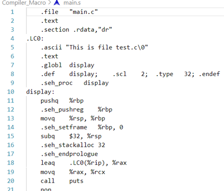

# Advance_C_Cpp
Contents

<details>
<summary>LESSON 1: COMPILER - MACRO</summary> 

---

**I. Compiler**
- Là quá trình chuyển đổi ngôn ngữ bậc cao sang ngôn ngữ máy.
- Gồm 4 giai đoạn


***Preprocessor (tiền xử lý)***: `gcc -E main.c -o main.i`. Các file trong source code (a.c, a.h, b.h, b.c, main.c,…) sẽ được biên dịch thành 1 file main.i. Ở giai đoạn này, trình biên dịch sẽ:

- Copy toàn bộ file thư viện (ví dụ #include <stdio.h>, #include “hello.h”,…)
- Thay thế các nội dung được #define 
- Xoá toàn bộ chú thích, các hàm và biến khai báo được giữ nguyên.

***Compiler***: File main.i được biên dịch thành file main.s (bao gồm các dòng lệnh được viết bằng ngôn ngữ assembly)



***Assembler***: Biên dịch ngôn ngữ assembly trong file main.s thành ngôn ngữ máy (file main.o)

***Linker***: 1 hoặc nhiều main.o sẽ được liên kết lại thành file thực thi (.exe)

---

**II. Macro**
-	Macro là một khái niệm dùng để định nghĩa một tập hợp các hướng dẫn tiền xử lý
-	Dùng để thay thế một chuỗi mã nguồn bằng một chuỗi khác trước khi chương trình biên dịch.
-	Giúp giảm lặp lại mã, dễ bảo trì chương trình.
-	Macro được định nghĩa bằng cách sử dụng chỉ thị tiền xử lý #define
-	Trong C, macro chia làm 3 loại: chỉ thị bao hàm tệp, chỉ thị định nghĩa, chỉ thị biên dịch có điều kiện.

**1. Chỉ thị bao hàm tệp (#include)** 
-	Gồm 2 loại:
    \*  <> (ví dụ #include <stdio.h>): khi run code, trình biên dịch tìm đến vị trí đã cài đặt file thư viện stdio.h trong bộ nhớ máy tính, sau đó sao chép toàn bộ nội dung file này vào file .i
    \* “…”: tìm trong thư mục chứ dự án hiện tại file nào có tên … sau đó sao chép toàn bộ nội dung file này vào file .i

    

**2. Chỉ thị định nghĩa**

***#define***: Định nghĩa, thay thế một tên, biến hoặc hàm 

-	Định nghĩa  giá trị của SIZE1 là 5 và  định nghĩa hàm

-	Sau giai đoạn tiền xử lý, nội dung được define ở file .c được thay thế vào trong file .i

***undef***: hủy định nghĩa của một macro đã được định nghĩa trước đó bằng #define
```c
#include <stdio.h>

#define SIZE1 5

int main(int argc, char const *argv[])
{
    printf("SIZE1 = %d\n", SIZE1);

    #undef SIZE1

    #define SIZE1 50

    printf("SIZE1 = %d\n", SIZE1);
    /* code */
    return 0;
}
```
**3. Chỉ thị biên dịch có điều kiện**

**3.1.**

***#if*** sử dụng để bắt đầu một điều kiện tiền xử lý.
- Nếu điều kiện trong ***#if*** là đúng, các dòng mã nguồn sau ***#if*** sẽ được biên dịch
- Nếu sai, các dòng mã nguồn sẽ bị bỏ qua đến khi gặp ***#endif***

***#elif*** dùng để thêm một điều kiện mới khi điều kiện trước đó trong ***#if*** hoặc ***#elif*** là sai

***#else*** dùng khi không có điều kiện nào ở trên đúng.

Ví dụ
```c
#include <stdio.h>

#define ESP32 1
#define STM32 2
#define ATmega 3

#define MCU STM32

int main(int argc, char const *argv[])
{
    while (1)
    {
        #if MCU == STM32
            printf("STM32");
        
        #elif MCU == ESP32
            printf("ESP32");
        
        #else 
            printf("0");

        #endif

    }
    return 0;
}
```
**3.2.**

***#ifdef*** và ***#ifndef*** thường được sử dụng trong tạo file thư viện, tránh việc định nghĩa mã nguồn nhiều lần gây lỗi trong quá trình tiền xử lý file .i

- ***#ifdef*** dùng để kiểm tra một macro đã được định nghĩa hay chưa, nếu macro đã được định nghĩa thì mã nguồn sau #ifdef sẽ được biên dịch.
- ***#ifndef*** dùng để kiểm tra một macro đã được định nghĩa hay chưa, nếu macro chưa được định nghĩa thì mã nguồn sau #ifndef sẽ được biên dịch.
Ví dụ
```c
#ifndef TEST_H
#define TEST_H

void display();

#endif
```
**3. Một số toán tử trong macro**

***a##b***: nối chuỗi

***#x***: chuẩn hóa chuỗi

Ví dụ
```c
#include<stdio.h>

#define concatenate(a,b) a##b

#define tostring(c) #c
int main(int argc, char const *argv[])
{
    int giatri = 10;

    // nối 'gia' và 'tri' thành 'giatri'
    printf("giatri = %d\n", concatenate(gia,tri));

    // chuẩn hóa chuỗi
    printf("chuỗi đã chuẩn hóa: %s\n", tostring(abc));
    return 0;
}
```

***Variadic macro***
- Là một dạng macro cho phép nhận một số lượng biến tham số có thể thay đổi.
- Giúp định nghĩa các macro có thể xử lý một lượng biến đầu vào khác nhau, dùng cho những hàm có tham số không xác định.

Ví dụ:

\__VA_ARGS__ sẽ thay thế vào dấu ...
```c
#include<stdio.h>

#define count_args(...) (sizeof(int[]){__VA_ARGS__}/sizeof(int));

#define sum(...)                \
int arr[] = {__VA_ARGS__};      \
int SUM = 0;                    \
int n = count_args(__VA_ARGS__);\
int i = 0;\
for(i = 0; i<n; i++)            \
{                               \
    SUM += arr[i];             \
}                               \
printf("SUM = %d\n", SUM);      \

int main(int argc, char const *argv[])
{
    sum(1,2,0,3,4);
    return 0;
}
```
</details>

<details>
<summary>LESSON 2: STDARG - ASSERT</summary>

**1. Thư viện starg**

- Tương tự variadic macro
- Cung cấp các phương thức để làm việc với các hàm có số lượng tham số đầu vào không cố định

Ví dụ:

***Cách 1:***

```c
#include <stdio.h>
#include <stdarg.h>

int sum(int count, ...)
{
    va_list args;

    va_start(args, count);

    int result = 0;

    for(int i = 0; i < count; i++)
    {
        result += va_arg(args, int);
    }

    va_end(args);
    
    return result;
}

int main(int argc, char const *argv[])
{
    printf("Tong = %d\n", sum(5, 0, 1, 3, 5, 6));
    return 0;
}
```
***

Giải thích:

- va_list: 

    ✦ Kiểu dữ liệu để đại diện cho danh sách đối số các biến số. Trong thư viện được định nghĩa là: ```typedef char* args;```, con trỏ args trỏ đến chuỗi được truyền vào hàm sum ```(args = "int count, 0, 1, 3, 5, 6")```, các kí tự trong chuỗi có địa chỉ liền kề nhau.

    ✦ Ví dụ `0xa0 ('i') 0xa1('n') 0xaa('1')`

- va_start: Bắt đầu một danh sách đối số biến đổi. Nó cần được gọi trước khi truy cập các đối số biến đổi đầu tiên. ```va_start(args, count);```

    ✦ Truyền vào 2 tham số con trỏ `args` và nhãn `count`. Trình biên dịch sẽ so sánh từng kí tự  của 2 chuỗi `"int count, 0, 3, 5, 6, 7"` và `"count"`. Con trỏ `args` sẽ truy cập đến từng địa chỉ của từng kí tự trong chuỗi, lấy ra giá trị được lưu sau đó sẽ so sánh với kí tự trong label `"count"` được truyền vào.

    ✦ Sau bước này chuỗi `"int count, 0, 3, 5, 6, 7"` được tách thành `"0, 3, 5, 6, 7"` (chỉ còn những tham số thay đổi)

- va_arg(args, int): Truy cập một đối số trong danh sách. Hàm này nhận một đối số của kiểu được xác định bởi tham số thứ hai

    ✦ Mỗi lần được gọi sẽ tách lần lượt từng kí tự trong chuỗi, sau đó ép kiểu về kiểu dữ liệu được khai báo bởi tham số thứ hai
    
    ✦ Ví dụ gọi lần thứ nhất lấy kí tự `'0'`, gọi lần thứ hai lấy kí tự `'3'`

- va_end: Kết thúc việc sử dụng danh sách đối số biến đổi. Nó cần được gọi trước khi kết thúc hàm.

    ✦ Thu hồi lại địa chỉ của con trỏ args

***Cách 2***

```c
/*
Tính tổng của một dãy số bất kì sử dụng thư viện stdarg nhưng tối ưu hơn
Bắt đầu từ giá trị của count kết thúc khi gặp số 0
*/
#include <stdio.h>
#include <stdarg.h>

#define tong(...) sum(__VA_ARGS__, 0)

int sum(int count,...)
{
    va_list args;

    va_start(args, count);

    int result = count; // bắt đầu tính tổng từ count
    int value;

    while((value = va_arg(args, int)) != 0)
    {
        result += value;
    }

    va_end(args);

    return result;
}

int main(int argc, char const *argv[])
{
    printf("Tong = %d\n", tong(3, 2, 4, 5, 7)); // sum(3, 2, 4, 5, 7, 0)
    return 0;
}
```

***Cách 3: loại bỏ nhược điểm gặp số 0 là dừng của cách 2***

```c
/*
Tính tổng của một chuỗi bất kì 
*/
#include <stdio.h>
#include <stdarg.h>

#define tong(...) sum(__VA_ARGS__, '\n')

int sum(int count,...)
{
    va_list args;
    va_list check;

    va_start(args, count);

    va_copy(check, args);

    int result = count; // bắt đầu tính tổng từ count
    int value;

    while(( va_arg(check, char*)) != (char*)'\n')
    {
        result += va_arg(args, int);
    }

    va_end(args);

    return result;
}

int main(int argc, char const *argv[])
{
    printf("Tong = %d\n", tong(3, 2, 4, 0, 5, 6)); // sum(3, 2, 4, 0, 5, 7, '/n')
    return 0;
}
```
- Khai báo thêm 1 con trỏ check trỏ đến chuỗi `"int count, 3, 2, 4, 0, 5, 6"`
- Sử dụng thêm hàm `var_copy`: sao chép địa chỉ mà con trỏ args đang trỏ tới, thao tác với con trỏ check

📌 Code ứng dụng thư viện stdarg trong thực tế, đọc và xử trí tín hiệu và giá trị của các cảm biến

```c
#include <stdio.h>
#include <stdarg.h>

typedef enum {
    TEMPERATURE_SENSOR,
    PRESSURE_SENSOR
} SensorType;

void processSensorData(SensorType type, ...) {
    va_list args;
    va_start(args, type);

    switch (type) {
        case TEMPERATURE_SENSOR: {
            int numArgs = va_arg(args, int);
            int sensorId = va_arg(args, int);
            float temperature = va_arg(args, double); // float được promote thành double
            printf("Temperature Sensor ID: %d, Reading: %.2f degrees\n", sensorId, temperature);
            if (numArgs > 2) {
                // Xử lý thêm tham số nếu có
                char* additionalInfo = va_arg(args, char*);
                printf("Additional Info: %s\n", additionalInfo);
            }
            break;
        }
        case PRESSURE_SENSOR: {
            int numArgs = va_arg(args, int);
            int sensorId = va_arg(args, int);
            int pressure = va_arg(args, int);
            printf("Pressure Sensor ID: %d, Reading: %d Pa\n", sensorId, pressure);
            if (numArgs > 2) {
                // Xử lý thêm tham số nếu có
                char* unit = va_arg(args, char*);
                printf("Unit: %s\n", unit);
            }
            break;
        }
    }

    va_end(args);
}

int main() {
    processSensorData(TEMPERATURE_SENSOR, 2, 1, 36.5, "Room Temperature");
    processSensorData(PRESSURE_SENSOR, 2, 2, 101325);
    return 0;
}
```
***

**2. Thư viện Assert**

- Dùng để phát hiện lỗi, debug chương trình, thể hiện lỗi cụ thể ở một vị trí cụ thể trong code
- Nếu điều kiện đúng (true), không có gì xảy ra và chương trình tiếp tục thực thi.
- Nếu điều kiện sai (false), chương trình dừng lại và thông báo một thông điệp lỗi.

📌 Ví dụ 1: 

```c
#include <stdio.h>
#include <assert.h>

int main(int argc, char const *argv[])
{
    
    int x = 5;

    assert(x == 5);

    //chương trình chỉ thực thi khi điều kiện đúng
    printf("X = %d", x);
    return 0;
}
```
*Output*

`X = 5`

📌 Ví dụ 2:

```c
#include <stdio.h>
#include <assert.h>

int main(int argc, char const *argv[])
{
    
    int x = 5;

    assert(x > 10 && "X phải lớn hơn 10" );

    //chương trình chỉ thực thi khi điều kiện đúng
    printf("X = %d", x);
    return 0;
}
``` 
*Output*

`Assertion failed: x > 10 && "X phải lớn hơn 10", file Assert2.c, line 9`

- Macro assert dùng để debug:
`#define LOG(condition, cmd) assert(condition && #cmd)`

📌 Ví dụ: Thiết lập level nằm trong khoảng cho phép

```c
#include <assert.h>

#define ASSERT_IN_RANGE(val, min, max) assert((val) >= (min) && val <= (max))

void set_level(int level)
{
    ASSERT_IN_RANGE(level, 1, 10);
    // thiết lập cấp độ bằng macro assert
}
```

</details>


<details>
<summary>LESSON 3: BITMASK </summary> 

### Bit mask

📌 Để tối ưu hóa bộ nhớ khi khai báo biến trong C, ta khai báo thư viện `#include <stdint.h>`, một số kiểu dữ liệu trong thư viện
```c
/*
    int, int32_t, uint32_t: 4 byte
    int8_t, uint8_t: 1 byte
    int16_t, uint16_t: 2 byte
*/
```
📌 Bit mask một kỹ thuật sử dụng các bit để lưu trữ và thao tác với các cờ (flags) hoặc trạng thái (thao tác trên bit).

Ví dụ:

```c
/*
    uint8_t PORT_A = 0b00001101 (1 byte)
    bit 0: Pin_A0
    bit 1: Pin_A1 
    bit 2: Pin_A2
    .
    .
    .
    bit 8: Pin_A8

    Thao tác trên cụm bit này -> bit mask -> tối ưu hóa bộ nhớ
*/
```
📌 Các toán tử bitwise

- `AND (&), OR(|), XOR(^), NOT(~)`


Ví dụ:

```c
uint8_t A = 0b01001001;
uint8_t B = 0b11101111;
    /*
    ~A = 0b10110110;
    A&B = 0b01001001;
    A|B = 0b11101111;
    A^B = 0b10100110;
    */
```

- `Shift left (<<) và Shift right (>>)`: phép dịch bit
- Trong trường hợp <<, các bit ở bên phải sẽ được dịch sang trái, và các bit trái cùng sẽ được đặt giá trị 0.
- Trong trường hợp >>, các bit ở bên trái sẽ được dịch sang phải, và các bit phải cùng sẽ được đặt giá trị 0 hoặc 1 tùy thuộc vào giá trị của bit cao nhất (bit dấu).

Ví dụ:

```c
uint8_t A = 0b01001001;
uint8_t B = 0b11101111;
    A = A << 2; //0b00100100;
    B = B >> 3; //0b00011101; 
    // bit dấu chỉ có ý nghĩa khi số có dấu (-8)
```

📌 Ví dụ sử dụng bit mask và giải thích

```c

#include <stdio.h>
#include <stdint.h>

/*
    Sử dụng macro và bit wise để khai báo các tính năng
    Phép dịch bit 1 << 0: 0b00000001 << 0
                  1 << 1: 0b00000001 << 1 để khai báo tính năng TSHIRT
    8 tính năng nằm trong 1 byte -> tối ưu bộ nhớ
*/


#define GENDER        1 << 0  // Bit 0: Giới tính (0 = Nữ, 1 = Nam)
#define TSHIRT        1 << 1  // Bit 1: Áo thun (0 = Không, 1 = Có)
#define HAT           1 << 2  // Bit 2: Nón (0 = Không, 1 = Có)
#define SHOES         1 << 3  // Bit 3: Giày (0 = Không, 1 = Có)
// Tự thêm tính năng khác
#define FEATURE1      1 << 4  // Bit 4: Tính năng 1
#define FEATURE2      1 << 5  // Bit 5: Tính năng 2
#define FEATURE3      1 << 6  // Bit 6: Tính năng 3
#define FEATURE4      1 << 7  // Bit 7: Tính năng 4

/*
    Sử dụng bit wise & để bật 1 tính năng mà không ảnh hưởng đến bit khác
    enableFeature(&options, GENDER | TSHIRT | HAT);
    uint8_t options = 0; // 0b00000000
    0b00000000
    &
    0b00000111
    ----------
    0b00000111 -> thao tác với bit mà không ảnh hưởng tới bit khác

*/

void enableFeature(uint8_t *features, uint8_t feature) {
    *features |= feature;
}

/*
    Sử dụng bit wise | để thao tác
    options = 0b00000111;
    disableFeature(&options, TSHIRT);
    0b00000111
    |
   ~0b00000010
   ------------
    0b00000101
*/

void disableFeature(uint8_t *features, uint8_t feature) {
    *features &= ~feature;
}


int isFeatureEnabled(uint8_t features, uint8_t feature) {
    return (features & feature) != 0;
}

void listSelectedFeatures(uint8_t features) {
    printf("Selected Features:\n");

    if (features & GENDER) {
        printf("- Gender\n");
    }
    if (features & TSHIRT) {
        printf("- T-Shirt\n");
    }
    if (features & HAT) {
        printf("- Hat\n");
    }
    if (features & SHOES) {
        printf("- Shoes\n");
    }

    for (int i = 0; i < 8; i++)
    {
        printf("feature selected: %d\n", (features >> i) & 1);
    }
    

    // Thêm các điều kiện kiểm tra cho các tính năng khác
}


int main() {
    uint8_t options = 0;

    // Thêm tính năng 
    enableFeature(&options, GENDER | TSHIRT | HAT);

    disableFeature(&options, TSHIRT);

    // Liệt kê các tính năng đã chọn
    listSelectedFeatures(options);
    
    return 0;
}


```

**Output**

```c
Selected Features:
- Gender
- Hat
feature selected: 1
feature selected: 0
feature selected: 1
feature selected: 0
feature selected: 0
feature selected: 0
feature selected: 0
feature selected: 0
```
- Sử dụng phép dịch bit và macro để khai báo các tính năng (tối ưu bộ nhớ)
- Dùng toán tử bit wise để bật tắt các tính năng mà không ảnh huởng đến tính năng khác, kiểm tra xem tính năng nào đã được bật.

</details>

<details>
<summary>LESSON 5: EXTERN_STATIC_VOLTAGE_REGISTER</summary> 

### Extern_Static_Voltage_Register

**1.Extern**

- Sử dụng lại biến, hàm,... từ file khác (tái sử dụng mã nguồn)

- Điều này giúp chương trình hiểu rằng biến hoặc hàm đã được định nghĩa và sẽ được sử dụng từ một vị trí khác, giúp quản lý sự liên kết giữa các phần khác nhau của chương trình hoặc giữa các file nguồn.

📌 Ví dụ 1: 

`file test.c`
```c
#include <stdio.h>

int var = 10;

void display()
{
    printf("%d\n", var);
}
```

`file main.c`, sử dụng các biến và hàm từ file test bằng từ khóa `extern` và không cần khai báo `"#include test.c"` -> gây lỗi khi vô tình được khai báo nhiều lần

```c
#include <stdio.h>

extern int var; // extern int var = 200; -> error

extern void display();

int main(int argc, char const *argv[])
{
    display();  
    return 0;
}
```
**Lưu ý**

- Chỉ khai báo chứ không định nghĩa giá trị cụ thể của biến, nội dung của hàm sau từ khóa `extern`

- Khi biên dịch cần liên kết 2 file `-o` qua câu lệnh `gcc main.c test.c -o a.exe`

- Chỉ sử dụng cho biến toàn cục

📌 Ví dụ 2:

`file test.h`

```c
#ifndef TEST_H
#define TEST_H

extern int var_global;

extern void display();

#endif
```
`file test.c`

```c
#include <stdio.h>
#include "test.h"

int var_global = 10;

void display()
{
    printf("%d\n", var_global);
}
```

`file main.c`

```c
#include <stdio.h>
#include "test.h"

int main(int argc, char const *argv[])
{
    var_global = 100;
    display();
    return 0;
}
```

- File .h sử dụng lại các biến, hàm mà nội dung của biến và hàm đó đã được khai báo ở file .c.

**2. Static**
**2.1 Static local variales**

- Khi static được sử dụng với local variables, nó giữ giá trị của biến khai báo cố định qua các lần gọi hàm, không giải phóng địa chỉ sau khi hàm kết thúc

-  Giữ phạm vi của biến chỉ trong hàm đó

📌 Ví dụ:

```c
#include <stdio.h>

int *ptr = NULL;

void upper()
{
    static int a = 0;
    ptr = &a;
    printf("addr of a: %p\n", &a);
    printf("a = %d\n", ++a);
}

int main(int argc, char const *argv[])
{
    upper(); // a = 1
    upper(); // a = 2
    *ptr = 9;
    upper(); // a = 10;
    return 0;
}

```

Output

```c
addr of a: 00007FF6018C7038
a = 1
addr of a: 00007FF6018C7038
a = 2
addr of a: 00007FF6018C7038
a = 10
```
- Sau khi kết thúc hàm, địa chỉ của biến `a` không được giải phóng nên lần gọi tiếp theo giá trị của `a` bằng 2

- Có thể thay đổi giá trị của biến static cục bộ a thông qua con trỏ.

**2.2 Static local variales**

- Khi static được sử dụng với global variables ( biến toàn cục - khai báo biến bên ngoài hàm), nó hạn chế phạm vi của biến đó chỉ trong file nguồn hiện tại.

📌 Ví dụ:

`test.h`

```c
#ifndef TEST_H
#define TEST_H

extern int b;

//extern int a;

//extern void display();

extern void test();

#endif
```

`test.c`

```c
#include <stdio.h>
#include "test.h"

static int a = 10;

int b = 2;

static void display()
{
    printf("file test.c/n");
}

void test()
{
    printf("Hello");
}
```

`main.c`

```c
#include <stdio.h>
#include "test.h"

int main(int argc, char const *argv[])
{
    //printf("%d\n", a);
    printf("%d\n", b);
    //display();
    test();
    return 0;
}

```
- `static int a = 10`, chỉ cho phép ở trong phạm vi file chứ nó, nếu cố tính truy cập thông qua extern -> báo lỗi

- Dùng để thiết kế các file thư viện

**3.Register**
- Trong ngôn ngữ lập trình C, từ khóa register được sử dụng để chỉ ra ý muốn của lập trình viên rằng một biến được sử dụng thường xuyên và có thể được lưu trữ trong một thanh ghi máy tính, chứ không phải trong bộ nhớ RAM -> nhằm tăng tốc độ truy cập. 

- Thông thường khai báo biến, địa chỉ của nó được lưu trên RAM

- CPU chuyển từ RAM sang register sau đó chuyển sang ALU (bộ xử lý tính toán)
giảm tính linh hoạt của register

📌 Ví dụ:

```c
#include<stdio.h>
#include<time.h>

int main(int argc, char const *argv[])
{
    clock_t start_time = clock();
    int i;

    for(i = 0; i < 200000000; i++)
    {
        // do something
    }

    // tính thời gian chạy bằng mili giây

    double time_taken = ((double)(clock() - start_time)) / CLOCKS_PER_SEC;

    printf("Run time = %f", time_taken);
    return 0;
}

```
Output

`Run time = 0.072000`

- Khai báo biến với register `register int i;` , lưu trên thanh ghi thay vì RAM output: `Run time = 0.071000` .

- Register chỉ dùng cho biến cục bộ

- Sử dụng cho việc tính toán số học

- Việc sử dụng register chỉ là một đề xuất cho trình biên dịch và không đảm bảo rằng biến sẽ được lưu trữ trong thanh ghi. Trong thực tế, trình biên dịch có thể quyết định không tuân thủ lời đề xuất này.

**4.Volatile**


</details>


